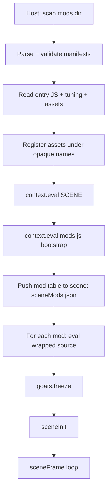

# Slag Goat — Mod API v1

> **Status:** draft specification for M14. Nothing here is implemented yet; this
> is the contract the modding milestone is built against. The scene is
> `crates/goats/src/game/*.js`, the client host is `crates/goats/src/main.rs`,
> the headless host is `crates/server/`, and the engine is Slag.

A mod is a directory of JavaScript, assets and JSON. It is loaded by the Rust
host, evaluated against the running scene, and talks to the game through a
single versioned global, `goats`. This document defines that global, the mod
file format, the loading rules, and the compatibility rules that let mods work
in a multiplayer session.

---

## 0. Scope and the one rule

**The rule: JavaScript never touches the filesystem. All I/O goes through Rust.**

- The `fs` engine feature stays **off**. Neither the client nor the server
  enables it.
- The host (`goats` client, `goatsd` server) discovers mods, reads manifests,
  source and assets, and re-exposes only what it decided to expose.
- A mod never receives a filesystem path. Assets are handed to the scene as
  opaque, host-registered names that `rl.loadModel` / `rl.loadTexture` /
  `rl.loadSound` / `rl.loadMusic` resolve from memory.
- Network sockets remain out of JavaScript, as they already are: networking is
  the Rust host's (`crates/goats/src/net.rs`), reached over the line bridge.

The API is therefore **not a sandbox** — mods are trusted code — but it is a
controlled surface: no file handle, no socket, no process, no engine internals
beyond the documented global.

---

## 1. Design principles

1. **The API is the contract; globals are an escape hatch.** Mods should use
   `goats` and never patch scene internals. Which functions exist in
   `crates/goats/src/game/*.js` is an implementation detail that may change
   between releases; `goats` is versioned and stable within a major.
2. **Additive first.** `goats` grows by adding events and fields. Removing or
   changing meaning requires a major API bump (see §9).
3. **Safety is about not breaking the game, not about distrust.** The API
   exists so a bad mod produces a clear console error and leaves vanilla
   behaviour intact, not so a hostile mod is contained.
4. **Vanilla is untouched.** With no `mods/` directory, the scene behaves
   exactly as it does today. The headless harness
   (`tools/goat_logic_test.js`) and the server's client/server drift test keep
   running against the unmodified scene.
5. **World mods are a compatibility set.** Anything that changes simulation is
   part of a set that the host and every client must share (§6).

---

## 2. How mods load

### 2.1 Discovery

The host looks for mods in this order and uses the first that exists:

1. `--mods <dir>` on the command line (client and `goatsd`).
2. `$GOATS_MODS` (a directory).
3. `mods/` next to the executable.
4. `mods/` in the current working directory (so `cargo run` finds the repo's).

`--no-mods` skips discovery entirely. Every immediate subdirectory containing a
`mod.json` is a mod. Files and directories without a manifest are ignored
(a `mods/.disabled/` dir is a convenient way to park a mod).

### 2.2 Load order

The host sorts mods by `id`. A manifest may list `loadAfter: ["other.id"]`,
which is honoured (topological, with id as the tiebreak). A cycle is a load
error for the mods involved.

Loading is all-or-nothing per mod: a manifest that fails to parse, an `api`
that does not match, or an entry that throws leaves that mod **failed** and
named in the console, and everything else loads. One broken mod never takes
the game down.

### 2.3 The load pipeline



Notes:

- The bootstrap (`crates/goats/src/game/mods.js`, a new scene part) defines the
  `goats` global and its registries. It is evaluated after the scene so it can
  wrap `sceneCommand`, `sceneFrame`, `sceneShutdown`, `netApplyWorld`,
  `sceneUseSeed` and friends.
- Mods are evaluated **after** `sceneInit`? No — **before**. Evaluating before
  `sceneInit` lets a mod register a model override, a clip table entry or a
  bot archetype that the load steps then use. Per-frame hooks are dormant
  until `goats.freeze` and `sceneInit`.
- `sceneMods(json)` is the host→scene channel that hands the scene the mod
  table (id, name, version, side, description, asset slots). It is the only
  thing the scene needs for `mod list`; the host already parsed everything.

### 2.4 The per-mod wrapper

Mod source is evaluated inside a wrapper so each mod gets a private scope and a
stable reload:

```js
(function (goats) {
    "use strict";
    /* ---- mod source starts here ---- */
})(goats.begin("com.example.fastgoat"));
```

Consequences:

- A mod cannot accidentally leak a global by declaring `const`; it can still
  reach the scene's globals by name, because the wrapper is a closure in the
  scene's realm.
- Reloading is safe: the previous wrapper's scope is discarded, and
  `goats.end(id)` has already unsubscribed its hooks.

### 2.5 Reload

`mod reload <id>` re-reads the manifest, entry and assets, calls `goats.end(id)`
for the live instance (which fires that mod's `"shutdown"` handlers and removes
its hooks, commands and registrations), then evaluates the wrapper again.

Tuning and assets are re-registered on reload. Nothing is re-read for mods the
player did not name, so reloading one mod never disturbs another.

---

## 3. The mod directory and manifest

### 3.1 Layout

```
mods/
  fast-goat/
    mod.json
    mod.js
    tuning.json
    models/goat_fast.glb
    audio/sprint.ogg
```

### 3.2 `mod.json`

```json
{
  "id": "com.example.fastgoat",
  "name": "Fast Goat",
  "version": "1.2.0",
  "api": 1,
  "game": ">=0.1.0",
  "side": "world",
  "description": "Sprint with Shift, zoomies on demand.",
  "author": "example",
  "loadAfter": ["com.example.hudkit"],
  "entry": "mod.js",
  "tuning": "tuning.json",
  "assets": {
    "model.goat": "models/goat_fast.glb",
    "sfx.bleat": ["audio/sprint.ogg"]
  }
}
```

| Field | Required | Meaning |
| --- | --- | --- |
| `id` | yes | Unique, stable, dot-separated. Used for ordering, reload and the compatibility digest. |
| `name` | yes | Human name for the console and the Mods screen. |
| `version` | yes | Semver of the mod itself. |
| `api` | yes | The `goats` API major the mod targets. Must equal `goats.api` (currently `1`). |
| `game` | no | Optional semver range against the game version. Out-of-range = a warning, not a failure, unless `strictGame` is true. |
| `side` | no | `"client"` (default) or `"world"` (§6). |
| `description` | no | One line for the UI. |
| `author` | no | Free text. |
| `loadAfter` | no | Ids that must load first. |
| `entry` | no | JS entry. Absent means a data-only mod (assets + tuning). |
| `tuning` | no | JSON merged into `goats.tuning` (§3.4). |
| `assets` | no | Slot → file, or slot → list of files (§3.3). |

### 3.3 Asset slots

A slot is a **logical** name the scene already uses. A mod points a slot at a
file; the host reads the file, registers its bytes under an opaque name, and
the scene's asset accessor returns that opaque name. This is how a mod
**replaces a built-in asset** while keeping the filesystem out of JavaScript.
The reading, validation and hashing all live in the pure `crates/mods/` crate;
`crates/goats/src/main.rs` does the registration.

Built-in file-backed slots in v1:

| Slot | Scene constant | Used by |
| --- | --- | --- |
| `model.goat` | `MODEL_PATH` | `loadGoat`, `botAdd` |
| `sfx.music` | `MUSIC_PATH` | `makeAudio` |
| `sfx.rain` | `RAIN_PATH` | `makeAudio` |
| `sfx.wind` | `WIND_PATH` | `makeAudio` |
| `sfx.bleat` | `BLEAT_PATHS` | `playBleat` |
| `sfx.thunder` | `THUNDER_PATHS` | `updateAudio` |

`sfx.bleat` and `sfx.thunder` are lists: the value may be a string (replace
the one-clip list) or an array (replace the whole list). Indexed forms
(`sfx.bleat.0`) replace a single entry.

The procedural textures (`xTex`, `moonTex`, `glowTex`, `terrainDetail`,
`cloudTex`, the per-bot fleeces) are generated in JavaScript and are **not**
file slots in v1. A mod that wants to change them paints them through
`rl.makeTexture`, which is engine-level and allowed.

### 3.4 `tuning.json`

A partial tree merged into `goats.tuning` (§4.10) before the mod's entry runs.
Missing keys keep their defaults; unknown keys are a load warning (a typo is
reported, not silently ignored).

```json
{
  "stats": { "max": 100, "energyDrain": { "run": 5.0 } },
  "gait": { "run": { "stride": 0.55 } },
  "herd": { "count": 10 }
}
```

---

## 4. The `goats` API

> **Implemented (M14b–M14e):** identity, logging, the `begin`/`end`/`freeze`
> lifecycle, the `mod` console verbs, the whole hook surface (`on`, `command`,
> `run`), the `player` / `camera` / `world` / `bots` / `settings` / `tuning` /
> `net` accessors, the content registries (`bots.register`, `clips.register`,
> `assets.override`), the mutable asset slots (a mod's declared `assets` are
> applied automatically in load order, last wins), the world-extension surface
> (`world.registerStream`, `goats.rng`, `world.extend`, §4.13), and a mod's
> `tuning.json` (`Manifest::json` carries the tree and `sceneMods` merges it
> before any entry runs; an unknown key warns). Registration closes at
> `freeze()`; a reload re-opens it for the mod being reloaded. `clips.register`
> applies `gait` only for now -- a clip's `asset` is refused with a message,
> since swapping one clip's source needs the model work; point the `model.goat`
> slot at the file instead.

`goats` is the only global a mod needs. Inside a wrapper, the per-mod handle is
the argument; `goats` itself is also global for convenience.

```js
goats.api          // 1 — the API major
goats.game         // game version, e.g. "0.1.0"
goats.mod          // this mod's info: { id, name, version, side }
```

### 4.1 Identity and lifecycle

| Member | Description |
| --- | --- |
| `goats.begin(id)` | Host-internal: starts a mod instance. Not called by mods. |
| `goats.end(id)` | Host-internal: tears a mod instance down (reload/disable). |
| `goats.freeze()` | Host-internal: closes registration; after this, `register*` throws. |
| `goats.mods()` | The loaded mod table: `[{ id, name, version, side, description, enabled }]`. |
| `goats.enabled(id)` | Whether a mod is currently loaded. |

### 4.2 Events

```js
const off = goats.on("update", (dt) => { /* ... */ });
off();   // unsubscribe
```

`on` returns an unsubscribe function. Handlers registered by a mod are removed
automatically when that mod is reloaded or disabled. A handler that throws is
logged with the mod's id and does **not** stop the frame or the other mods'
handlers.

| Event | Fires when | Handler arguments |
| --- | --- | --- |
| `"load"` | The mod's own entry runs, before `sceneInit` | *(none)* |
| `"ready"` | The world is live (loading finished) | *(none)* |
| `"update"` | Each frame after the world updates, before render | `(dt)` |
| `"draw3d"` | Each frame inside `beginMode3D`, after the world is drawn | `(camera)` |
| `"hud"` | Each frame in 2D, after the built-in HUD | `(screen)` |
| `"draw"` | Each frame, after everything, before `endDrawing` | *(none)* |
| `"command"` | A console/stdin line was not a built-in command | `(line, parts)` → see §4.3 |
| `"weather"` | The weather kind changes | `(kind, previous)` |
| `"mode"` | The player's mode changes | `(mode, previous)` |
| `"spawn"` | A bot is created | `(bot)` |
| `"despawn"` | A bot is removed | `(bot)` |
| `"session"` | A net event (`session`, `joined`, `left`, `roster`, `chat`, …) | `(event)` |
| `"world"` | A server world snapshot was applied (client side) | `(world)` |
| `"tuning"` | A tuning value changed | `(path, value)` |
| `"shutdown"` | The game is closing, or this mod is being reloaded | *(none)* |

Firing points map to real scene code: `"update"` after the bot update and
terrain ensure in `sceneFrame`; `"draw3d"` before `endMode3D`; `"hud"` after
`drawHud`; `"ready"` when `loaded` flips true; `"weather"` where `weatherKind`
is assigned; `"mode"` where `lastMode` is updated; `"session"`/`"world"` in
`sceneNetEvent`/`netApplyWorld`.

### 4.3 Commands

```js
goats.command("dance", (parts, raw) => {
    if (parts.length > 1 && parts[1] === "stop") { stopDance(); return "ok dance stop"; }
    startDance();
    return "ok dance";           // any string is printed to the console
});

goats.on("command", (line, parts) => {
    if (line.startsWith("dance ")) { /* observe, and return a reply to consume it */ }
});
```

- Names are single tokens. Leading `/` is stripped by the dispatcher, as today.
- A command returns a string (the console prints it; `""` prints nothing) or
  `undefined`/`null`/`false` to decline, in which case the next handler and
  then the chat fallback see the line.
- **Built-in commands win.** Registering `help`, `quit`, `connect`, `host`,
  `leave`, `say`, `msg`, `who`, `mod` (and the rest of the existing
  vocabulary) is rejected with a console warning. Mods extend the vocabulary;
  they do not shadow it.
- `"command"` observers run after the built-in switch but before the
  unknown-command chat fallback, which is what makes a mod command usable both
  offline and in a session.

### 4.4 Registries

Registration is only valid before `goats.freeze()`. Registering after the
freeze throws.

```js
goats.bots.register("com.example.giant", {
    name: "giant",
    coat: [180, 150, 120],
    scale: 2.0,
    bold: 0.8,
    lazy: 0.6,
});

// Walk / trot / run gaits can be retuned. A clip's `asset` is refused for now;
// point the model.goat slot at the file instead.
goats.clips.register("run", { gait: { stride: 0.55, duty: 0.34 } });

// Point a built-in slot at an opaque asset name from a declared asset.
goats.assets.override("sfx.music", "mod:com.example:sfx.music");
```

| Registry | Purpose |
| --- | --- |
| `goats.bots.register(id, spec)` | Adds an archetype to the herd's pool (`spec.name`, `coat`, `scale`, `bold`, `lazy`). |
| `goats.clips.register(role, { gait })` | Retunes `walk` / `trot` / `run` stride and duty. An `asset` is refused until the model work. |
| `goats.assets.override(slot, name)` | Points a built-in slot at an opaque asset name. |
| manifest `assets` | Applied automatically at load, in mod order, last wins. |

All three registries are pre-freeze: the loaders run after the entries do.

### 4.5 Player

Reads are a snapshot; writes go through methods so the scene can keep its
invariants (cooldowns, collision, mode legality).

```js
const s = goats.player.state();
// { mode, health, energy, exhausted, satiety, x, y, z, yaw, phase, speed, clip }
goats.player.teleport(x, z);
goats.player.face(yaw);
goats.player.giveEnergy(20);
goats.player.giveHealth(10);
goats.player.setMode("trot");     // rejected for "dead"/"jump"; see docs
goats.player.restart();           // only meaningful in "dead"
```

`setMode` accepts `idle`, `walk`, `trot`, `run`, `sleep`, `eat`. Entering
`sleep`/`eat` goes through the same helpers the keys use; `jump` and `dead` are
driven by the simulation and cannot be forced.

### 4.6 Camera

```js
goats.camera.get();               // { yaw, pitch, dist }
goats.camera.set({ yaw: 0.7, pitch: 0.42, dist: 5.2 });   // partial is fine
```

The camera is cosmetic and never part of the compatibility set.

### 4.7 World

```js
goats.world.time();               // hours, [0, 24)
goats.world.setTime(6.5);
goats.world.weather();            // { kind, cloudiness, rain, wind, speed }
goats.world.setWeather("rain");   // valid: clear | cloudy | rain | clearing
goats.world.wind();               // { x, z, sway }
goats.world.terrainHeight(x, z);  // metres, the same function the scene uses
```

`setTime`/`setWeather` are **local-only** and, in a client session, are ignored
with a console note when the host owns the world (the existing
`netWeatherLocal()` gate). A client can therefore call them safely; they just
do nothing authoritative.

### 4.8 Bots

```js
goats.bots.count();               // current herd size
goats.bots.setCount(n);           // 0..10, same path as the setting
goats.bots.list();                // [{ id, x, z, yaw, mode, satiety }]
const b = goats.bots.get(0);      // a handle or null
b.zoomies(3);                     // seconds of sprint
b.startle();
b.teleport(x, z);
b.face(yaw);
```

On a client in a session, bot state is server-owned (`netWorldLocal()` is
false); writes are ignored with a note, reads mirror the last snapshot.

### 4.9 Settings

```js
goats.settings.get();             // { bgm, sfx, light, shadow, sky, cloud, fullscreen, herd }
goats.settings.set({ bgm: 50 });  // partial; goes through applySettings
```

This is the same `SETTINGS` object the main menu edits. `herd` is a
convenience alias for `goats.bots.setCount`.

### 4.10 Tuning

The gameplay constants, lifted out of `const` into a mutable tree so both data
packs and script mods can change them. This is the prerequisite refactor of
M14a.

```js
goats.tuning.get("stats.energyDrain.run");   // 4.0
goats.tuning.set("stats.energyDrain.run", 5.0);
goats.tuning.merge({ stats: { max: 120 } });
goats.on("tuning", (path, value) => { /* react */ });
```

The tree in v1:

```
stats    max, energyDrain{idle,walk,trot,run}, jumpEnergyCost,
         sleepEnergyRecover, sleepHealthRecover, idleHealthRecover,
         exhaustHealthDrain, restedEnergy, autoSleepDelay, deadEyeFraction
movement turnRate, goatRadius, modelScale
gait     {walk,trot,run}: { stride, duty }
jump     fallbackTime, fallbackHeight, fallbackTrotMult, fallbackRunMult
food     eatRange, eatEnergy, eatSatiety, satietyDecay, rainShelter,
         regrowMin, regrowMax
weather  windBase, cloudDrift, rainMax, rainSlow, windSlow, wetDrain,
         windDrain, windNorm, hold{clear,cloudy,rain,clearing}
terrain  relief, flat, ramp, snap, uv
world    dayLength, timeFast, nightDrainMult
herd     count, spec[]              (spec is the archetype pool)
camera   yaw, pitch, dist, minDist, maxDist
sky      cloudBase, cloudTop, scale, detail, absorb, cirrusLevel, speed, steps[]
lighting shadow{size, half, dist, near, far, bias, strength}
```

Every name is one the scene reads today (`ENERGY_DRAIN`, `GAIT`,
`WEATHER_HOLD`, `TERRAIN_*`, `CLOUD_*`, `SHADOW_*`, …). Setting a leaf
validates the type and, where it applies, clamps the range. `set` on a
non-leaf or unknown path throws, so a typo is loud.

### 4.11 Assets

```js
goats.assets.slots();                 // every known slot: ["model.goat", ...]
goats.assets.get("model.goat");       // the name to pass to rl.loadModel
goats.assets.override("sfx.music", "mod:com.example:sfx.music");   // pre-freeze only
```

`get` prefers the mod's own declared asset for the slot, then falls back to the
built-in logical name (`"goat_animated.glb"`), which the engine already resolves
from its embedded registry before the disk. A manifest's `assets` map is applied
automatically when the host pushes the table, so a data-only pack (no `entry`)
replaces a built-in just by declaring the slot.

### 4.12 Network

Read-only, plus chat:

```js
goats.net.mode();                 // "off" | "host" | "client"
goats.net.inSession();
goats.net.isHost();
goats.net.localWorld();           // true unless mirroring a server
goats.net.name();                 // this player's assigned name
goats.net.roster();               // names, host first
goats.net.say("hello");           // the same path as typing a chat line
```

World-facing mods also get §4.13.

### 4.13 World extension (multiplayer simulation)

> **Implemented (M14d2).** A `side: "world"` mod may register a seeded stream
> and publish state; it travels in the snapshot's `mods` section and the host
> must run it (the digest in §6 guarantees every peer has the same set).

This is the seam that lets a `side: "world"` mod add simulated state and have
it travel in the existing world snapshot. A world mod registers extensions;
the scene merges their `publish` output into the snapshot and calls their
`apply` on receipt. The snapshot is already JSON built by `sceneWorldBots` /
`sceneWeatherState` / `sceneStreams` / `sceneEaten`, so this is an additive
field (`sceneWorldMods()`), not a new protocol.

```js
goats.world.registerStream("sprint", 0x1234abcd);   // a seeded PRNG stream
const rnd = goats.rng("sprint");                    // () -> [0, 1)

goats.world.extend("com.example.fastgoat", {
    publish() { return { dashCooldowns: DASH }; },   // JSON-able
    apply(state) { if (state) DASH = state.dashCooldowns; },
});
```

Rules:

- `registerStream`/`rng` names are namespaced to the mod (`<id>:<name>`).
  Streams are re-derived from the session seed inside `sceneUseSeed`, and their
  state travels in the snapshot's `mods.streams`, so a client that joins
  mid-session continues where the host is rather than replaying from zero.
- `publish`/`apply` must be pure JSON round-trips. No functions, no class
  instances. Only `side: "world"` mods may register a stream or an extension.
- On a client, `publish` is not called (the server is authoritative); only
  `apply` is, and only for extensions the client also registered.
- The scene calls `extend` contributions in registration order, so ordering is
  part of the compatibility digest's guarantee.
- The `mods` section rides the unreliable world datagram, so it is bounded by
  `MAX_DATAGRAM_BYTES`; an oversized snapshot is dropped like any other. That
  budget is shared with the herd and the weather, and with the default herd the
  room left for mods is only a few hundred bytes -- a world mod should publish a
  handful of rounded numbers per entity, not a full object each. See the `birds`
  example (§5.4) for the shape of a compact `publish`.

### 4.14 Utility

```js
goats.log("...");     // console.log with a "[mod:<id>]" prefix
goats.warn("...");
goats.error("...");
goats.run("weather rain");       // dispatch a line through sceneCommand
goats.fail("...");               // mark this mod failed and stop calling its hooks
```

`goats.command` re-enters the dispatcher, so a mod command can call a built-in
or another mod's command. Re-entrancy from a `"command"` handler into
`goats.command` is depth-limited (a small guard; a cycle is logged and
dropped), so a mod cannot hang the frame.

---

## 5. Examples

### 5.1 A client cosmetic mod (HUD + camera)

`mods/hud-clock/mod.json`

```json
{
  "id": "com.example.hudclock",
  "name": "Big Clock",
  "version": "1.0.0",
  "api": 1,
  "side": "client",
  "entry": "mod.js"
}
```

`mods/hud-clock/mod.js`

```js
goats.on("hud", (screen) => {
    const t = goats.world.time();
    const hh = String(Math.floor(t)).padStart(2, "0");
    const mm = String(Math.floor((t - Math.floor(t)) * 60)).padStart(2, "0");
    rl.drawText(hh + ":" + mm, 24, 24, 40, rl.color(255, 255, 255, 220));
});

goats.command("closer", () => {
    const c = goats.camera.get();
    goats.camera.set({ dist: Math.max(2.2, c.dist - 1) });
    return "ok closer";
});
```

No simulation changes, so this mod never enters the compatibility set and can
be installed on one player only.

### 5.2 A world gameplay mod (a dash with a cooldown)

`mods/dash/mod.json`

```json
{
  "id": "com.example.dash",
  "name": "Dash",
  "version": "1.0.0",
  "api": 1,
  "side": "world",
  "entry": "mod.js",
  "tuning": "tuning.json"
}
```

`mods/dash/tuning.json`

```json
{ "movement": { "turnRate": 2.0 } }
```

`mods/dash/mod.js`

```js
goats.world.registerStream("dash");
const rnd = goats.rng("dash");

let cooldown = 0;
const DASH_TIME = 0.35;
let dashTime = 0;

goats.on("update", (dt) => {
    cooldown = Math.max(0, cooldown - dt);
    if (dashTime > 0) dashTime -= dt;
    if (goats.net.localWorld() && rl.isKeyPressed(rl.KEY_Q) && cooldown === 0) {
        dashTime = DASH_TIME;
        cooldown = 4;
        goats.log("dash!");
    }
});

goats.on("mode", (mode) => { if (mode === "dead") { dashTime = 0; cooldown = 0; } });

// Travels in the world snapshot so every client sees the dash.
goats.world.extend("com.example.dash", {
    publish() { return { cooldown: cooldown, active: dashTime > 0 }; },
    apply(s) { if (s) { cooldown = s.cooldown; dashTime = s.active ? DASH_TIME : 0; } },
});
```

Because it changes movement and adds snapshot state, this mod is `"world"`:
the host and every client must have `com.example.dash@1.0.0`, or the join is
refused (§6).

### 5.3 Replacing the model

```json
{
  "id": "com.example.highpoly",
  "name": "High-poly Goat",
  "version": "1.0.0",
  "api": 1,
  "side": "client",
  "assets": { "model.goat": "models/goat_hp.glb" }
}
```

That is the entire mod: no `entry`. The host registers the file, the scene's
model slot points at it, and `loadGoat` / `botAdd` load it for the player and
the herd. The clip names are matched by substring as today, so a GLB exported
with the same `Goat*` action names just works.

### 5.4 A world mod with its own entity: `birds`

The checked-in `mods/birds/` is the worked example of a mod that is more than a
patch: it adds a flock of birds nobody else knows about. It ships no binary
assets -- the meshes come from `rl.makeModel` and the feather texture from
`rl.makeTexture` -- and it is `side: "world"`, so every peer sees the same
birds.

Tools a mod already has, without new API:

- **Its own geometry.** `rl.makeModel(vertices, indices, normals, colours,
  texcoords)` takes flat arrays; the terrain uses it, and a mod may too. A
  generated texture is `rl.makeTexture(n, n, "rrggbbaa...")`.
- **Its own draw.** The `draw3d` event fires inside the scene's `beginMode3D`,
  after the world is drawn, and hands the camera position. `drawModelEx` draws a
  handle with an axis, an angle, a scale and a tint.
- **Its own simulation.** `update` fires once a frame with `dt` (and `dt` is 0
  while the menu or console is open, so birds freeze with the world).
- **Its own shared state.** `world.registerStream` seeds a PRNG,
  `world.extend(id, { publish, apply })` rides the world snapshot.

Two things are worth knowing before writing one.

**Build models lazily.** `rl.makeTexture` uploads to the GPU, so it needs the
window, and a mod entry runs before `sceneInit` opens it. The birds build their
meshes on the first `update`/`draw3d`, not in the entry. (The `"ready"` event
fires after the window exists, but a reload of an already-ready scene does not
re-fire it, so a lazy build is the robust form.)

**Pose with one axis-angle.** `drawModelEx` takes a single rotation axis and
angle, so yaw, pitch, roll and each wing's flap are composed as quaternions and
reduced to one axis-angle per part in `draw3d`. The birds are three models --
body and two wings -- each drawn with its own composed rotation; the wings are
pivoted at the shoulder so the flap is a rotation about the body's forward axis.

Its animation states are `idle` (standing on the ground, or perched on a
player's or a bot's goat), `walk`, `takeoff`, `fly` (boids: separation,
alignment, cohesion, a pull home and a soft altitude hold, with glide
stretches) and `land`. The state and its clock travel in the snapshot; a client
eases toward the host's positions and re-derives the flap from `(state, clock)`,
so the flap function is shared and nothing cosmetic is sent over the wire.

> **Watch the datagram.** A world mod's `publish` output shares the single
> `MAX_DATAGRAM_BYTES` (1200) world datagram with the herd, the weather, the
> streams and the meadow. The flock publishes five rounded numbers per bird and
> leaves ~144 bytes of headroom with the default herd; a mod that publishes more
> should expect to be dropped. A dedicated per-mod datagram is a candidate for a
> later protocol revision (see `ROADMAP.md`).

---

## 6. Multiplayer and compatibility

### 6.1 Sides

| `side` | Effect on simulation | Compatibility |
| --- | --- | --- |
| `"client"` | none — HUD, camera, sky, textures, sounds, local tuning of *visuals* only | local; not hashed, not required by peers |
| `"world"` | changes what the simulation does or what a snapshot carries | must match host and every client exactly |

A `"client"` mod that changes a value the simulation reads (for example
`tuning.stats.energyDrain`) is a **lie**: energy drain is simulated on the host
and mirrored, so the client's local change does nothing but desync the HUD from
the server's. The API does not stop this; the docs and the console warn when a
`"client"` mod touches a tuning path the world owns. Treat any tuning path
under `stats`, `gait`, `food`, `weather`, `world` or `herd.spec` as world-side.

### 6.2 Digest

At load, the host computes for each `"world"` mod:

```
ModRef { id, version, hash }
```

where `hash` is a stable 64-bit FNV-1a over the manifest id and version, the
entry source bytes and every asset's bytes. This is a compatibility hash, not
security: it catches "same version, different content" during development.

`"client"` mods are excluded.

### 6.3 Handshake

`crates/proto` gains a mod list on the join:

```rust
ClientMessage::Hello { version: u16, name: String, mods: Vec<ModRef> }
```

The server compares the client's sorted world-mod set with its own. On a
mismatch it replies with `ServerMessage::Error` naming the missing, extra and
differing ids, waits for the peer to read it, and drops the connection; the
client surfaces that in the console's network stream. This shipped in M14d:
`PROTOCOL_VERSION` is `7`, `ModRef { id, version, hash }` rides `Hello` and
`Welcome`, `proto::compare_world_mods` is the shared comparison, and
`session` has `Host::start_with_mods` / `Client::join_with_mods`. `goatsd`
takes `--mods`/`--no-mods`, hashes the assets without keeping them
(`mods::AssetMode::HashOnly`), requires its world-mod set of every joiner, and
now **runs its mods** in the headless world (M14d2), so their published state
and streams reach clients in the snapshot.

`Goatsd` takes `--mods <dir>` and loads the same loader; a server with no
`mods/` only accepts clients with no world mods.

### 6.4 Determinism rules for world mods

A world mod **must**:

- Draw all simulation randomness from `goats.rng(name)` (seeded from the
  session seed), never `Math.random`.
- Not read wall-clock time (`Date.now`, `performance.now`) in simulation.
- Publish and apply plain JSON.
- Do all simulation inside `"update"` (or `"command"`) handlers, gated on
  `goats.net.localWorld()` when the state is client-authoritative.

The existing scene follows these rules with its separate stream PRNGs
(`rngState`, `botRngState`, `foodRngState`, `audioSeed`); the API exposes the
same mechanism rather than a new one.

### 6.5 Mirroring

On a client, `goats.net.localWorld()` is `false`; `publish` is not called and
`apply` is called with the server's data. A world mod's per-frame update should
skip authoritative work when `localWorld()` is false, exactly as the scene's
`netWorldLocal()` gate does today.

---

## 7. I/O and safety

- **No `fs`.** The engine's `fs` feature is not enabled in either crate. Mods
  cannot read, write or list files.
- **No paths.** `goats.assets.get` returns a host-registered name, never a
  path. The host reads mod assets with `std::fs` and registers their bytes.
- **No network.** Sockets stay in `crates/goats/src/net.rs`; the scene reaches
  the host over the existing line bridge, and `goats.net` is a read-only view
  plus `say`.
- **No process or dynamic library access.** Not exposed by the engine.
- **Direct `rl.load*` with a path is allowed and expected.** A trusted mod may
  hand raylib a path (`rl.loadModel("mods/x/goat.glb")`) for content the asset
  slots do not cover, or when it wants to manage a model itself. The blessed,
  portable route is still `goats.assets`, because the host owns resolution and a
  slot keeps working when the mod directory moves; path loading is the
  lower-level option for mods that need it, not something the host prevents.
- **Failure isolation.** A mod that throws at load is marked failed and named;
  a handler that throws is logged per mod per event. `goats.fail` is the
  explicit version.
- **Resource limits.** The host caps entry size and asset size, and counts
  registered commands/hooks, so a runaway mod is reported rather than silently
  eating memory. Exact caps are host policy, not API.

---

## 8. Console and UI

New console vocabulary (all routed through the existing `sceneCommand`):

| Command | Effect |
| --- | --- |
| `mod list` | Id, name, version, side, enabled. |
| `mod info <id>` | The manifest fields, asset overrides and the digest hash. |
| `mod enable <id>` | Load a discovered-but-failed or disabled mod (session only). |
| `mod disable <id>` | Unload and unsubscribe a mod (session only). |
| `mod reload <id>` | Re-read and re-evaluate a mod (iteration loop). |
| `mod key` | The sorted `id@version#hash` compatibility set this client would present. |

There is **no persistence in v1**: enablement lasts for the session, and a
restart restores the `mods/` directory's default (every discovered mod
enabled). The main menu gains a **Mods** screen listing the same table with
toggles, marked "this session only". (Implemented in M14e; the screen's toggle
calls the same `modSetEnabled` helper the console verbs use.)

In a session, `mod` commands that would change the world-mod set are refused
with a note to leave the session first, because the set was fixed at join.

---

## 9. Versioning

- `goats.api` is a single integer, bumped only for a breaking change. A mod
  declares the major it targets in `api`; a mismatch is a load error with a
  clear message.
- Within a major: new events, new members, new tuning leaves and new asset
  slots are additive. Existing names keep their meaning.
- Deprecation: a name scheduled for removal is documented, logs a one-time
  warning, and is removed no sooner than the next minor release.
- `game` (semver) lets a mod warn about an older game without failing.
- The compatibility digest covers `id`, `version` and content; bump the mod's
  `version` whenever `side: "world"` behaviour or published data changes, so
  peers notice.

---

## 10. Testing

Landed with the implementation:

- `mods/example/` — a small checked-in fixture (one command, one HUD hook, one
  declared asset override, a `tuning.json` with a valid leaf and a deliberate
  typo) used by the smoke test and as documentation.
- `tools/mod_smoke_test.js` — stubs `rl`, loads the scene plus the fixture the
  way the host does, and asserts: the command is dispatchable, the `"hud"` hook
  runs, the asset slot returns the override name, the known tuning leaf merges
  while an unknown distinct path warns, a throwing handler is isolated, and
  reload leaves no duplicate handlers or commands.
- `node --check` over `mods/**/*.js` in CI, alongside the scene parts.
- `tools/birds_mod_test.js` — drives the `birds` fixture (§5.4) with a stub
  `rl` and asserts its meshes build lazily, every animation state is reached,
  boid separation holds, a client mirrors rather than simulates, and two fresh
  worlds with the same seed agree. A `server` test loads the same fixture
  through the real loader and checks the world still fits one datagram.
- `tools/goat_logic_test.js` gained the Mods screen and `modSetEnabled` cases
  but still uses synthetic tables only, so the vanilla assertions are unchanged.
- `crates/proto` tests for the `ModRef` round-trip; a `session` test for a
  world-mod mismatch rejection; a `server` test that `goatsd --mods` loads the
  same table the client does.
- A determinism test: the same seed + the same `side: "world"` mod produces
  the same world snapshot on two fresh sims (mirrors the existing
  `the_same_seed_runs_the_same_world`).

---

## 11. Non-goals for v1

- Persistence of enabled mods or mod settings.
- A mod repository, installer or signature scheme.
- Sandboxing untrusted mods; mods are trusted code with an I/O wall.
- Hot-reloading assets without a reload of the mod that owns them.
- Replacing the procedural textures (sky, terrain detail, fleeces) via file
  slots; use `makeTexture` or wait for a later API.
- Native plugins / dynamic libraries.
- Per-mod save data.
- ES-module mod syntax (a possible v2, built on the same `goats` API).

---

## Appendix A — event list

```
load  ready  update  draw3d  hud  draw  command  weather  mode
spawn  despawn  session  world  tuning  shutdown
```

## Appendix B — asset slots (v1)

```
model.goat        sfx.music      sfx.rain      sfx.wind
sfx.bleat         sfx.thunder
```

## Appendix C — tuning tree (v1)

```
stats.max  stats.energyDrain.{idle,walk,trot,run}  stats.jumpEnergyCost
stats.sleepEnergyRecover  stats.sleepHealthRecover  stats.idleHealthRecover
stats.exhaustHealthDrain  stats.restedEnergy  stats.autoSleepDelay
stats.deadEyeFraction
movement.{turnRate,goatRadius,modelScale}
gait.{walk,trot,run}.{stride,duty}
jump.{fallbackTime,fallbackHeight,fallbackTrotMult,fallbackRunMult}
food.{eatRange,eatEnergy,eatSatiety,satietyDecay,rainShelter,regrowMin,regrowMax}
weather.{windBase,cloudDrift,rainMax,rainSlow,windSlow,wetDrain,windDrain,windNorm}
weather.hold.{clear,cloudy,rain,clearing}
terrain.{relief,flat,ramp,snap,uv}
world.{dayLength,timeFast,nightDrainMult}
herd.count  herd.spec[]
camera.{yaw,pitch,dist,minDist,maxDist}
sky.{cloudBase,cloudTop,scale,detail,absorb,cirrusLevel,speed,steps[]}
lighting.shadow.{size,half,dist,near,far,bias,strength}
```
