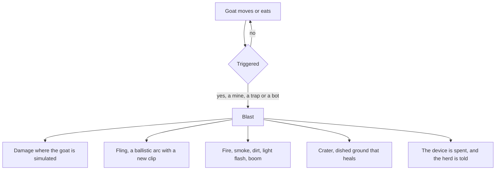
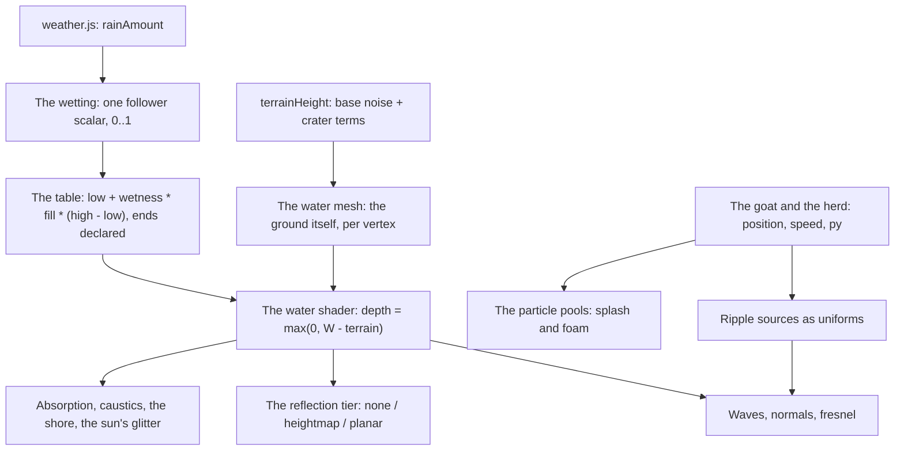

# Roadmap & Wishlist

Planned work for the goat sandbox, roughly in dependency order. This is the
wishlist plus the technical path for each item; milestones are checked off as
they land.

Guiding principles:

- **Gameplay lives in JavaScript.** The scene, rules and stats stay in
  `crates/goats/src/game/`; engine work is limited to small, generic additions
  like a few 3D primitives and shader plumbing.
- **Blender is the source of truth for the goat.** New poses are authored as
  clips in `goat.blend` and re-exported, exactly like walk / trot / run / jump.
- **Verify numerically.** Every animation is checked for ground contact, IK
  soundness and loop closure, and every state machine change gets a case in the
  scene harness (`crates/harness/tests/`, `tools/goat_logic_test.js` before M15).

Effort is a rough size: **S** ≈ an afternoon, **M** ≈ a few days, **L** ≈ a week
or more.

---

## What is possible today vs. what needs engine work

The `rl` surface currently exposes window/frame control, 2D text and shapes
(`drawRectangle`, `drawCircle`, `drawLine`, `drawPixel`), 3D cubes and grid,
models with skins and animations, textures, audio, and input. That already
covers more than it first appears:

| Capability | Today? | How / why not |
| --- | --- | --- |
| Recolor the sky, dim the scene | ✅ | lerp `clearBackground`; `drawModelEx` `tint` multiplies albedo |
| Soft blob shadow under the goat | ✅ approx | flattened dark `drawCube`, no shadow map needed |
| Stars | ✅ approx | a few hundred tiny `drawCube`s on a celestial sphere |
| Sun / moon | ✅ | two spheres (`makeModel`) on the light's own line, 600 units out, shaded by a small program of their own (M2b) |
| Rain streaks | ✅ (2D) | `drawLine` overlay angled to match the wind |
| Grass sway / wind | ✅ | offset the existing tuft cubes with a wind field |
| HUD bars, clock, icons | ✅ | `drawRectangle` + `drawText` |
| New states + clips (sleep, dead) | ✅ | same Blender → GLB → `updateModelAnimation` pipeline |
| X-eyes / closed eyes | ✅ | real eyelids (`LidL`/`LidR`) for sleep; X-eye sprite for death |
| Weather and night ambience audio | ✅ | `loadSound` / `playSound` / `setSoundVolume` |
| Real directional lighting | ✅ | custom lit shader (M4) |
| Cast shadows (shadow map) | ✅ approx | planar projection (M4); a depth map is M4b |
| Camera-facing billboards | ✅ | `drawBillboard` / `drawBillboardRec` (M0) |
| 3D rain drops / splashes | ✅ | `drawLine3D` / `drawPoint3D` (M0) |
| Read a bone's world transform | ✅ | `modelBonePosition` / `modelBoneTransform` (M0) |
| Photoreal / volumetric clouds | ✅ approx | raymarched slab, self-shadowed, with a phase function (M5b); not full radiative transfer |
| Text input (character entry) | ❌ | the surface has `isKeyPressed` but no `getCharPressed` (M9) |
| Voice playback | ✅ Rust-side | the `rl` surface has no audio streams, but `raylib_sys` exposes them and the client already links raylib, so Rust plays into a stream directly (M13a) |
| Networking | Host only | the JS engine has no sockets; `iroh` lives in the Rust host and reaches the scene over the command bridge (M10) |
| Mod support | ✅ | `crates/mods/` loads a `mods/` directory into a versioned `goats` hook API; world mods are hashed into the join handshake (M14, see `APIv1.md`) |
| Fire / smoke flipbooks | ✅ | `drawBillboardRec` takes a source rectangle, which *is* a flipbook frame; a Blender atlas is a PNG in the asset table like the goat's GLB (M19) |
| A scorch decal on the ground, additive blending | ✅ | `drawQuad3D` lays a textured quad down on an explicit basis, and `beginBlendMode` carries raylib's whole mode set plus the factors its two custom modes blend with; `loadImage`/`imagePixel` read an artist's mask or height stamp (M19a, landed upstream) |

The practical consequence: **stats, sleep and death needed no engine work at all**,
and day/night plus a first pass of weather needed only the M0 primitives. With M0
and the M4 shader bindings landed upstream, even the volumetric cloud shader
(M5b) needed no new bindings -- the M4 surface already carried everything it
uses.

---

## Milestones

| # | Milestone | Depends on | Size | Why this order |
| --- | --- | --- | --- | --- |
| **M0** | Engine primitives: 3D shapes, billboards | — | S–M | ✅ **Done** — landed upstream |
| **M1** | Stats, `sleeping`, `dead` states | — | M | ✅ **Done** |
| **M2** | Day/night cycle (approximate lighting) | M0 (sun/moon) | M | ✅ **Done** |
| **M3** | Weather phase 1: clouds, 2D rain, wind, audio | M0 | M | ✅ **Done** (audio in M3b) |
| **M3b** | Weather and goat audio | M3 | S | ✅ **Done** |
| **M4** | Shaders: real lighting + cast shadows | M0 | L | ✅ **Done** (incl. M4b shadow map) |
| **M5** | Weather phase 2: sky shader clouds | M4 | L | ✅ **Done** (2.5D shader) |
| **M5b** | Volumetric clouds: raymarched slab | M5 | M | ✅ **Done** (self-shadowed, phase function, cirrus) |
| **M6** | Weather affects gameplay | M3 | S | ✅ **Done** (rain slows, wet drains energy) |
| **M7** | Bot herd | M1, M4 | M | ✅ **Done** (collides, grazes, zoomies) |
| **M8** | Heightfield terrain + materials | M4 (lighting) | M | ✅ **Done** (engine `makeModel`) |
| **M9** | In-game console + character input | `getCharPressed` (upstream) | S–M | ✅ **Done** (engine binding + console; live keystroke check pending) |
| **M9b** | Console clipboard: paste a ticket | M9 | S | ✅ **Done** |
| **M10** | Networking foundation: workspace, proto/session/server, join by ticket | M9 | L | ✅ **Done** (the two-window session check still needs a display) |
| **M11** | Chat: global, DMs, system lines | M10 | S–M | ✅ **Done** |
| **M12** | World sync: seed handshake + goat snapshots | M10 | M–L | ✅ **Done** (players sync; server-owned bots/weather are M12b) |
| **M12b** | Server-owned world: headless `goatsd` scene, bots/weather/meadow authority | M12 | L | ✅ **Done** (the world is the server's; the players are the open axis) |
| **M13a** | Voice playback sink: a per-peer raylib stream from Rust | M12b | S | ✅ Available through `raylib_sys`; no engine binding needed |
| **M13b** | Voice: capture, VAD, Opus, media channel, playback | M13a | L | ✅ **Done** |
| **M13c** | Voice polish: jitter buffer, PLC, mute/volume, attenuation | M13b | M | Per-peer controls and the talking indicator |
| **M14a** | Tuning registry: lift the gameplay `const`s into `goats.tuning` | — | M | ✅ **Done** — the tree + `tuningGet/Set/Merge/Watch` live in `core.js`; herd size is now `TUNING.herd.count` |
| **M14b** | Mod loader: `mods/` discovery, manifest, host asset registry, console verbs | M9 | M | ✅ **Done** — the pure loader is `crates/mods/`; the host wiring and the scene part are in place |
| **M14c** | `goats` API v1: events, commands, accessors | M14a, M14b | L | ✅ **Done** — the hook surface; registries and asset slots split into M14c2 |
| **M14c2** | Content registries + mutable asset slots: `bots.register`, `clips.register`, `assets.override` | M14c | M | ✅ **Done** — declared assets apply automatically; clips are gait-only |
| **M14d** | World mods + net compatibility: seed streams, world extension, join handshake | M14c, M12b | M–L | ✅ **Done (handshake)** — the digest and refusal; the snapshot extension is M14d2 |
| **M14d2** | World-mod simulation: `goats.rng`, `world.extend`, snapshot merging, `goatsd` evaluates mods | M14d | M | ✅ **Done** — streams + extension state travel in the snapshot's `mods` field |
| **M14e** | Mods menu, sample mod, smoke test, CI | M14c | S–M | ✅ **Done** — session-only Mods screen, `mods/example/` fixture, the mod smoke test, CI syntax-check, a world-mod determinism test |
| **M14f** | Example: a full world mod, `birds` (own model, animations, flocking) | M14d2 | M | ✅ **Done** — procedural meshes + generated texture, five animation states, boids, synced through `world.extend`; the birds fixture test |
| **M14g** | Mod developer workflow: `--watch`, reload from disk, `.zip` mods | M14f | S–M | ✅ **Done** — a `notify` watcher, `Loader::reload`, and directory-or-zip mod sources |
| **M14h** | Example: a second sample mod, `fatguy` (his own model, and his bad luck) | M14f, M19 | S–M | ✅ **Done** — a `side: "client"` mod whose model rides in a slot of its own; contact with goats *and* the birds' flock through the new `goats.entities`, device trips through `goats.explosions`, and an aimed chain that lands him on the next device |
| **M15** | Rust harness: run the scene tests on Slag, drop Node | M12b, M14 | M–L | ✅ **Done** — 205 cases on the engine, and Node is gone from CI, `tools/` and the docs |
| **M16** | The world datagram: binary, quantized, bounded; world mods on their own | M12b, M15 | M–L | ✅ **Done** — binary and quantized, shed in a defined order, the mods on their own datagram, and a guard so the budget cannot erode again (M16c deferred on the numbers) |
| **M17** | Compiled mods: WebAssembly plugins, any language, capabilities by construction | M14g, M15 | M–L | ✅ **Done** — M17a (the ABI), M17b (the Rust host), M17c (the digest + determinism), M17c2 (the state surface) and M17d (the performance debt) all landed |
| **M18** | Mod sync: pull a host's mods before joining | M14d, M17 | M–L | ✅ **Done** — the fetch ALPN, the client's fetch/verify/install, the catalogue and the client wiring (consent, `--pull`, the one retry, and loading a mod that arrives after the freeze) |
| **M18e** | Mod sync polish: remembered consent, signed `ModRef`s, size caps | M18 | S–M | Not started — open questions 3, 5 and 6 of M18 |
| **M19** | Landmines and boobytraps: a blast, a crater, a flung goat | M12b, M14 | M–L | ✅ **Done** — M19a (the engine additions), M19b (the devices and the blasts), M19c (the flung goat, the herd that dies to it, and the device that moves house), M19d (the craters), M19e (the wire), M19f (the look: the flipbook atlases, the light flash, the camera knock, the `GoatFlung` clip and the `py` field that finally puts a mirrored leap where it belongs) and M19g (the per-slot pools, the trigger's click, and the `goats.explosions` surface) have landed. The layout is derived from the seed, so nothing new on the handshake |
| **M20** | Water: pools, waves and a reflected sky | M3 (rain), M4 (the lit program), M8 (the heightfield), M19d (the craters) | M–L | 🚧 **In progress** — M20a (the field: `water.js`, the priority-flood fill, `sceneWater()`, the two hooks and the console verbs), M20b (the surface and the level), M20c (the waves), M20d (the interactions: the wake, the splashes, the drag and the submerged grass), M20d′ (the feel, after the first play-through) and M20d″ (the table is the world's) have landed, with `water.rs` at 47 checks over eight cases and the rest of the suite green. What is left is M20e (the reflections) and M20f (the wire audit, the mod surface and the guards); **M20g (swimming, buoyancy and drinking) is the next planned step**, not a deferral. **Nothing on the wire**: the table's ends are declared, so the level is a stateless function of the seed's own rain, and the ground it pools on is derived |

---

## M0 — Engine prerequisites ✅ Done (landed upstream)

Small, generic additions to `crates/runtime/src/raylib.rs`, following the same
window-thread-guarded, arity-checked pattern as the existing bindings, each with
a case in the `rl` surface test. All of the following shipped:

**3D primitives** — for the sun, moon, stars, rain and the X-eyes:

| Binding | Arity | Use |
| --- | --- | --- |
| `drawSphere` | 5 | sun / moon |
| `drawSphereEx` | 7 | moons with rings, planets |
| `drawLine3D` | 7 | 3D rain streaks, X-eyes |
| `drawPoint3D` | 4 | stars, spray, dust motes |
| `drawTriangle3D` | 10 | lightning bolts, splash fans |

**Billboards** — for clouds and sprites that always face the camera:

| Binding | Arity | Use |
| --- | --- | --- |
| `drawBillboard` | 6 | cloud puffs, sun/moon glow |
| `drawBillboardRec` | 11 | sub-rect of a cloud atlas |

**Bone queries** — for effects that ride the skeleton:

| Binding | Arity | Use |
| --- | --- | --- |
| `modelBonePosition` | 2 | attach X-eyes / a "Zzz" sprite to the head bone |
| `modelBoneTransform` | 2 | position + orientation for the same |

**HUD polish**: `drawTextEx`, `drawRectangleLines`, `drawRectangleGradientV`,
`measureTextEx`.

Implementation notes:

- Billboards need a whole `Camera3D` while the surface only exposes the
  individual `beginMode3D` fields, so the binding caches the camera on
  `beginMode3D` and replays it.
- The bone queries read `currentPose` in **model space**. raylib zero-fills the
  runtime pose at load, so before the first `updateModelAnimation` they fall
  back to the bind pose.
- `measureTextEx` returns `{ x, y }`; the bone queries return objects too.

Verified: the surface test covers every new name, and throwaway probes rendered
each draw binding in a live window and dumped the goat's 13-bone skeleton
(rest head y = 1.160, posed head y = 1.080).

---

## M1 — Stats, sleeping, dead ✅ Done

The whole feature set here is JavaScript plus two Blender clips, so it shipped
before any engine work.

What landed: health/energy with the drain/recover table below, an explicit sleep
toggle (`Z`) plus auto-sleep when exhausted and idle, a recumbent `GoatSleep`
clip, a `GoatDeath` collapse that holds its final pose, and the eyes — the X-eye
billboards placed at eye points baked from the rig, plus (later, replacing the
closed-eye sprite) a real `LidL`/`LidR` eyelid pair that `GoatSleep` closes. The
dead state offers `R` to restart.

### Goat stats

```js
const stats = { health: 100, energy: 100 };   // both 0..100
```

Proposed starting numbers (tunable):

| Situation | Energy | Health |
| --- | --- | --- |
| Idle | −0.4 / s | +0.1 / s (only while energy > 20) |
| Walking | −1.0 / s | — |
| Trotting | −2.0 / s | — |
| Running | −4.0 / s | — |
| Jump (flat cost) | −2.0 | — |
| Sleeping | **+12 / s** | **+2 / s** |
| Exhausted (energy 0) | — | **−3 / s** |
| Night, below 0 °C (M2) | −1.0 / s faster | −0.5 / s |

Rules:

- Energy drains faster with speed, so running everywhere is unsustainable.
- At **energy 0** the goat is *exhausted*: capped at a walk and slowly losing
  health, which is the pressure that makes sleeping matter.
- **Sleeping** is the only fast recovery, and the only way to recover health
  meaningfully.
- At **health 0** the goat dies (see below).
- HUD: two bars plus a small clock (M2), built from `drawRectangle`/`drawText`.

### `sleeping` state + clip

Blender: a new `GoatSleep` clip — the goat lies down (root lowered, legs folded
under the body), the neck curls and the head tucks, with slow deep breathing and
the occasional ear or tail twitch. Author with the same 2-link leg IK used for
the gaits so the folded legs sit on the ground believably.

Eyes closed: **done with real eyelids.** A `LidL`/`LidR` bone pair, each with a
spherical-cap shell over its eye, was added by `tools/goat_eyelids.py`; closing
is −90°/+90° about the bone's hinge and `GoatSleep` keys them shut. The cheap
alternative (a second `goat_eyes_closed.glb` skinned to the head) was not needed.
Every clip keys the pair, open except `GoatSleep`, because raylib only resets a
bone that a clip animates.

JS:

- Enter sleep on a player key (only when grounded and not already dead), or
  automatically when energy hits 0.
- While sleeping the goat ignores movement input; the camera eases in a little.
- Wake on any movement key or when energy is full.
- HUD shows `Zzz` and the recovery rate.

Acceptance: energy visibly drains while running; auto-sleep triggers at 0;
sleeping restores energy and health; waking returns to idle.

### `dead` state + pose

Blender: a `GoatDeath` clip that collapses (the goat rolls onto its side, legs
splay, head goes back) and holds the final pose. A 1–1.5 s collapse followed by
a long hold is enough.

"X eyes": the goofy crossed-out eyes. Shipped as a **billboard sprite** at eye
points baked from the death pose — no new bindings, and it rides the head via
those baked positions. (The closed-eye sprite that used to sit alongside it is
gone now that the goats have real eyelids.) Alternatives if it ever needs to be
real geometry instead:

1. Bake the X into the main mesh on a separate material and hide/show it — needs
   material visibility, i.e. shaders. Defer.
2. Draw two `drawLine3D` Xs per eye from `modelBonePosition(head)` — tiny code,
   but needs the M0 bone query.

JS: health ≤ 0 → `dead`; controls disabled; HUD shows the cause; offer a
restart / respawn key. Decide whether death is permanent for the session.

Acceptance: draining health to 0 plays the collapse, holds the dead pose with X
eyes, ignores input, and can be restarted.

---

## M2 — Day/night cycle ✅ Done

Goal: a clock drives the sky, the light and the celestial bodies, and the world
looks meaningfully different at night.

What landed: an interpolated sky curve (colour + light factor by the hour)
drawn as a full-screen vertical gradient; a scene-wide ambient tint multiplied
into the model, terrain and fallback goat; a sun and moon arcing east to west on
a celestial sphere; a fixed star field that fades in at dusk; a cheap blob
shadow; and a night-drain hook (energy costs 1.6x in the cold). Hold `T` to
fast-forward the clock. The HUD shows the time of day.

- **Clock**: `world.time` in hours `[0, 24)`, advancing at a configurable rate
  (e.g. 1 game day = 6 real minutes). `rl.getTime()` already exists for the
  elapsed-time base.
- **Sky**: keyframe `clearBackground` through night → dawn → day → dusk,
  interpolating smoothly. A gradient can be faked once
  `drawRectangleGradientV` exists, or by drawing a tall 2D rect before 3D.
- **Approximate lighting**: tint the goat and terrain by the ambient colour
  (`drawModelEx` tint multiplies albedo; recolor the ground and tuft cubes).
  Cheap, and reads as "dimmer and bluer at night" without shaders.
- **Sun and moon**: two bodies on opposite ends of one line through the goat, whose
  direction is the *light's* -- the sun at `SUN_DIR`, the moon at its negation, 600
  units out. Both are `makeModel` spheres shaded by a small program of their own
  (M2b): the sun's disc is unshaded, and the moon is lit by the sun's direction, so
  it carries a phase that follows the real sun even at night, when the scene's own
  light has already gone to the moon. The sun carries glare with it: a tight
  billboard on the disc and a wide faint halo under that, both drawn additively,
  so they add light to the sky rather than greying it. A body below the horizon
  is not drawn (it fades out over the last few degrees), and the clouds pass *in
  front of* it: the sky is two layers -- the air, then the clouds alone -- with
  `drawCelestial` drawn between them, so a cloud that drifts over the sun takes it
  per pixel out of the sky's own march rather than the disc being painted on top of
  the cloud (M5b).
- **Stars**: a fixed field on the celestial sphere, faded in after dusk and out
  before dawn, drawn with `drawPoint3D`.
- **Blob shadow**: a flattened dark cube under the goat that shortens toward
  noon and disappears at night — cheap depth cue until M4.
- **Gameplay hooks** (optional, pairs with M1): colder at night drains energy
  faster; the goat prefers to sleep at night.

Acceptance: over one full cycle the sky colour and scene tint change smoothly,
the sun and moon arc across the sky, stars fade in and out, and the shadow
tracks the time of day.

---

## M3 — Weather phase 1 ✅ Done

Goal: believable clouds, rain and wind, with audio (see M3b).

Shipped in the scene (`crates/goats/src/game/`):

- **Weather state machine**: a seeded xorshift32 walks `clear → cloudy → rain →
  clearing` with per-state hold times, targets for cloudiness and rain, and a
  smooth ease toward the target so transitions cross-fade rather than pop.
  `C` forces the next state (handy for demos and the harness).
- **Clouds**: 46 procedural noise-puff billboards (`drawBillboard`, texture made
  once at startup from value noise) fill a wrapping 100-unit box around the goat,
  drift with the wind, and are tinted by the time of day. Cloud *cover* gates
  which puffs appear, so cover rises before rain. Overcast also lerps the sky
  gradient toward grey. This is lighter than the planned `sky.glb` dome and needed
  no new assets; the shader dome is deferred to M5.
- **Rain**: 160 screen-space streaks (`drawLine`) angled along the wind, count
  scaled by rain intensity. The pool size is the cost knob — 300 drops dropped the
  debug build to ~30 fps, so it sits at 160 (a full storm holds 59–60 fps in
  `--release`). 3D drops with splashes will use the M0 primitives if wanted.
- **Wind**: one global gusty vector (`WIND_BASE` 1.6 m/s plus noise) that drives
  cloud drift, rain angle and **grass sway** — each tuft cube leans on a sine
  scaled by the gust, with a second segment up close.

Acceptance met: weather transitions blend rather than pop; rain falls at the
wind angle; grass sways with gusts; audio tracks the intensity (M3b). Verified
code-side via the scene harness (`crates/harness/tests/scene_logic.rs`; the
clock, weather text and `C` are covered); visual look is **not** machine-verified.

### M3b — Weather and goat audio ✅ Done

Shipped with the `Music` bindings (streaming, native looping) and `Sound`
effects. A background track loops under everything at a low volume; the rain and
wind beds stream at a volume tied to the weather intensity; thunder plays on a
cooldown once the rain is heavy; and the goat bleats on jump, sleep, waking and
death, with a little random pitch so repeats differ. `M` mutes. All of it loads
from `sfx/` on disk and is skipped if a file is missing. MP3/OGG decoding was
enabled on raylib-sys for the compressed effects.

---

## M4 — Real lighting and shadows (shaders)

raylib's core has no light system, so this shipped a small lit shader and the
plumbing to drive it.

Bindings added upstream in `sdgoij/slag`:

| Binding | Purpose |
| --- | --- |
| `loadShaderFromMemory`, `isShaderValid`, `unloadShader` | compile and manage the GLSL |
| `getShaderLocation` | cache uniform locations |
| `beginShaderMode` / `endShaderMode` | bind the lit shader around immediate-mode draws |
| `setShaderValue`, `setShaderValueVector2/3/4`, `setShaderValueMatrix`, `setShaderValueTexture` | per-frame uniforms |
| `setModelShader` | point a model's materials at a shader (`DrawMesh` ignores `beginShaderMode`) |
| `setModelTexture` | point a material map at a texture (how the shadow map reaches a model draw) |
| `loadRenderTexture`, `isRenderTextureValid`, `unloadRenderTexture`, `beginTextureMode`, `endTextureMode`, `renderTextureSize`, `renderTextureColor`, `renderTextureDepth` | offscreen passes and shadow maps |

Shipped in the scene (`crates/goats/src/game/`):

- **Directional lighting.** A custom program lights the scene per fragment from a
  sun (or the moon after dusk) driven by the M2 clock, with a hemispheric ambient
  term so night is dim blue rather than black. The goat is routed through it with
  `setModelShader`; the terrain (immediate-mode cubes) goes through
  `beginShaderMode`. `L` toggles the whole thing; a missing-binding check falls
  back to the M2/M3 ambient-tint look.
- **CPU skinning needed no bone matrices.** raylib deforms positions *and*
  normals on the CPU in the default build and uploads them, so the lit shader works
  on the animated goat with plain `vertexPosition`/`vertexNormal` — the roadmap's
  bone-matrix risk did not materialise. (The client has since moved to a
  `gpu-skinning` build, where each of these three shaders has a skinned twin: see
  “The engine took the frame-cost profile”, item 22 below.)
- **Cast shadows.** A depth pass renders the goat from the light's point of view
  into a render texture, and the lit shader compares depths with a 3x3 PCF
  kernel, so the goat self-shadows and the terrain takes a perspective-correct
  shadow. Depth is packed across RGB and stored as `1 - depth`. `K` cycles the
  shadow map, a planar fallback and off.

Acceptance: the goat and terrain are lit by the sun/moon and the goat casts a
shadow that tracks the day/night cycle. Code-side this is verified (three
shaders compile, no GL/JS errors, 59–60 fps in release by day and night); the
*look* and shadow correctness are not machine-verified.

### M4b — Shadow map ✅ Done

A depth-only pass with `lightVP` (a JS-built orthographic light matrix passed
via `setShaderValueMatrix`), sampled in the lit program with a 3x3 PCF blur.
Two raylib details shaped it: a render texture's depth attachment is a
renderbuffer (not samplable), so depth is packed into the colour attachment's
RGB; and `DrawMesh` binds a model's material maps over any unit
`setShaderValueTexture` picks, so the shadow map rides in material map 1 via
`setModelTexture` for the model, while the terrain (batch path) uses
`setShaderValueTexture`.

What it adds over the planar fallback: self-shadowing (the goat's legs and head
on its body) and a correct shadow on any non-flat receiver. The grass inside the
light's box casts into the same pass (the batch path, like the terrain, drawn
before the goat), so nearby tufts ground the goat in the field; tufts outside the
box are culled because they cannot project into the map. The field is generated
per 2-unit cell from a hash of the cell around the goat, so it is effectively
infinite and never leaves bare ground behind. Limits: a single 1024² map
covering a 14-unit box, so the shadow softens at distance and clips when the
goat leaves the box.

---

## M5 — Weather phase 2: procedural sky ✅ Done (2.5D)

The cloud layer is now a full-screen sky shader rather than billboards.
Per pixel it rebuilds the camera ray from the camera basis, draws the
hour-of-day gradient, and samples animated value-noise fBm on a flat cloud layer
at `CLOUD_HEIGHT`; the ray-to-plane projection is what compresses the clouds
toward the horizon (the parallax). Clouds are shaded by comparing the density
against a sample taken toward the sun, so they brighten on the sun's side and
pick up its dawn/dusk colour, and they dim and grey with night and overcast.
`B` falls back to the M2 gradient and the noise-puff billboards.

Cost is a 4-octave fBm, twice per sky pixel (the second sample is the sun-side
lighting term). Release holds 60 fps in daylight and 56–58 in the worst case
(night, stars, heavy rain); the earlier billboards were a little cheaper but much
less convincing.

**Deferred:** true volumetrics (raymarching a participating medium). The roadmap
flagged this as a research stretch; the 2.5D shader is the realistic target and
is what shipped. (Overtaken by M5b, below.)

---

## M5b — Volumetric clouds ✅ Done

The flat layer was replaced by a marched slab, which is what turns the clouds
from a moving texture into a volume:

- **Shape.** `cloudDensity` fBm-domain-warps the 2D field (`fbm2(q + warp*0.75)`)
  and shears it with height, so the billows are billows rather than an extrusion,
  and the layer parallaxes correctly. A soft base and a rounded top come from an
  analytic height profile; the coverage threshold falls as `cloudiness` rises, so
  the sky goes from a few puffs to solid overcast; high-frequency erosion (only
  evaluated near a surface, where it reads) frays the edges.
- **Light.** Each sample marches three steps toward the sun with a cheaper
  two-octave density, giving real self-shadowing -- dark bases, lit tops. A
  Henyey-Greenstein phase function adds the forward-scattering rim on the sun's
  side, and a Beer-Powder term keeps dense interiors from glowing. Transmittance
  is Beer-Lambert, composited front to back.
- **Depth.** A thin, wind-sheared cirrus layer sits above the cumulus, and
  distance haze blends far cloud into the horizon colour instead of aliasing.
- **Anti-aliasing.** The steps grow exponentially with distance (`growth` up to
  1.4), so samples stay dense near the camera and stretch where a cloud covers
  fewer pixels, and the high-frequency erosion fades out with distance. There is
  deliberately *no* per-pixel jitter on the march start: randomising the offset
  per pixel is itself what reads as pixelated noise.
- **Bodies.** The sun and moon are *not* drawn here, and M2b turned that into the
  layering: this pass is drawn as two -- the air and the cirrus, then the clouds
  alone -- with `drawCelestial` between them. The cloud pass returns premultiplied
  light and the transmittance it leaves, and is blended ONE /
  ONE-MINUS-SRC-ALPHA, which is what lets it attenuate the bodies under it instead
  of covering them with a second helping of sky: a cloud that drifts over the sun
  takes it, per pixel, out of the march the sky already does. `SKY_LAYER_*`
  (sky.js) names the two passes, and the single pass for a build without the blend
  mode. What the shader adds around the disc is the wide atmospheric glow, and it
  stays in the air pass, where it belongs -- a disc in the shader would double it.
  is up.
- **Atmosphere.** The gradient gained a forward-scattered glow that widens as the
  sun approaches the horizon, the sun/moon disc, and a horizon haze band.

Cost is step-count bound, so it is a setting: **Clouds — Low / Medium / High**
(6 / 12 / 22 march steps). At 2560x1440 release sits at the 60 fps cap on Low
and Medium; High read ~55, which is inside run-to-run noise (the billboard
fallback read 55 in the same run), so the knob is there for weaker GPUs rather
than for the default.

Verified numerically rather than by eye: the shader compiles, the harness asserts
the march is what gets installed (and that no disc has crept back in), and frame
statistics behave -- overcast is flatter than broken cloud (luma sd 0.090 vs
0.121), dusk dim with a still-lit sky band, and night dark with no glow. The
aliasing fix was measured the same way: mean high-frequency energy in the sky
band fell 74-97% horizontally across the three quality levels, which pins the
speckle on the march rather than on the noise field. Whether it *looks* right is
still an eyeball call.

**Still a stretch:** true radiative transfer (raymarching the atmosphere proper,
multiple scattering).

### Investigated: temporal reprojection (not shipped)

Temporal accumulation is the textbook way to trade march quality for frame
history: render the sky into one of two ping-pong targets, reproject the previous
frame through the previous camera basis, blend, and let a *per-frame* jitter
(rather than a per-pixel one) resolve the stepping.

It was implemented, measured, and **deliberately reverted**. Two findings:

- **It no longer solves the problem it exists for.** With the deterministic march
  (exponential stepping, no per-pixel jitter) the static image already measures
  0.00032 mean high-frequency energy in the sky band at Medium -- lower than the
  pre-alias-fix High (0.00321). An accumulator needs a per-frame jitter to have
  anything to average, and reintroducing it *raises* static noise to 0.00082
  while costing ~10% of the frame (60 -> 54 fps at 2560x1440): nothing to gain,
  measurable loss.
- **It cannot be done correctly on the current engine surface.** The history
  sampler costs a texture unit, and raylib's batch system has only
  `RL_DEFAULT_BATCH_MAX_TEXTURE_UNITS = 4`. `rlSetUniformSampler` *silently does
  nothing* once they are full, so the sky's two samplers (history + present)
  starve the lit shader's bindings: the terrain's albedo sampler ends up reading
  the sky target, darkening the whole ground by a uniform ~9% (ground luma 0.611
  -> 0.554 with the camera frozen, and unchanged by turning shadows off, which
  is what fingered the albedo sampler rather than the shadow one).

What would unblock it:

1. **Do not sample through `setShaderValueTexture`.** The engine's `drawTexture`
   blits a render texture through raylib's normal batch path, so drawing the
   history as the quad and sampling `texture0` should cost no registry slot.
   That is the route to try first, and needs no engine change.
2. **A per-pixel reprojection depth.** Carrying it in the target's alpha does not
   survive raylib's alpha-blended 2D drawing; it needs `BLEND_ALPHA_PREMULTIPLY`
   (or no blending) exposed, or a second target. M19a put the whole blend mode set in
   the surface, so the first of those is now available. Failing that, the slab
   geometry (`(cloudBase - camY) / dir.y`) is a serviceable depth proxy.

---

## M6 — Weather affects gameplay ✅ Done

Being wet and cold is now a resource cost, which ties the weather to the M1
stats:

- **Rain and wind slow the goat**: up to `RAIN_SLOW` (28%) plus `WIND_SLOW` (7%)
at full rain, applied to every gait and to the jump take-off speed.
- **Being soaked drains energy faster**: up to +65% (`WET_DRAIN`) plus wind, on
top of the existing night penalty.
- Both are gated on `rainAmount`, so `clear` stays exactly neutral — which also
  keeps the gait-speed assertions in the harness exact.

The HUD weather line reports the current slowdown, and the harness checks that a
deterministically-rainy frame walks slower than a dry one.

---

## M7 — Bot herd ✅ Done

Six autonomous goats wander the world around the player. Each has its own
procedural mottled fleece (a JS-built texture, so no new assets), its own body
scale, and its own temperament (`bold` biases how fast it moves, `lazy` how often
it stops). A small state machine picks between grazing, strolling, trotting, the
occasional sprint and the odd doze, steering to a wander target and turning back
toward the player once it drifts past a comfortable radius. A run is a "zoomies"
burst: the bot hops every second or so, which reads as a young goat tearing
about. Goats also collide — every pair is pushed apart (bots yield fully to the
player, and split the push with each other), so nothing can walk through
anything else.

Each bot owns a model handle rather than sharing one, which the CPU-skinning build
this started on forced: `updateModelAnimation` writes the deformed vertices into the
model's own meshes, so two goats can only hold different poses if they have
different models. (A `gpu-skinning` build lifts that -- the pose is bone matrices,
and one model can serve the whole herd as long as each instance is updated
immediately before it is drawn -- but the scene still loads one per bot for now:
sharing them would save the extra mesh copies and their load time, not frame time.)
Bots inside the shadow map's box are drawn into the depth pass
and cast real shadows; the rest get a small contact blob so distant goats stay
grounded. The bots use a private PRNG, so they cannot shift the seeded weather
stream the harness asserts on.

Cost: seven models loaded and skinned twice per frame in the worst case. Release
holds 59–60 fps; debug drops to ~38-43 (the flattened bot AI also keeps the debug
stack guard happy). The harness asserts the herd loads, animates, never
overlaps, and jumps.

---

## Animation variants & the side-fall death ✅ Done

To give the herd some individuality:

- **Idle variants.** `GoatIdle2` is a grazing idle (head down, weight shifting),
  `GoatIdle3` an alert one (head up, big held looks left and right). The player
  advances its idle variant each time it settles back into idle; every bot
  cycles its own variant on each new action, so the herd shows all of them.
- **Sleep / jump variants.** `GoatSleep2` curls the head the other way with
  slower breathing; `GoatJump2` is a bigger bound -- deeper crouch, higher arc
  and a proper leg tuck at the apex.
- **Death falls onto its side.** `GoatDeath` now rolls about the forward axis
  until the goat is genuinely on its side (the old clip only slumped ~10°).
  Because the roll pivots on the goat's edge rather than its centreline, the clip
  emulates a ground-level pivot and then applies a per-frame ground correction
  (the leg IK depends on the root height, so one pass does not settle).

All authored in Blender by `tools/goat_states.py` (sleep/death) and
`tools/goat_variants.py` (idle/sleep/jump variants); the model now carries 11
clips, and a mismatch between the two scripts' grounding passes is why the death
clip needed a small residual (max ~0.18) to keep the lowest vertex on the ground.

---

## M8 — Heightfield terrain + materials ✅ Done

The ground is no longer a flat plane. It is a 3-octave value-noise field
(`terrainShape`) scaled by a ramp that keeps a bowl around the spawn level, so
the goat starts on flat grass and the relief eases in over `TERRAIN_RAMP` units.
`terrainHeight(x, z)` is the single source of truth for the ground: the goat, the
herd, the grass, the eyes and both shadows all read it.

**One mesh, not cubes.** A cube per cell was built first and reverted. On the
same probe at 2560x1440 it cost ~14 us per cube, so ~450 cells ran 41 fps
against 56 for the flat plane — a practical ceiling of ~100 cells, roughly a
tenth of what a good-looking heightfield needs. Immediate-mode triangles are no
better: `drawCube`/`drawTriangle3D` leave raylib's default normal `(0, 0, 1)` and
texcoord `(0, 0)`, so a triangle heightfield is lit as if every face pointed +Z
and cannot carry a world-mapped texture at all.

So the terrain is a 48x48-quad grid built through a new engine binding,
`rl.makeModel(vertices, indices, normals, colors, texcoords)`, which returns a
handle in the same registry as `loadModel` — so `drawModelEx`, `setModelShader`,
`setModelTexture` and `unloadModel` all apply unchanged, and the shadow map binds
through material map 1 exactly as the goat's does. The grid spans +/-48 units and
is rebuilt once the goat has moved `TERRAIN_SNAP` (24) units; between rebuilds
the whole terrain is a single `drawModelEx`.

**Materials without a splat map.** Per-vertex colours carry the material —
grass / dark grass / sand / mud / rock, picked from height, slope and a
patchiness noise — and a tiling procedural detail texture supplies the grain. The
lit shader already computes `texture0 * colDiffuse * fragColor`, so this needed no
shader change and no extra texture units, which matters here: the batch has a
4-unit budget and `rlSetUniformSampler` silently no-ops once it is full (see
M5b). Adjacent cells interpolate, so material boundaries come out as gradients.

**Cost.** The mesh is free — one draw, 4608 triangles, 55-58 fps at 1440p
against 56-59 for the flat plane, i.e. within noise. The cost was the per-cell
noise: `drawTufts` samples the field ~500 times a frame, measured at ~2 ms/frame.
A per-cell height cache (`TERRAIN_CELL_H`, keyed like the grass's eaten-cell map
and cleared past 32k entries) removes it. The rebuild resamples the whole
2401-vertex grid — at the ~4 us per field sample that 2 ms implies, roughly
13 ms, so it drops one frame every `TERRAIN_SNAP` units of travel, felt only at a
run.

**Verified numerically, not by eye.** The harness gained seven checks: the field
is not flat, the spawn bowl is level, the mesh is one grid with per-vertex normals
/ colours / UVs and a varying height, it carries at least four distinct materials,
and both the goat and every bot are drawn exactly at `terrainHeight` under them.
Two rendered frames
were decoded to confirm the ground region is green-dominant with 0% sky pixels
(so it is neither culled nor missing), and that the detail texture is sampled at
all: replacing it with white raised the ground's mean luma 104.6 -> 119.5 at the
same time of day, which is the texture's own mean. (Comparing frames from
different times of day instead showed a similar shift from the rising sun alone,
which is a reminder to A/B within one scripted run.)

**Deferred.** Water (the field has hollows but no lakes or streams); per-material
textures (needs a splat map and a careful look at the texture-unit budget); and
drawing the terrain into the depth pass so hills cast onto each other — the
normals already shade slopes, and terrain self-shadowing brings acne that only a
screenshot review could judge.

---

## M9 — In-game console + character input

✅ **Done.** The console is the input substrate for chat and a dev tool in its
own right, so it landed before any networking. It was one new JS part plus two
small engine bindings; no workspace change was needed — the repository only
splits into `crates/` when M10 starts.

### Engine prerequisite (upstream Slag)

One addition to `crates/runtime/src/raylib.rs`, arity-checked like the rest, with
a case in the `rl` surface test:

| Binding | Arity | Use |
| --- | --- | --- |
| `getCharPressed` | 0 | one UTF-32 codepoint per queued key press, `0` when drained — read in a loop until it returns 0 |
| `guiTextBox` (optional) | 6 | raygui-owned single-line fields; not needed for the console, only if the username/ticket dialogs (M10) want one |

### JS plumbing

A new part, `crates/goats/src/game/console.js`, appended after `menu.js` (part
13/13), plus one line in the crate host's `concat!` — which also updates the
part list in `core.js`'s header comment and the README Layout row (`12 parts`
→ `13`).

- **`consoleOpen` is an overlay flag, not a `uiScreen` value.** Menus freeze the
  world (`dt` is forced to 0 while one is open); the console must *not* pause,
  especially once multiplayer lands. It draws over the HUD and the game keeps
  running behind it.
- **Suppress gameplay input while open.** Both existing gates — `ctlKeyDown`
  (ctl.js: movement, the arrow-orbit keys, `T`) and `press` (menu.js: `P`, `C`,
  `L`, `K`, `M`, `F11`, `B`, `R`, `Z`, `E`, `Space`) — become
  `uiScreen === "hud" && !consoleOpen && ...`. The inline mouse-wheel zoom check
  in `goat.js` needs the same guard, and the `Escape` menu toggle must defer to
  the console while it is open (close the console, not open the menu).
- **Keys.** Backquote (`` ` ``, `KEY_GRAVE` = 96) toggles; `Enter` submits;
  `Backspace` edits the line; `Up`/`Down` walk the history.
- **Submit routes through the existing `sceneCommand` dispatcher**, so every verb
  that already exists (`settings`, `time`, `bots`, `weather`, `spawn` …) works in
  the console for free, and its `ok`/`error` reply is echoed into the scrollback.
- **Two output streams.** A scrollback ring buffer (~200 lines) that keeps local
  command replies visually distinct from network/system lines (`<name> text`), so
  M10/M11 can push the latter without a second buffer.
- **A host→scene entry point** — `sceneNetEvent(line)`, resolved by the host
  exactly like the other `scene*` functions — so Rust can print into the console
  without evaluating a fresh script. If an older engine build lacks the hook the
  scene degrades to no console output rather than throwing (the same pattern as
  the shader fallbacks).
- `drawConsole` is an overlay built from existing bindings
  (`drawRectangle`/`drawText`), independent of `uiScreen`.

### Harness

The driver already scripts input by filling the `keys`/`pressed` maps per frame,
so the console slots straight in:

- add `KEY_GRAVE: 96`, `KEY_BACKSPACE: 259`, `KEY_ENTER: 257` to the constants
  and a scriptable `rl.getCharPressed` queue;
- cases: open, type `ping`, submit (assert `ok pong` reaches the scrollback); a
  held `W` must not move the goat while the console is open; `Up` recalls the
  last command; `Escape` closes the console instead of opening the menu.

Acceptance: backquote opens and closes; every printable key lands in the line;
`Enter` runs the command and echoes `ok`/`error`; no gameplay binding fires
while it is open; the harness covers open, type, submit, history and
suppression.

**What landed.** `getCharPressed` and `KEY_GRAVE` (96) added to the engine's
raylib surface (upstream Slag; exercised locally through the `./slag` path
dependency, which must not be committed). `crates/goats/src/game/console.js` as
part 13/13, which renumbered the other twelve headers. The console gate in
`ctlKeyDown` and
`press`; Escape precedence and the mouse-wheel guard in the frame loop; a
`console` verb on the dispatcher (`open` / `close` / `toggle` / `say`, plus a
query returning the input, caret, history and scrollback); and the README and
keymap rows. One detail worth keeping: raylib queues a character for every
printable key whether or not it is read, so the toggle drains that backlog —
otherwise the console would open full of the `wasd` typed while playing.

**Verified.** The engine surface test passes
(`cargo test -p runtime --features raylib,raygui installs_the_rl_surface`), the
game builds against the local checkout, and the harness gained eleven checks —
open, type `ping`, submit, `ok pong` in the scrollback, history recall, Escape
closing the console without opening the menu, reopen, and the goat moving while
closed but frozen while open — taking it to 88 passing checks.
**Not verified here:** an actual keystroke in a live window (this environment has
no display), which is the one check left for a machine with a GPU.

---

## M9b — Console clipboard (paste a ticket)

A ticket is forty-odd characters of base32, and asking a person to type one is
asking for a typo. So the console reads the clipboard on Ctrl+V; `copy` with no
argument puts the ticket you were given back onto it; Ctrl+C copies the current
line.

Two more engine bindings carry it: `getClipboardText` and `setClipboardText`,
which are raylib's own clipboard. Without them the console says the binding is
missing rather than silently doing nothing. The paste path drops control
characters -- a ticket copied out of a terminal arrives with a newline -- and
respects the input's length limit, so a stray paste cannot overflow the field.

Verified: the harness sets a stub clipboard, presses Ctrl+V and Ctrl+C on
scripted frames, and checks the pasted line plus both writes back (five checks),
taking it to 105. The rl surface test covers the two new bindings.

**Pending:** nothing. The bindings landed upstream (Slag `d8dd8c4`, an ancestor
of the revision `Cargo.lock` pins), so the clipboard works in a normal build.

---

## M10 — Networking foundation: workspace, iroh, join by ticket

All of it moves to Rust, because the JS engine has no sockets: the scene never
touches the network, it only emits intents and consumes events.

**Landed.** The workspace (`crates/goats`, `proto`, `session`, `server`), the
`proto` wire types and framing, the iroh transport carrying the join handshake
and the roster, the host bridge, the `goatsd` binary and the username prompt. A
tokio thread owns the session; the frame loop feeds the scene its events with
`sceneNetEvent` and takes the scene's queued intents back with `sceneNetDrain`,
never awaiting. The host assigns and de-dupes the name, answers `Welcome` with
the canonical name and the current roster, and broadcasts `Roster` on every join
and leave. Headless tests drive real loopback endpoints for the session and the
scene end of the bridge, so none of it needs a network or a display.

The one check left is a real two-window session on a machine with a display: run
the client twice, `host` in one and `connect <ticket>` in the other.

**Repository.** Convert to a Cargo workspace, mirroring Slag's layout:

```
crates/goats     client + the JS scene (moved from src/)
crates/proto     serde message types; no iroh/tokio; testable in isolation
crates/session   session/server logic on tokio + iroh; no window
crates/server    bin `goatsd`: session + a headless frame loop
```

**Transport.** `iroh`, pinned exactly (1.2.0 at the time of writing). One ALPN
per major protocol version (`goats/1`) so a mismatched build fails cleanly
instead of deserialising garbage. Joining is copy-pasting an `iroh-tickets`
ticket. Reach is `presets::N0` — n0's public relays plus DNS lookup — so a
ticket dials across networks. It was opt-in behind `GOATS_INTERNET=1` for a
while; that was dropped, because an env var is not a setting a player has, and
the LAN-only default left a pasted ticket unable to reach anything off the LAN.
Self-hosting `iroh-relay` remains a later option (see the open questions).
`bevy_iroh` is worth **trialling** and pinning — it advertises replication,
rooms, presence and voice, which is exactly the shape we want — but it is
Bevy-shaped and days old, so plain `iroh` plus our own `session` layer is the
fallback, not a rewrite.

**Host bridge.** A Tokio runtime on its own thread owns the `Endpoint`; the
synchronous frame loop drains an `mpsc` at frame boundaries and **never awaits**,
so the render loop cannot stall. Rust→JS is `sceneNetEvent(line)`; JS→Rust is one
more host callback. Keeping it line/JSON matches the existing command channel and
stays stubbable by the harness.

**Client-as-host.** A client hosting a game is just an endpoint that accepts the
same ALPN and runs `session` in-process, so "Host" and "Join" share one code
path. Host quitting ends the session (no migration).

**The headless server runs the same JS.** `goatsd` will evaluate the identical
scene against a **null `rl` host module** — no window, no GL — the trick
the scene harness (`crates/harness`, `tools/goat_logic_test.js` before M15)
already proves works: terrain, weather, bots and food
simulate with every draw/audio call no-op'd, while `rl.color` and the
model/texture builders return usable handles. That keeps one world model instead
of a Rust re-implementation, and means the server needs no GPU. Watch the one
binding the sim genuinely needs: `getFrameTime`, which the server replaces with a
fixed timestep.

**Deferred, deliberately.** `goatsd` is a lobby for now. Relaying presence does
not need the simulation, and there is no consumer for a headless world until
world sync (M12) exists to send it, so the null-`rl` scene is where M12 starts
rather than something to build against nothing.

**Protocol basics.** A version/`hello` handshake, the username prompt (server
owns the canonical name), a roster, and input validation — message-size caps and
finite positions, since a `NaN` leaked into an interpolated transform poisons the
render.

Acceptance: two clients and one `goatsd` can each host or join by ticket; the
roster shows names; the console prints join/leave; `proto` round-trips and the
`session` state machine are covered by headless tests (iroh's `test-utils` /
loopback endpoints need no real network).

---

## M11 — Chat

Cheap once M10's channel exists, and it exercises it in both directions.

**Landed.** `ClientMessage::Chat` and the server's `Chat`/`Joined`/`Left`/
`Notice` replies carry chat over the existing per-message stream, and the server
ows routing: a bare line goes to everyone (the sender included), a leading
`@name` goes only to that player (and the host, when the host is the sender or
the target), and an unknown name comes back as a `Notice`. The sender reaches
the session through `Host::say` / `Client::say`, queued from the scene as a
`Say` intent, so the frame loop still never awaits. The console handles the
typing: bare text is chat in a session, `@name text` / `say` / `msg <name>
<text>` are the DM spellings, a leading `/` is stripped so `/who` is `who`, and
an empty command reply prints nothing so a queued chat line is silent. Names
are canonical on the server, chat is sanitised and capped at 512 bytes, and a
burst of 5 lines per 3s per player is the rate limit.

**Verified.** `cargo test --workspace` (the loopback bridge test now carries a
global line and a whisper end to end), the scene suite (then the Node harness,
113 checks -- the console's chat and command routing among them; now
`crates/harness/tests/scene_logic.rs`) and clippy. The live
two-window check also passed: two clients, one hosting, and global chat and a
whisper both arrived in the other window.

- Global: bare text broadcasts.
- 1:1: a **leading** `@name text` is a DM, with `/msg name text` as the
  unambiguous form. Deliberately not parsing `@` mid-message, so a sentence that
  merely mentions a name does not leak as a DM.
- Commands: `who`, `help`; system lines for join/leave. `/nick` (renaming)
  is not implemented yet — names are fixed for the life of the session.
- Names are not unique, so the server assigns the canonical one: cap the length,
  strip control characters/ANSI, de-duplicate (`Bob`, then `Bob #2`).
- DMs are filtered by the server, not broadcast.
- Rate-limit and cap message length; unbounded chat is a trivial DoS and a
  bandwidth sink.

---

## M12 — World sync

- **The world is shared by seed.** Terrain, grass and the initial layout are pure
  functions of position, and the assets are embedded and identical, so the host
  sends a session seed at join and every client generates the same world — no
  asset transfer and, more importantly, only goats need syncing.
- The current seeds are hardcoded constants (`botRngState`, `audioSeed`, the
  weather `rnd()` stream); they become a session seed. Note this touches the
  harness, which asserts the exact weather a seeded stream produces.
- **Authority.** Player goats are client-authoritative and relayed by the host —
  simple and low-latency, trusting clients, which is the right call for a
  sandbox. Bots and weather are server-owned: bots collide with players, so they
  diverge the moment anyone interacts.
- **Transport.** Unreliable datagrams at ~15–20 Hz carrying
  `(id, x, z, yaw, mode, phase, speed, name)`; remote goats interpolate ~100 ms
  behind. Reliable streams carry join/roster/chat only.
- **Deferred:** client-side prediction/reconciliation, server-authoritative
  movement and lag compensation. Also settle `P` (pauses locally today) and the
  death/restart flow, both of which must become server-owned or be disabled.

**Landed (player sync).** The wire version is 2 (M12b raises it to 3, when the
datagram channel gains a tag). `Welcome` carries the session
seed, which the host mixes from the clock at `host` and both ends hand to the
scene as the first event; `sceneUseSeed` derives the weather, bot, food and
audio xorshift streams from it with one draw each. Offline the streams keep
their old constants, so the harness is untouched. `PeerState`/`PeerFrame` and a
`Gait` enum carry the transforms, and both the host and each client publish
their own goat every third frame (~20 Hz) on QUIC datagrams, which the server
relays tagged with the sender's canonical name — a client sends the state alone,
so it cannot move someone else's goat. Non-finite states are dropped rather than
relayed. The scene keeps one goat model per peer (the same per-goat ownership
the bots use), eases position, yaw and phase toward the newest snapshot on the
short way around, and drops the model when the peer leaves.

**Follow-on.** At this point the bots and the weather were still simulated on
every client, so once two players interacted with a bot the goats drifted. That
is what M12b addresses for the bots.

**Verified.** `cargo test --workspace` (proto 12, session 7 — the new relay test
sends real datagrams through a real host — goats 4), the scene suite (then the
Node harness at ALL PASS, 120 checks -- the seed, pose-cadence and peer checks;
now `crates/harness/tests/scene_logic.rs`), `cargo fmt
--all -- --check` and `cargo clippy --workspace --all-targets -- -D warnings`
clean. The visual check — two windows, each seeing the other's goat move — still
needs a display.

---

## M12b — Server-owned world

**Landed.** The wire version is 3: a `Datagram` enum now tags the transform
channel, because it carries two kinds of traffic. `BotState` and `WorldState`
carry the server's bots, and `Host::publish_world` broadcasts them about 10 times
a second; the client's datagram reader emits `Event::World`. A client mirrors
what it receives and does not run the bot AI at all (`netWorldLocal` gates
`updateBots`), while the host — the game window that ran `host`, or `goatsd` —
simulates the herd and publishes it. The relay accepts only `Datagram::Peer` from
a client, so a client cannot move the bots.

The sky followed the bots, on the same snapshot. `WeatherState` carries the
state the machine is in, the eased cloudiness and rain, the wind and the
day/night clock; the wire version is 4. The host runs `updateWeather`/
`updateWind`; a client takes the scalars (`applyWeatherState`) and still
recomputes its own goat's speed and drain every frame, because those depend on
its own belly. Clouds, rain particles and grass sway stay local and relative to
the viewer, which is why the wind reaches them but their positions do not cross
the wire; the rain keeps its own PRNG stream so a client, which never advances
`rngState`, still gets varied streaks without disturbing the seeded weather. `C`
and `T` are host-only now, since a client forcing either would just be
overwritten.

The headless half is `crates/server/src/headless.rs`: it evaluates the client's
exact scene parts, in the client's order, against a null `rl`
(`crates/server/src/headless_rl.js`) instead of installing raylib, then drives
`sceneFrame` at a fixed 1/60 and reads the world back as JSON. A test asserts the
server's part list matches `crates/goats/src/main.rs`, so the two cannot silently
diverge. `goatsd` seeds the sim from the session seed before `sceneInit`, so the
world is generated from it rather than adopted after the fact — which closes the
"the initial layout does not agree" gap the player-sync note left open. It
behaves like a server in the small ways as well: SIGINT stops it, and SIGTERM on
Unix, so Ctrl-C and `kill` work and the close is bounded so a quiet peer cannot
wedge the shutdown. Confirmed on the VPS.

**Landed (the meadow).** The world snapshot gained the PRNG streams and the
eaten cells, and joining now *replaces* a client's world rather than merging it
with the one it had generated before connecting. The streams the server sends
are its current values, not the seed it started from, so a stream a client still
draws from continues where the server is; the snapshot keeps re-adopting them,
so the two cannot drift. The meadow has to travel as state because the stream
only picks a regrow duration at eat time — which is also why a client *reports*
its bites (`ClientMessage::Consume`, its own rate limit) and the host's scene
records them, instead of the client counting its own meadow down: otherwise the
next snapshot would resurrect the tuft it just ate. Wire version 5.

**Still open.** The world is the server's now; the *players* are not. Player
goats remain client-authoritative, and the stats and the pause/death flow that
were built for single player (`stats.energy`, `satiety`, `P`, restart) are still
local, so they carry across a join and are not part of a session — open questions
9 and 13. That is also where the interaction latency lives: a remote goat eases
toward its newest snapshot and is never extrapolated, so it sits ~100 ms behind
and bumping or racing it feels soft, and the world snapshot's 10 Hz cadence
bounds how fast a bot's reaction or a fresh eaten patch shows. Both are the
accepted price of trusting the client for movement, and both are exactly what
prediction/reconciliation (question 9) would remove — deferred until it matters.
Separately, the scene does the full render-side work every step (all no-ops, but
real JavaScript): a release build keeps up with 60 Hz, a debug one does not, so
`goatsd` wants `--release`.

**Verified.** `cargo test --workspace` — proto 14, session 9, goats 4, server 2
plus 1 `#[ignore]`d (three fresh sims, each re-JITing the scene, is ~35 s) — the
harness at ALL PASS (128, including the host-publishes, client-mirrors, streams,
meadow and bite-report checks), `cargo fmt --all -- --check` and `cargo clippy
--workspace --all-targets -- -D warnings` clean. The live check passed too: a
real session syncs the world — a tuft eaten in one window disappeared in the
other, so the bite was reported, the host's scene recorded it, and the next
snapshot carried it across. Interaction works, with the latency above.

---

## M13 — Voice chat

Split into three: the sink, the feature, and the polish. No upstream engine work
is needed after all.

### M13a — Playback sink: `raylib_sys` from Rust (no engine binding)

The plan assumed `rl` would need new audio-stream bindings, but the client
already links raylib through the `raylib` feature, and `raylib_sys` exposes the
whole AudioStream API through bindgen — `LoadAudioStream`, `IsAudioStreamProcessed`,
`UpdateAudioStream`, `PlayAudioStream`, `IsAudioStreamPlaying`,
`SetAudioStreamVolume`, `UnloadAudioStream`. So the decoded PCM can go straight
into a per-peer raylib stream from Rust: it still passes through raylib's mixer
and the device the scene opens with `rl.initAudioDevice()`, with no new `rl`
surface and no upstream change.

One seam to respect: the scene owns the audio *settings*, so `M` and
`SETTINGS.sfx` have to reach Rust. The scene queues a small intent (`voice`
volume) and the module uses it as the master gain; distance attenuation needs
positions, which also live in the scene, so per-peer gain joins that intent in
M13c. Until then voice plays at the master level.

### M13b — Voice: capture, detection, codec, media channel, playback ✅ Done

- Capture: `cpal` in the client (the headless `goatsd` only relays), downmixed to
  mono and resampled to 48 kHz by a small linear resampler.
- Detection: there is **no push-to-talk key**. An energy gate with an adaptive
  noise floor, a 300 ms hold and a 40 ms pre-roll decides when a frame is speech,
  so idle room noise never leaves the machine and word onsets are not clipped.
  This is the hand-rolled version of what games usually do with WebRTC or Silero
  VAD; the gate is separated from the thread so it is unit-tested.
- Codec: `libopus_sys` with `bundled` (compiles libopus from source, no system
  dependency) behind a thin wrapper in `crates/goats/src/audio.rs`; ~24 kbps,
  20 ms frames (960 samples at 48 kHz mono).
- Transport: a `Voice` datagram beside the peer and world ones, tagged with the
  sender's name by the relay like a pose, with its own burst limit. It is the
  roadmap's generic "media" channel, so the transform channel does not change.
  Wire version 6: a version-5 relay does not know the variant, decodes it as an
  error and drops it, so the bump turns that silence into a failed handshake.
  JSON carries the frame, with the payload base64 (a ~60-byte packet, so the
  overhead is tolerable at ≤4 players); a binary envelope is a later optimisation,
  not a redesign.
- Playback: decoded PCM into one raylib `AudioStream` (M13a) whose callback
  drains a single mix queue, so every speaker shares a stream and raylib asks for
  exactly the frames it needs. raylib's per-stream API is a virtual double buffer
  that is easy to feed wrong -- a short write is zero-filled, and a feed loop can
  leave one half permanently empty -- so the callback, the API meant for
  generated audio, is used instead. The client names `raylib-sys` directly,
  because Slag does not re-export it.
- Mute: the scene's master mute reaches the module as a `voice_gain` intent and
  becomes the stream gain, so `M` silences voice along with everything else.

Verified: unit tests for the gate, the resampler, the mix and the gain intent;
the harness asserts that muting queues the intent; an `#[ignore]`d device test
drives the real mixer headlessly and asserts the callback drains the mix at the
device rate, and a second one checks the microphone itself is not delivering
digital silence (a muted device, the OS privacy switch and another application
holding it all look like that, and all of them read as "voice is broken" on the
far end); `cargo test --workspace`, `cargo fmt --all -- --check` and `cargo
clippy --workspace --all-targets -- -D warnings` clean. `GOATS_VOICE_LOOPBACK=1`
plays the microphone back through the whole chain on one machine, which tells a
one-window problem apart from a session one.

Confirmed live: two clients, one of them hosting, hear each other. Getting there
cost three playback fixes that this section now records -- gating on
`IsAudioStreamProcessed` dropped every packet that arrived while the mixer was
mid-block, writing short into a half-buffer zero-filled the rest of it, and the
double buffer itself resets to half 0 the moment both halves are free -- and the
last stretch of "still nothing" turned out to be the microphone, not the code:
Windows was handing the client digital silence, which the gate correctly refused
to send. That is why the mic check and loopback exist.

### M13c — Voice polish

Jitter buffer and Opus PLC for loss, per-peer mute/volume, distance attenuation
(positions are already exchanged, so it is nearly free), and a talking indicator
on the roster. Uplink is the limit: full mesh is ~24–32 kbps upstream *per peer*,
so it suits ≤4 players; beyond that the host should mix and relay.

---

## M14 — Modding support

Mod support lets players add code, content and tuning without forking the
game. The full contract is `APIv1.md`; this section is the milestone plan, the
decisions behind it and the constraints that shape it.

**Decisions (settled).**

- **Trust model:** mods are trusted code, but **`fs` stays off**. JavaScript
  never touches the filesystem; the Rust host discovers, reads and validates,
  and hands the scene opaque asset names. All I/O goes through Rust.
- **Format:** script mods against a versioned `goats` hook API (the `APIv1.md`
  design), not raw monkey-patching of scene internals. Data-only packs
  (assets + tuning, no `entry`) are the same format with no code.
- **Multiplayer:** world mods work in a session. `side: "world"` mods are a
  compatibility set, hashed and checked in the join handshake; `side:
  "client"` mods are local and unhashed.
- **Persistence:** none yet. Enablement is per session; a restart restores the
  `mods/` directory's default.
- **Asset replacement:** allowed, through logical asset slots the host
  resolves. A mod may point `model.goat` or `sfx.music` at its own file.

**Where it lives.**

| Piece | Path |
| --- | --- |
| The API + registries (new scene part) | `crates/goats/src/game/mods.js` |
| Loader: discovery, manifest validation, ordering, hashing, asset reads | `crates/mods/` (pure crate, no engine) |
| Loader wiring, asset registration, entry evaluation | `crates/goats/src/main.rs` |
| The same loader on the server | `crates/server/src/` (`goatsd --mods`) |
| `ModRef` and the join handshake | `crates/proto/src/lib.rs`, `crates/session/`, `net.js` |
| Mod console verbs + Mods screen | `crates/goats/src/game/ctl.js`, `menu.js` |
| Fixture and tests | `mods/example/`, `crates/harness/tests/mods.rs` |

**Phases.**

- **M14a — Tuning registry. ✅ Done.** Every gameplay constant moved into one
  mutable tree (`TUNING`, `core.js`) the scene reads directly, with
  `tuningGet`/`tuningSet`/`tuningMerge`/`tuningWatch` as the validated write
  path (a typo, a branch write or a non-finite number throws; bounded leaves
  clamp). Defaults are byte-for-byte the old constants, so the vanilla run is
  unchanged; `tools/goat_logic_test.js` gained six tuning cases (135 pass).
  Herd size is now `TUNING.herd.count`, written by the menu and the console
  through `tuningSet`, with a watcher that resizes the herd. This is the
  prerequisite for the loader's `tuning.json` and for `goats.tuning`.
- **M14b — Loader. ✅ Done.** The pure loader is its own crate,
  `crates/mods/`: it discovers mod directories, parses and validates `mod.json`
  (api major, id, side, size caps, no paths escaping the mod directory), orders
  them by id with a deterministic `loadAfter` topological sort (missing deps and
  cycles are warnings, not failures), reads entries/tuning/assets into memory,
  and computes the FNV-1a compatibility hash. It has no engine dependency, so it
  is unit-tested without a window (8 tests) and `goatsd` can reuse it in M14d.
  The client wires it up in `main.rs`: `--mods <dir>` / `$GOATS_MODS` / `mods/`
  next to the exe or in the CWD, `--no-mods`, assets leaked to `'static` and
  registered under opaque `mod:<id>:<slot>` names (no path ever reaches JS), the
  metadata table pushed with `sceneMods(json)`, each entry evaluated inside a
  scoped wrapper, then `goats.freeze()`. The scene part `mods.js` holds the
  table, the minimal `goats` lifecycle, and the `mod
  list|info|key|enable|disable|reload` verbs; the console queues host intents
  and the frame loop drains them with `sceneModDrain()`, so enable/disable/reload
  genuinely re-read and re-evaluate. Events, commands, registries and the
  accessors are M14c.
- **M14c — `goats` API v1 (the hook surface). ✅ Done.** The per-mod wrapper and
  reload lifecycle; `goats.on` for the whole event set (`load ready update
  draw3d hud draw command weather mode spawn despawn session world tuning
  shutdown`), fired from the frame loop and the simulation; `goats.command`
  registration plus `command` observers (built-ins always win, reserved names
  refused); `goats.run(text)`; and the `player` / `camera` / `world` /
  `bots` / `settings` / `tuning` / `net` accessors. Registration closes at
  `goats.freeze()`, and a reload re-opens it for the mod being reloaded. The
  contract is `APIv1.md` §4.
- **M14c2 — Content registries and asset slots. ✅ Done.** The built-in asset
  names moved out of `const` into `ASSET_SLOTS` (core.js); `loadGoat`, `botAdd`,
  `addPeer` and `makeAudio` read the slot, and a mod's declared `assets` map is
  applied when the host pushes the table, in load order, so a **data-only pack
  replaces `model.goat` or `sfx.music` with no code at all**. `goats.bots.register`
  appends to `TUNING.herd.spec`; `goats.clips.register` retunes a walk / trot /
  run gait (`asset` is refused with a message until the model work, since
  swapping one clip's source is a different job); `goats.assets.override`
  re-points a slot at an opaque asset name. All three are pre-freeze.

  **Slots belong to the toggle (fixed later, with M19c).** The writes above landed
  in `ASSET_SLOTS` for every mod in the table, enabled or not, so `mod disable
  <id>` dropped a mod's code and left its assets behind -- which is how the example
  fixture's 0.16 s test bleat went on playing the jump sound with the fixture
  switched off. `modApplyAssets` (mods.js) now rebuilds the table from the built-ins
  (`ASSET_DEFAULTS`, core.js) plus the *enabled* mods, on the table push, on a
  toggle and on a pulled world mod; a toggle also re-reads the effects
  (`reloadSfx`, audio.js), because a `Sound` that has been loaded cannot be
  un-picked. Slots are therefore logged as they are filled. A slot the game keeps
  (the goat model) still waits for a restart.

  **...and a mod may join a list instead of taking it (`assetAdds`).** Every write
  above was a *replace*, which for the bleats meant a mod with one more goat sound
  silenced the six the game ships -- the same fixture, one review later. So the
  manifest gained `assetAdds` (and the API `goats.assets.add`): the files join the
  slot's list, after that mod's fills and after the mods before it, so a mod either
  sets a slot or joins it and the host refuses a manifest that does both. The bytes,
  the name and the digest are the same either way -- an `Asset` carries an `add`
  flag, and only the table ([`Manifest::json`]) says which was asked for -- so
  registration, hashing and `take_assets` are untouched. A slot that holds a single
  file is refused a join (a warning from a manifest, a `throw` from code), and the
  list is *copied* before it grows, because the built-ins are the baseline every
  rebuild starts from. The example fixture is now an addition rather than a
  replacement, which is the example worth copying.
- **M14d — World-mod digest and join handshake. ✅ Done.** A `side: "world"` mod
  is identified by `ModRef { id, version, hash }` -- the loader's FNV-1a hash
  over the id, the version, the entry's text, the `tuning.json` tree and every
  asset's bytes -- and the set travels in `ClientMessage::Hello`; the host
  compares it with `proto::compare_world_mods` and refuses a mismatch with an
  `Error` naming the missing, extra and differing ids, waiting for the peer to
  read it before the connection drops. `PROTOCOL_VERSION` is `7` (M16b raises
  it to `8`); `session` gains `Host::start_with_mods` /
  `Client::join_with_mods`; the client bridge sends the client's set when
  hosting or joining; and `goatsd --mods`/`--no-mods` discovers mods (the shared
  `crates/mods` loader) and requires the set of every joiner. The server does
  not simulate the mods yet -- M14d2 does that -- but the gate is real, so a
  client with different world mods cannot silently diverge.

  A digest taken over text was a portability trap, and the first user hit it: at
  the same commit (`0ab6137`) a Windows build hashed `mods/birds/mod.js` from a
  CRLF worktree while the Linux build hashed the LF blob, so a client and a
  `goatsd` that agreed on everything refused each other with `world mods do not
  match (differing com.github.sdgoij.goats.birds)` -- and the Windows and Linux
  release archives shipped a `birds.zip` that differed for the same reason. The
  digest is now the same number on every platform: `read_source_text` normalises
  `\r\n` to `\n` before an entry or a tuning tree is hashed or evaluated
  (JavaScript does not care which line ending ends a statement, so a mod's
  identity does not either), and `.gitattributes` pins `eol=lf`, so a checkout
  is the same bytes everywhere and the archives agree. The tuning tree joined
  the inputs at the same time, because a world mod whose `tuning.json` differs
  while its code does not is exactly the silent divergence the digest exists to
  catch. A refusal names both sides now -- `(host 1.0.0#bf1f98a740460a01, you
  1.0.0#3c9d2e5f10ab7742)` -- and `goatsd` and the client each log their set at
  startup (`goatsd: world set: <id>@<version>#<hash>`), which is what made the
  diagnosis one look rather than a guess. Opaque assets are still compared byte
  for byte, since the loader cannot know what they are. `mods/birds` itself is
  pinned at `de6ce23124a07ca4` by a test, because a release ships it and an
  older client refuses a server whose birds differs. That pin has moved three
  times: once when the mod's arithmetic was rewritten to stop naming `Math`
  (PERF.md §4b), again when the flock learned to set devices off, to sit on the
  goat and to squawk (M19's surface, below), and now because it offers the flock
  to other mods so the fat guy can collide with a bird (APIv1.md §4.16) --
  deliberate changes all three, and a compatibility boundary: a peer on the older
  birds cannot join a host on the newer one.
- **M14d2 — World-mod simulation. ✅ Done.** `goats.world.registerStream` and
  `goats.rng` own a seeded PRNG stream per `side: "world"` mod; `sceneUseSeed`
  re-derives them from the session seed, and their state travels in the
  snapshot's `mods.streams` so a joiner continues rather than replays.
  `goats.world.extend(id, { publish, apply })` contributes JSON to
  `sceneWorldMods()`, which the host merges into the snapshot (a `mods` field on
  the proto `WorldState`, a generic JSON value bounded by the datagram cap) and
  `netApplyWorld` applies on a client through `sceneApplyWorldMods`. The server
  now **evaluates its mods** into the headless world, before `sceneUseSeed`, so
  a `goatsd --mods` world actually runs them; the loader gained
  `AssetMode::HashOnly` so the server hashes assets for the digest without
  keeping a mod's model in memory. APIv1 §4.13 is the reference.
- **M14e — UI and tests. ✅ Done.** The main menu gained a session-only
  **Mods screen** (`menu.js`): it lists what the host found with an Enable /
  Disable toggle each, writing the same flags `mod enable|disable` do, and a
  `side: "world"` mod cannot be toggled while in a session because the set was
  fixed at join. The `ui` console verb accepts `mods`. A checked-in
  `mods/example/` fixture documents the manifest and backs the fixture block of
  `crates/harness/tests/mods.rs` (`tools/mod_smoke_test.js` when this landed): it
  registers a command, draws a HUD clock, declares
  an `sfx.bleat` override (a tiny committed WAV) and ships a `tuning.json` with
  one valid leaf and one deliberate typo. That test evaluates the real
  scene plus that fixture the way the host does and asserts the command
  dispatches, the asset slot re-points, the known tuning leaf merges while the
  unknown path only warns, the `hud` hook runs, a throwing handler is isolated,
  and a reload leaves no duplicate handler or command. That last path exposed a
  gap: `tuning.json` was read by the loader but never applied -- `Manifest::json`
  now carries the tree and `sceneMods` merges it. CI ran a `node --check`
  syntax check over `mods/**/*.js` and the smoke test (both M15e's to remove),
  and a world-mod determinism test
  mirrors `the_same_seed_runs_the_same_world`. The harness gained the Mods
  screen and `modSetEnabled` cases (158 total) but still uses synthetic tables
  only, so the vanilla assertions are unchanged.
- **M14f — A full example world mod: `birds`. ✅ Done.** `mods/birds/` is the
  worked example of a mod that adds an entity of its own rather than patching
  an existing one. It builds a low-poly body and two wings with `rl.makeModel`,
  bakes a feather texture with `rl.makeTexture`, and poses the parts with
  quaternions reduced to the single axis-angle `drawModelEx` accepts. Five
  states -- idle (standing on the ground, or perched on a player's or a bot's
  goat), walk, take-off, fly and land -- with boids flocking while flying, a
  seeded stream and `world.extend` so the host simulates and clients ease to the
  published positions. It is `side: "world"`, so the flock is shared. Two
  engine facts it documented: models must be built lazily on the first
  `update`/`draw3d` (an entry runs before the window exists, and `makeTexture`
  needs the GL context), and `drawModelEx`'s one axis-angle means yaw, pitch,
  roll and wing flap are composed into a quaternion per part.
  `crates/harness/tests/birds.rs` (`tools/birds_mod_test.js` when this landed)
  drives the mod with a stub `rl` and asserts the
  meshes build, every state is reached, separation holds, a bird perches, a
  client mirrors instead of simulating, and two fresh worlds agree; a `server`
  test loads the real fixture through the real loader and checks the whole world
  still fits one datagram.
- **M14g — Mod developer workflow. ✅ Done.** Three things that make iterating on
  a mod bearable. `goats --watch` starts a `notify` watcher on the mods
  directory -- the platform's native API (inotify / kqueue /
  `ReadDirectoryChangesW`), not polling -- coalesces an editor's burst of writes
  and reloads the affected mod. `mod enable` / `mod reload` now re-read the mod
  **from disk** before evaluating it (`Loader::reload`), so code and
  `tuning.json` edits land without a restart; assets are re-read for the digest
  but not re-registered, so a model or sound change still needs one. And a mod
  may ship as a single `.zip` with `mod.json` at its root: `ModSource { Dir |
  Zip }` is what discovery records, and entry, tuning and assets are read
  through it, so a zip hashes identically to the equivalent directory. Only the
  `zip` crate's `deflate` feature is enabled, which keeps the new dependency tree
  to `flate2`/`miniz_oxide`. `--watch` is client-only: a `side: "world"` mod is
  fixed at join, so a server must not change it under its peers.
- **M14h — A second example mod: the fat guy. ✅ Done.** `mods/fatguy/` is the
  counterpart to the birds: `side: "client"`, one model, no world state, and an
  asset slot of its own -- `"assets": { "model.fatguy": "assets/fat_guy.glb" }` --
  which is what proved a mod may name a slot the scene does not already use. A fat
  guy with a small guitar runs in the meadow and runs for his life when a goat
  closes in. Shipping his model shook out two loader bugs, both of which had to
  fall out before the asset arrived: `take_assets()` emptied the manifest list that
  `table_json` is built from (the pull path built its table before that handover,
  which is what hid it), so every boot-loaded mod arrived with no slots at all; and
  an opaque name ended in the *slot* (`...:model.fatguy`) where the engine's temp
  file needs the source's own extension, so raylib picked no decoder. `APIv1.md`
  §3.3 and §4.11 say what is true now.
  What he did *not* do was touch the field, and nothing but a goat's shoulder ever
  touched him. Two additions closed both gaps -- and the second turned out to be a
  joke at his expense:
  - **`goats.entities`, one mod's entities seen by another (§4.16).** The mods are
    separate scripts with no handle on each other's state and the scene has no
    entity system, so a mod *offers* the entities it simulates as a live callback
    of `[x, y, z, r]` rows and any mod asks what is near a point in the ground
    plane. The row is the whole contract -- nothing here knows what a bird is --
    the query is in the plane the scene resolves its own collisions in, `y` comes
    back so the asker can tell a standing bird from a flying one, rows are
    validated rather than trusted, a throwing offer costs only its own mod (and is
    logged with its id), every offer goes when its mod reloads or unloads, and
    nothing here is published: it is one client's own view of what it is already
    drawing, so two clients may disagree about where the fat guy is.
  - **Contact.** Goats as before (the player and every bot), and now the birds: the
    flock offers itself at `BODY_R = 0.35` and this asks. A bird is worth
    `BIRD_BUMP` (0.45) of a goat, so it nudges him rather than flooring him, and
    one perched on a goat that then walks into him counts -- the incident that
    prompted the collision. A bird more than `BIRD_AIRBORNE` above the ground does
    not, and the row's `y` is the whole of telling those two apart. Only the deepest
    contact of a frame counts, so being crowded is never worse than the closest of
    them. (He is still not solid: contact is read, and he is the one who moves -- a
    goat genuinely blocked by him would fight the player's own movement.)
  - **Devices, and the throw that follows.** He asks the core's own derivation at
    the core's own trigger radius (`goats.explosions.traps`,
    `explosions.mine.trigger`), at half-metre buckets -- the core's trick in
    `checkTriggers`, by way of the birds -- and fires through
    `goats.explosions.blast`, so the crater, the damage, the flash, the sound and
    the device's spend-and-relocate are the ones a goat gets. The `"blast"`
    *event*, not his own trip, is what throws him, so every bang near him does:
    `explosions.blast.lift` up and `push` out, scaled by the same falloff as the
    damage -- so the rim is a shove and the centre is the twelve metres and eight
    up the tuning's own comment quotes -- on his own gravity, with `y` as height
    above the ground. Thrown, he somersaults over a level axis perpendicular to his
    facing: one axis-angle, where the birds had to compose a quaternion.
  - **The chain, which is the joke.** With a device within `CHAIN_RANGE` and the
    ladder saying yes, the arc is *aimed* at it: the flight time from the bang's
    own lift and the drop to that device's ground, then the horizontal speed that
    covers the span in it. `CHAIN_CHANCE` is 1, 0.75, 0.5, 0.25 by blast number and
    then none, so the first bang of an episode always finds one and he escalates
    until he runs out of luck; `CHAIN_RESET` seconds on his feet restores the
    ladder, which is what makes the next episode's first bang a certainty. The
    aim's one guard is `CHAIN_REACH` (the bang's own push, doubled): a throw too
    weak to carry him lands short, and that is the only thing that ever ends a
    chain early. `CHAIN_RANGE` is the field's own arithmetic -- one device per
    ~330 m² is a neighbour about nine metres away, so a shorter reach would make
    "another device nearby" a coin toss on the layout as well as on his luck. The
    roll is the mod's own xorshift32, because a `side: "client"` mod may not
    register a seeded stream and `Math.random` would make a run unreproducible.
  - **His two voices.** `sfx.fatguy.yell` as he goes up and `sfx.fatguy.land` when
    he comes down: slots of the mod's own, declared with `assetAdds` -- the door for a
    *list* slot, which is what both are, so the yell is three screams and the landing
    one thud. Every variant is loaded once through `assets.all` and one is picked per
    play, because a chain of yells should not be one file three times over; the pick
    and the pitch come out of one roll, which is what leaves the ladder's own sequence
    exactly where it was. The volume is `goats.settings.get().sfx`, faded by his
    distance to the player. An undeclared slot is the empty list -- silence, not an
    error -- and only a *declared* file that is missing is a load error, which is the
    difference between the mod shipping without a voice and pointing a slot at the
    wrong file.
  - **Tests.** `crates/harness/tests/mods.rs` gained ten checks in two blocks.
    `entities_block` stages two mods and asserts the seam itself: a row found in
    range and a query filtered by range, a malformed row skipped, an offer that
    throws survived and logged with its id, and the rows gone when their owner is
    unloaded. `fatguy_block` drives the shipped `mods/fatguy/mod.js` (compiled in
    with `include_str!`, so it cannot drift from what ships) through his own
    `fatguy state|boom` verb: the trip and the throw, the ladder asserted every
    frame of the arc, the landing and the second bang, the reset after two seconds
    on his feet, a shove from a bird on the ground and none from one in the air, a
    shove from a goat, and the sound slots played by path, both yell variants
    included. (The loader's own discovery cases read every shipped mod's assets, so
    a manifest pointing at a file that is not there fails the suite, not the ear.)
    The birds' own digest moved with this -- the flock is part of that file -- which
    is the third move of the pin written up in M14d: the compatibility boundary
    working, not a bug.
  - **It ships.** A release packages it as `dist/mods/fatguy.zip` beside the birds'
    (`.github/workflows/ci.yml`), so both examples in a release are the `.zip` mod
    source the loader is meant to accept; `crates/mods`'s cases load each of them
    from a zip and compare it with its directory -- same id, same entry, same
    digest, and here the model and its four sound files still inside the archive.
    No digest pin comes with it, unlike the birds': it is `side: "client"`, so its
    digest is nobody's compatibility surface. The zip is the checked-in directory
    (source and all), which is what the birds' rule already was.

**Constraints to respect.** The scene is one flat global scope joined by
`concat!`, so `goats.freeze()`, not the loader, is what keeps registrations
sane. Embedded assets win over disk (`AssetFile::open` checks the registry
first), so replacement goes through slots rather than same-named files. The
client and the server evaluate the same parts, so a world mod has to work
against the null `rl` in `crates/scene/src/null_rl.js` and guard on
capability as the scene already does. Direct `rl.load*` with a path is allowed
-- a mod may point raylib at a file the slots do not cover -- but `goats.assets`
slots are the portable route, since the host owns resolution.

---

## M15 — Rust harness: the scene tests run on Slag

The three Node harnesses (`tools/goat_logic_test.js`, `tools/mod_smoke_test.js`,
`tools/birds_mod_test.js`) are the project's test suite, and they are the last
thing that needs Node. They also test the scene against a **model of the
engine**, so they cannot catch a binding or a builtin the real engine lacks.
`crates/server` already proves the alternative works: `headless.rs` evaluates the
client's exact scene on Slag against a null `rl`, with no window and no raylib.
M15 moves the harness onto that footing, so `cargo test` is the whole gate and
the tests run on the engine that actually ships.

**Decisions (settled).**

- **One scene list.** A new dependency-free `crates/scene` owns the ordered
  list, the joined script and the `rl` stubs; the client, the server and the
  harness all read it. `crates/goats/src/main.rs` stops carrying its own
  `concat!` list, and the server's client/server drift test goes with it: a
  single source cannot drift.
- **Assertions in Rust.** Only the fake engine stays JavaScript, and only
  because it has to -- the scene calls `rl` from JavaScript. The driver and every
  assertion are Rust.
- **No Node, in any way.** The end state has no `setup-node`, no `node` step and
  no `tools/*_test.js`. Slag's builtin surface already covers what the stubs use,
  `Proxy` included (verified in the linked engine: `Proxy`, its traps,
  `Proxy.revocable`, `Reflect` and `String.prototype.padEnd` all work), so the two
  mod tests' catch-all stubs port as they are rather than being rewritten as
  explicit enumerations.
- **No Node oracle.** The expected values -- magic frames, gait speeds, clip
  names -- are already written into the current checks, so the port transcribes
  them verbatim. A mismatch is a finding to investigate, not a number to
  re-baseline.
- **A strict stub.** The harness's `rl` returns packed numbers from `color` and
  checks that every argument of a draw or model call is a number -- the guard
  `birds_mod_test.js` already carries, which is what caught an object colour
  reaching `drawCube` and aborting the birds on the client.
- **The cost is accepted.** See below; the harness doubles as Slag's performance
  workload.

**What it costs (measured).**

| Suite | Cases | Node/V8 | Slag, release | Slag, debug |
| --- | --- | --- | --- | --- |
| `scene_logic.rs` (4050 frames) | 141 | 1.9 s | **31 s** | 113 s |
| `mods.rs` (60 frames) | 38 | — | 1.9 s | ~6 s |
| `birds.rs` (driven by hand, no timeline) | 26 | — | 11 s | does not fit the stack |

The engine's own Rust is what is slow unoptimized, so the long runs are
`#[ignore]`d and driven in `--release`, while the short ones are part of a plain
`cargo test`. That is the price of dropping Node, and it is also the first time
the engine's speed is visible as a number: the same workload is what Slag's own
`--jit-bench` measures, so engine work now shows up here.

**What the port taught us about the engine.** Three findings, all of them
engine characteristics rather than harness bugs:

- **Naming a hot function's parameters costs ~25%.** The recording stub's
  `drawCube` is deliberately written parameterless (`drawCube: function () { … }`):
  30.6 s for the run against 38 s for the same 1.4M calls with its six parameters
  named. `arguments` inside a `function` is worse still (107 s in one experiment),
  so the natural way to write a recording stub is the slow way. The strictness the
  parameters would have bought lives on `drawModelEx` instead, which is called a
  few thousand times rather than a million.
- **A debug build cannot take the flock.** `birds.rs` passes in release and fails
  exactly one case in debug with `RangeError: Maximum call stack size exceeded`,
  thrown inside the mod's `update`: unoptimized builds spend far more stack per
  activation (`README.md` §Troubleshooting), and the deepest script in the suite
  runs out of it. So the file is `#[ignore]`d for a reason that is not just
  speed.
- **Two stepped engine contexts abort the process.** Two `Context`s with one of
  them being stepped dies with `STATUS_ACCESS_VIOLATION`, reproducible from a
  fresh process in ten lines; creating and dropping twelve *serially* is fine, as
  is 24k updates across them. The harness therefore holds **one live context at a
  time** -- which is why `birds.rs` scopes each world rather than keeping two, and
  why a new case in an existing binary has to reuse the harness instead of
  starting a second one. Tests inside one binary share a process, so parallel
  `#[test]`s each wanting a scene would hit this.

**Where it lives.**

| Piece | Path |
| --- | --- |
| The scene list, the joined script and both `rl` stubs | `crates/scene/` |
| The harness: driver, glue, observations | `crates/harness/` |
| The ported assertions | `crates/harness/tests/` |
| The fixtures the tests load | `mods/example/`, `mods/birds/` |

`crates/harness` depends on `slag` with only the `jit` feature, exactly as
`crates/server` does, so the tests build without raylib and without a display.

**Phases.**

- **M15a — Single-source the scene; spike the harness. ✅ Done.** `crates/scene`
  owns the ordered list, the `SCENE` `concat!` and both `rl` stubs -- `null_rl.js`,
  moved off the server, and the recording `harness_rl.js` -- so the client, the
  headless server and the harness share one copy and the client/server drift test
  is gone. `crates/harness` evaluates the scene on Slag (the `jit` feature only:
  no raylib, no display), drives the scene's own `run()` loop and reads the
  observations back as one JSON string. The spike pins the footing: the scripted
  gaits land on the same frames the Node harness used, the run is deterministic,
  `help` survives as a multi-line page (which exercises `padEnd` on the real
  engine), and two contexts run on two threads at once. The three Node harnesses
  were repointed at `crates/scene` so they stay green as the cross-check, and
  `main.rs` still owns the embedded-asset table their checks read.
- **M15b — The stub, the timeline and the probes. ✅ Done.** The recording `rl`
  now covers the whole surface the assertions need: the per-frame timeline and the
  console probes, the model/shader/texture/audio call tables, the terrain mesh,
  where the goat and each bot were drawn, the scene's own `console.log` lines, and
  a counter set a test can zero between measurements. `Observations` carries it as
  typed Rust, plus `observe` (re-read after driving the scene), `call` (any scene
  function by name), `eval` (into the scene's own scope) and `reset_counters`,
  each returning an `{ok, value}` envelope so a failure reports what the scene
  said rather than a conversion error. Two engine details surfaced, both worth
  knowing: the host `console.log` is a native function with no
  `Function.prototype` (so it cannot be forwarded with `.apply`), and `Math.min` /
  `Math.max` are natives of the same kind. Because the stub's shaders are valid,
  the harness takes the real lit and shadow paths as the Node harness did: the
  same run draws 1.49M cubes and costs 35.5s (8.8 ms/frame).
- **M15c — The assertions. ✅ Done** (the mod cases are M15d). 141 cases in
  `scene_logic.rs`, on one 4050-frame run reported through a collector, so a
  failure names itself and the rest still run -- the Node harness's reporting,
  kept. Ported: the gaits, stats and death; weather, lighting, the sky shader and
  audio; the splash and the embedded-asset table; grass, eating and the terrain;
  the settings and the tuning tree; the console and the clipboard; the network
  bridge, chat and world sync; the herd's animation; and the help page's
  formatting. The expected values are transcribed, never re-derived, and a
  name-by-name comparison against the Node harness's case list is what confirmed
  the coverage -- it caught three bot cases that had been missed.
- **M15d — The mod tests. ✅ Done.** The 24 mod cases in `goat_logic_test.js` (the
  `goats` lifecycle, commands and observers, events, the tuning hook, the
  accessors, the registries, the world extension and the Mods screen) are
  `crates/harness/tests/mods.rs`, joined there by the 14 cases of
  `mod_smoke_test.js` in its `fixture_block`, which loads the checked-in
  `mods/example/` fixture the way the host does -- compiled in with `include_str!`,
  so a broken fixture fails the build as well as the case. The host-side half of
  the smoke test is consolidated rather than duplicated: the loader's own 18 tests
  already cover manifests, ordering, zips, reload and the watcher, and the
  fixture-specific half (manifest well-formed, declared asset a real RIFF wav) is
  two lines. `birds_mod_test.js`'s 26 cases are `crates/harness/tests/birds.rs`.
  Two things the port settled: the fixture block runs **last**, because
  `goats.freeze()` is one-way and the table block is the case that asserts it was
  open before it froze; and the HUD-hook cases stand in for `rl.drawText` with an
  `eval` probe, the way the Mods-screen cases already stand in for the raygui
  calls, so `modEmit("hud", …)` reaches only the mod's handler and the count is
  the same fact the Node harness measured.
- **M15e — Node is gone. ✅ Done.** `setup-node`, the `node --check` glob and the
  three `node` steps are out of `.github/workflows/ci.yml`. The `test` job is now
  two Rust steps: `cargo test --workspace --exclude goats` (the client crate
  links raylib, and the build job is the one that installs the toolchain that
  needs) and `cargo test --release -p harness -- --ignored --nocapture` for the scene
  suite. (The root `Cargo.toml` later grew `dev` and `fast` for local iteration -- `fast`
  being a long case's runtime without release's link -- but the gate stays on `--release`,
  which is the build that ships.) The three `tools/*_test.js` files are deleted, and `README.md`,
  `APIv1.md` §10 and the cross-cutting notes here no longer mention them.

The Python tools stay: `tools/inspect_glb.py`, `goat_states.py` and
`goat_variants.py` are Blender and model-authoring scripts, not tests, and have
nothing to do with the harness.

**Constraints to respect.** The port has to keep the assertions' *meaning*, not
just make them pass: the magic frame indices (the rain speed at frame 3400, the
console probes at frame 4007+) encode real behaviour, and re-deriving them would
turn the suite into a description of whatever the code happens to do. The strict
stub is deliberately stricter than the server's null `rl`, so a test that needs
the looser behaviour should say why. And the harness is one long deterministic
run and therefore one test; splitting it into parallel scenarios is an optional
later step, and it changes the frame indices, so it must not land in the same
change as the port.

---

## M16 — The world datagram: binary, quantized and bounded

The world snapshot is JSON, sent ~10×/s (the pose channel is ~20 Hz and voice
~50 Hz), and it is **already over budget in vanilla play** -- before any mod is
involved. Measured on the headless scene, encoding the real `Datagram::World`
(`crates/server`, one 150 s run, released build):

| Configuration | bots | meadow | mods | datagram | headroom |
| --- | --- | --- | --- | --- | --- |
| herd 7 (the default), empty meadow | 602 | 2 | 24 | 886 | +314 |
| herd 7, meadow at 10 cells | 602 | 320 | 24 | **1202** | **-2** |
| herd 10 (the clamp), empty meadow | 866 | 2 | 24 | 1150 | +50 |
| herd 7 + the `birds` flock | 602 | 2 | 235 | 1097 | +103 |
| herd 10 + a 20x5 mod payload | 866 | 2 | 403 | **1529** | **-329** |

The meadow is not a corner case: it is where the bot herd's own grazing puts it.
The same run reports `eaten` at 6 cells after 25 s and 10 after 150 s -- entries
expire only after `TUNING.food.regrowMin..regrowMax`, 40-90 s -- so a default
session crosses the cap about two minutes in and then oscillates across it.
Crossing means `Host::broadcast` returns silently: every client freezes at the
last good snapshot, and just before that the world arrives in fits. Nothing logs
it, and the same failure takes down the whole snapshot whatever field caused it,
so one greedy mod evicts everyone's world rather than losing its own state.

**All four levers, plus a binary wire.** The levers compose, and the format
change is what buys the most -- it also *subsumes* "make the JSON smaller", since
there is no point hand-tuning key names that are about to disappear.

**Why not protobuf.** protobuf earns its keep with a schema two independent
implementations share, and it costs `protoc` at build time (or a hand-rolled
`prost` derive) plus a second set of types. Here both ends are the same Rust
crate from the same build behind a `PROTOCOL_VERSION` gate, and the types are
already `serde`-typed: a serde-based compact codec -- **postcard** (`varint`, pure
Rust, no build step) or **bincode 2** -- gets the same win from the same derives,
with `serde_json` kept for the frames and the JS bridge. Two obstacles have to be
handled whichever way it goes:

- `Datagram` carries `#[serde(tag = "kind")]`, and an internally tagged enum needs
  a self-describing format to deserialize. It becomes a one-byte tag (or an
  externally tagged enum), which is also cheaper.
- `WorldState::mods` is a `serde_json::Value`, and a non-self-describing format
  cannot decode one (`deserialize_any`). That is not a loss: the transport has no
  schema for what a mod publishes, and the payload only ever enters and leaves
  Rust as JSON. It travels as **length-prefixed JSON bytes** (`RawValue`, so the
  client can splice it into the bridge JSON without re-encoding) -- which is also
  the argument for M16d.

**The frames stay JSON.** The control streams carry chat text, tickets and names,
ride the JS bridge (which is JSON by construction), and are read by humans when a
session misbehaves. Their bytes are not the problem; the 10 Hz datagram is.

**What it is worth (measured).** The "before" column is what the same fixture
encoded to as JSON when M16a landed -- *including* the world mods, which travelled
inside the world then. These are read off `datagram_size` and `encode_datagram`
in a test, not estimated.

| Configuration | JSON | binary + quantized |
| --- | --- | --- |
| herd 7 (the default), empty meadow, no mod | 886 | **119** |
| herd 7, meadow at 20 cells, no mod | ~1470 | **239** |
| herd 10 (the clamp), meadow at 20 cells, no mod | ~1600 | **269** |
| the `birds` flock, on the mods datagram | 1097 (with the flock in the world) | **155** |
| one bot, inside a world | 86 | **10** |
| one peer pose | ~120 | **17** |
| one voice frame, a 60-byte Opus payload | ~104 | **69** |

The rows marked `~` are extrapolated from the measured ones (six bytes a meadow
cell, 211 for the flock); everything else was read off `datagram_size` and
`encode_datagram`. The headline is the herd-7 pair: at 886 bytes that shape used
to fit only with an empty meadow, and at 119 it fits with room for eighteen of
them. M16d did not make the bytes fewer -- the flock's 155 is what it always cost,
since a mod's payload was already opaque JSON -- but it made them *separate*: a
session with the flock now spends 119 on the world and 155 on the mods instead of
274 in one datagram, where either could push the other out.

A bot was 86 bytes of JSON (`{"index":0,"x":1.234,"z":-12.345,"yaw":0.5,
"phase":0.123,"gait":"walk","variant":0}`) and is 10 as a quantized record: an
`i16` of centimetres each for `x`/`z`/`yaw`, a `u8` for the animation clock, the
gait's variant byte, and the rest varint.

**Phases.**

- **M16a — Make the snapshot budget-aware. ✅ Done.** The failure was silent and
  total, so this landed first and stands alone. The shedding is in Rust, not in
  the scene: `proto::fit_world(&mut WorldState, budget)` measures the real
  encoded datagram and trims it -- the meadow first, then world-mod state, never
  the bots, the sky or the streams -- returning a `WorldOutcome` that names what
  happened (`Whole`, `MeadowShed`, `ModsShed`, `TooLarge { size }`, `NotFinite`),
  with `describe()` holding the wording so the client host and `goatsd` say the
  same thing. Both get it through `Host::publish_world`, which now returns the
  outcome, and the two callers report it **on the change** rather than ten times
  a second. The plan's `sceneNetBudget(maxWorldBytes)` turned out to be
  unnecessary: the snapshot only exists as a `WorldState` on the Rust side, where
  its encoded size is exact, so the scene never needs the number and there is no
  constant to keep in step with `proto`'s.

  Two things the work settled along the way. **Shedding has to mean "keep", not
  "empty"**: `WorldState::eaten` is now `Option<Vec<EatenCell>>`, and a snapshot
  that could not carry the meadow omits the field, which `applyEaten` reads as
  "keep the one you have". Sending it as an empty list would put back every tuft
  the host had eaten -- and since a client picks its eat target with
  `nearestTuft` and reports the key, a client that believes a tuft is there
  cannot eat it, which would have made the shed meadow a gameplay bug rather than
  a cosmetic one. A world mod's `null` already meant the same thing, so only the
  meadow needed the change. And **a refused world is handed back untouched**, so
  the `TooLarge` size it reports is what the irreducible parts come to on their
  own. Seven `proto` tests (the measured over-cap fixture, the shed order, the
  refusal, and the round trip of a meadow that is missing rather than empty) and
  a `session` test that an over-budget world still reaches a client without its
  meadow.
- **M16b — A binary datagram channel. ✅ Done.** `crates/proto/src/wire.rs` is
  the packed form, and postcard is the codec: a variant byte where
  `#[serde(tag = "kind")]` cost twenty, and the entity fields quantized -- `x`/`z`
  at 1 cm as `i16`, `yaw` at 1/10000 of a turn, `phase` at 1/255, `speed` at
  1/256 m/s, `EatenCell::left` in quarter-seconds as `u16`. `WeatherState` and
  `Streams` ride as they are: neither carries an entity count, so postcard's
  fixed-width fields are already the right size. `WorldState::mods` travels as
  opaque JSON bytes, which is what it always was -- the transport has no schema
  for a mod's payload -- and it is also why M16d is the natural next step. The
  two codecs are named for their channels (`encode_frame`/`decode_frame` for the
  JSON control stream, `encode_datagram`/`decode_datagram` for this one), and
  `PROTOCOL_VERSION` is 8: a version-7 peer would fail to decode every datagram,
  so the two would agree on a session and then see nothing move. `base64` is gone
  from the crate, because the voice payload is the bytes now, and
  `Error::NotFinite` is what an encoder returns when a datagram carries a NaN --
  quantization would otherwise turn one into an unrelated number, which for a
  position is a peer teleporting across the field.

  Two properties the tests pin, because both are easy to lose in a later edit:
  **a quantized field saturates rather than wraps** (`1e30` and `NaN` land on the
  edge of the range, not somewhere else in it) and **the encoding is idempotent**
  (a relay decodes a peer's frame and re-encodes it with the name stamped on, so
  `decode`-then-`encode` has to return the same bytes or a value drifts every
  hop). The `session` tests now assert the wire's resolution at the integration
  level -- positions to 1 cm, the clock to 1/255 -- with everything the wire does
  not touch (the gait, the variant, the sky, the streams, a mod's bytes) still
  exact. The M16e guard was restated at the same time: the worst case a player can
  reach without a mod fits **whole**, with room for a greedy mod, and it takes a
  deliberately greedy one to force a shed at all.
- **M16c — The meadow at its own cadence. Deferred, deliberately.** A tuft that
  returns in 40-90 s does not need 100 ms resolution, so `eaten` could travel on
  a slower tick and stop its size being coupled to the world's rate. The
  measurement says it is not worth a protocol field: a meadow cell is six bytes,
  and the map is bounded by the regrow window rather than by session length --
  the steady state is however many bites the herd takes in a minute, eight to ten
  cells with the default seven bots. The real version of this is a delta with a
  periodic full resync, which is a protocol of its own, and nothing today
  justifies it. M16e's guard is what would say when something does.
- **M16d — World mods get their own datagram. ✅ Done.** `Datagram::Mods`
  carries `{ streams, data }` -- exactly what `sceneWorldMods()` returns, opaque
  as ever -- and the scene queues it beside the world snapshot, only while a
  world mod is loaded. `WorldState` lost its `mods` field, so `fit_world` lost
  its second shed step, and the mods gained a `fit_mods` of their own: there is
  nothing to shed *inside* that payload (the transport cannot tell one mod's
  contribution from another's), so it is a size check and a report, and the
  per-mod answer -- a datagram each, so a greedy mod loses only its own state --
  remains open. Alongside it, `goats.world.publishRows(rows)` is the compact way
  to publish a table: rows of finite numbers rounded to three decimals, at most
  64 rows of 8, with a `NaN` thrown at the publisher -- where the log names the
  mod -- rather than becoming a `null` at every peer, and a warning when one
  table passes ~600 bytes. The `birds` fixture publishes through it now. The
  callback dropped its `name` argument from the plan: `rows` alone says it, and
  the diagnostics already carry the mod's id.
- **M16e — A guard so the budget cannot silently erode again. ✅ Done.** The
  guard is three tests, and they are the ones to read before adding a field to
  `WorldState`:
  - `proto::the_vanilla_world_fits_with_room_to_spare` builds the worst case a
    player can reach without a mod -- the herd at its clamp and a meadow well
    along -- and requires it to fit *whole* in under a third of the budget, so
    the next field has to argue for its bytes.
  - `proto::an_over_budget_mods_state_is_reported_rather_than_dropped_in_silence`
    and its neighbour hold the mods' side: the flock's shape fits its own
    datagram, and a state over the cap is refused with the size named.
  - `server::the_birds_fixture_loads_and_both_datagrams_fit` runs the real
    fixture through the real loader on the headless scene and checks both, plus
    that the flock is **not** in the world: the separation M16d bought cannot be
    undone by a later edit without a red test.

  The stale comment in `food.js` -- "does not regrow within a session", which the
  40-90 s regrow contradicts -- is fixed, and the map's bound is written down
  where the map is.

**Where it lives.**

| Piece | Path |
| --- | --- |
| The wire types, the two codecs, the tag and the caps | `crates/proto/` |
| The datagram paths (world, pose, voice, mods) | `crates/session/` |
| The snapshot assembly, the shed order and the mods datagram | `crates/goats/src/game/net.js`, `mods.js` |
| The shed order, the outcome, and the two reporters | `crates/proto/`, `crates/session/`, `crates/goats/src/net.rs`, `crates/server/src/main.rs` |
| The worst-case guard | `crates/server/src/headless.rs`, `crates/harness/tests/` |

**Constraints to respect.** `MAX_DATAGRAM_BYTES` stays 1200: it is the IPv6
minimum-MTU-safe value and both ends refuse anything larger, so raising it trades
a bug for an MTU-dependent one. Quantization must not lose anything observable to
a player -- the fields chosen are all below the resolution the sim reads back at
-- and a quantized field that saturates has to clamp rather than wrap. The mods
datagram must stay optional: a vanilla session should pay nothing for it.

---

## M17 — Compiled mods: WebAssembly

**Why.** M14 gave the game a mod API, but mods are JavaScript: an entry is
evaluated into the scene and that is the only way in. That excludes anyone whose
work lives in Rust, C, Zig, Go or AssemblyScript, and it excludes the libraries
they would bring. Wasm is the one way to lift that without giving up the property
`APIv1.md` section 0 is built on -- that a mod gets no filesystem, no path, no
socket and no engine internals.

**Why not speed.** The honest answer is that this is not (yet) a performance
feature. Slag runs wasm on an interpreter; the Cranelift wasm-to-native path
exists but is off by default until its equivalence gate holds corpus-wide, while
the JavaScript path has had years of optimization and the client already enables
its JIT. If speed were the goal, the first move would be more JS optimization.
The ABI is therefore designed so speed is not a premise: see the coarse crossing
below. See `ABIv1.md`.

**What already exists, and what that means.** Slag's `wasm` crate is a full
WebAssembly core engine -- decoder, validator, interpreter, SIMD, GC,
exceptions, tail calls -- built cut-by-cut against the pinned official `waspec`
submodule, with the embedding API (`Store`, `Instance`, `Memory`, `Value`) already
shaped for a host: `external_host` + `start`/`resume`/`abandon` exist precisely
to suspend a run around a host call. The WebAssembly **JS API is a default-on
runtime feature** (`runtime/wasm`, installed as the `WebAssembly` global) and
`goats` does not turn defaults off, so **the shipped client and the headless
harness already have it**. `crates/slag/examples/wasm_smoke.rs` instantiates a
module and calls an export from JS today. So the engine is not the work; the ABI,
the host and the policy are.

**The proof that the ABI is not Rust-shaped.** `fixtures/wasm/` holds one ABI
implemented twice -- `c/plugin.c` (clang, `wasm32`, `-nostdlib`, no WASI) and
`rust/src/lib.rs` (`wasm32-unknown-unknown`) -- as checked-in artifacts of 733 and
335 bytes, so the test and CI need no wasm toolchain.
`harness::plugin_abi` loads both through the `WebAssembly` global with a JS host
stub and requires that both negotiate the same ABI version, declare exactly the
imports `goats.log` and `goats.rng` (read off the module, not assumed), log the
string the host reads out of *their* memory, and return **the same `vx` values,
byte for byte**, given the same host-provided randomness. Two toolchains agreeing
on a computed result is what says a mod author in a third language would not hit
an ambiguity.

It also found one thing by failing: an `i64` parameter is a `BigInt` across the
JS boundary, so the ABI is `i32`/`f32`/`f64` only.

**Decisions.**

1. **The import list is the API.** A plugin's power is the length of its import
   list, granted at instantiation. A missing import fails to *link*
   (`unlinkable`), so default-deny is structural rather than a check someone can
   forget. The list is inspectable without running the module.
2. **No WASI.** A plugin that tries to open a file does not get policed, it does
   not link. Section 0's I/O wall becomes a property of the linker.
3. **One coarse crossing per frame.** The host writes a record array into the
   module's linear memory, calls `goats_update(ptr, count, dt)` **once**, and
   reads the results back out. This is what makes a slow interpreter tolerable:
   the gap applies to the inner loop -- the part `compile` exists to fix -- not
   to every entity. It also means buffer layout is part of the ABI.
4. **No clock import**, so a world mod that cannot read wall time cannot desync.
   Arithmetic is specified in the ABI, not implied: `vx' = f32(f64(vx) + rng(i) *
   f64(dt))`, one draw per record, ascending.
5. **No `dlopen`.** Not deferred -- out of scope for the mod system. No stable
   Rust ABI, per-platform artifacts, a library that can never be unloaded safely
   (so `--watch` dies), a segfault that takes the game with it, and native math
   diverging per platform. Wasm is a stable ABI with an independent
   specification, and one artifact serves all three release targets.
6. **A world mod's wasm runs the interpreter**, and `compile` stays opt-in, per
   the engine's own equivalence-gate rule: two hosts must agree on the world
   whatever codegen path they built.

**Engine prerequisite (upstream Slag).** Narrower than it was. The embedding API
now registers native functions -- `Context::create_object`, `create_function`,
`register_fn`, and re-entrant `FunctionCall::call`/`eval` -- so a plugin's imports
can be Rust closures over host state, and the ABI test runs the fixture through
both capability implementations to keep that honest. The JS-API shape therefore
needs no engine change at all. What is still missing is M17b's shape: driving a
module's *exports* from Rust, which needs the `wasm` crate's `Store`, and from
`goats` that crate is not reachable (`slag` depends on `crux`/`runtime`/`jit`;
`wasm` hangs off `runtime` behind a feature; `Context` exposes no instantiation
API). So either `slag` re-exports the engine surface, or `goats` takes a second
dependency on the same git revision. Same shape as M9's upstream prerequisite.

- **M17a — The ABI and wasm as a primitive. ✅ Done.** `mods/wasm/` is a mod
  with no JavaScript: `mod.json` declares `"wasm": { "module": "plugin.wasm" }`,
  the loader reads the bytes -- and refuses a `side: "world"` module, a path that
  escapes the mod's directory, or a file without the wasm magic -- and the client
  hands the bytes to the scene as an `ArrayBuffer` through `sceneWasmModule`,
  never a path. The scene's driver in `mods.js` instantiates with the host's
  `goats.log`/`goats.rng`, negotiates `goats_abi()`, seeds the record buffer and
  calls `goats_update` once a frame, reading the results back out of the module's
  memory. A trap, a wrong ABI or a module missing an export is a named failure
  like any other. The harness runs the real artifact through the real loader
  (`wasm_mod`, four cases including a deterministic replay and the ABI refusal);
  the console's `mod info` reports the declared imports, the ABI, the frame count
  and the last log. What the Mods screen renders of that is not wired yet, and a
  world-side module stays refused until M17c prices it into the digest.
- **M17b — The Rust-side host. ✅ Done.** The driver now
  lives in Rust: `crates/plugin/` decodes, instantiates through `Store`, owns
  the module's memory, and calls `goats_update`/`goats_apply` per frame with no
  JavaScript in front of the plugin. `slag` re-exports the `wasm` crate
  (`slag::wasm::{Store, Module, Value, …}`) as the engine prerequisite. Both
  hosts drive compiled mods from Rust: the client ticks a `PluginSet` each frame
  at `sceneDt` (gating world mods on `netWorldLocal`) and bridges publish/apply
  through `sceneSetWasmPublished` and a native `sceneWasmApply`; `goatsd` does
  the same for world mods. Reload is "drop the instance, instantiate again":
  `--watch`, `mod reload` and `mod enable`/`disable` all re-instantiate the
  plugin, and `mod info` reports the ABI, imports, frames and log from the Rust
  host. The JS driver remains only as the harness's reference for the ABI.
- **M17c — World-side plugins in the compatibility set. ✅ Done.** The loader no
  longer refuses a `side: "world"` module, and its bytes are folded into the
  compatibility digest (`hash_manifest`), so two hosts that agree on the id and
  version but ship a different module refuse each other in the join handshake.
  Determinism gets its line in the driver rather than in the spec: a world-side
  module's streams re-derive from the session seed (the same generator, one draw
  per stream, as the JS world mods), and it ticks only where the world is
  authoritative (`netWorldLocal()`), so a mirroring client instantiates it but
  does not simulate it. The harness covers it (`wasm_mod`: seed dependence, and a
  mirroring client's frame count standing still).
- **M17c2 — The world-mod state surface for compiled plugins. ✅ Done.** A
  `side: "world"` module now ships its state to peers the way a JS world mod
  does. The ABI gains `goats.publish(ptr, len)` -- an import: the module pushes
  `len` bytes of state the host copies -- and `goats_apply(ptr, len)` -- an
  export: the host writes a peer's bytes into the module's memory and calls it,
  so a mirroring client's module adopts the state without running `goats_update`.
  `mods.js` folds a world module's published bytes into `sceneWorldMods().data`
  as base64 (the mods datagram is JSON and the bytes are opaque) and
  `sceneApplyWorldMods` hands them back through `goats_apply`; `modWorldActive`
  counts a compiled world mod with published state. The dedicated server now
  runs world modules headlessly: `AssetMode::KeepWasm` hashes and drops assets
  but keeps a mod's module, and `headless::load_mods` delivers it through
  `sceneWasmModule` exactly as the client does. The harness covers the crossing
  (`wasm_mod`: publish reaches the datagram, the same seed replays the same
  published bytes, a mirroring client applies a peer's state), the loader covers
  `KeepWasm`, and the server covers a world wasm mod publishing on `goatsd`. The
  two-language `plugin_abi` proof now covers `publish`/`goats_apply` too: the C
  and Rust fixtures publish the same bytes.
- **M17d — The performance debt. Paid upstream.** `wasm --features compile` is
  the default for native targets now, so the compiled path *is* the shipped path,
  and the wasm arm of the benchmark is 16-18x past the JavaScript JIT on the
  kernel. What is left here is not the flag but its consequence: two hosts agree
  on a world mod only if the compiled and interpreted paths agree, which makes the
  engine's equivalence gate part of M17c's determinism story rather than a
  performance detail.

**What it costs (measured).** `crates/harness/tests/plugin_bench.rs` runs
`fixtures/wasm/c/bench.c` -- the boid inner loop, one O(n^2) neighbour pass per
frame, f64 with f32 storage -- three ways. Nanoseconds per agent-pair per frame,
release, one machine, one kernel, at engine `2dba2c5e` (an ancestor of the
revision `Cargo.lock` pins):

| n | js interpreted | js + jit | wasm | wasm per frame | wasm / js+jit |
| --- | --- | --- | --- | --- | --- |
| 1 | 910 | 446 | 577 | 0.58 us | 1.30x |
| 6 | 306 | 91 | 23.2 | 0.84 us | 0.25x |
| 64 | 256 | 77 | 4.8 | 19.5 us | 0.06x |
| 1024 | 378 | 133 | 7.6 | 8.0 ms | 0.06x |

`n=1` is a floor probe: one record and no pair-iterations at all.

The table that stood here before was the same benchmark at the previous revision
(`4e73db3b`), and one part of it is a different story now: **`n=1` and `n=6` cost
8.0 and 8.5 us a frame then and 0.58 and 0.84 us now**, while the kernel itself
barely moved (6.6 -> 4.8 ns a pair at `n=64`, 6.8 -> 7.6 at `n=1024`). So what
changed is the host side of a call, not the compiled code -- which is the half of
this section's bill that was still open, and it was settled upstream rather than
here. The figures that moved are quoted in prose instead of being left
deleted, so the delta survives a reader who only sees the current table.

- **The compiled path is the shipped path now, and on the kernel it is 16-18x
  faster than JavaScript.** `perf(wasm): run the compiled wasm path by default on
  native targets` puts Cranelift behind every native embed, so the 4.8-7.6 ns a
  pair in the rows above is what a mod gets without anyone opting in. The
  interpreter is reachable only through `Store::set_compile(false)`, which the JS
  API does not expose -- `fixtures/wasm/kernel-bench-compiled.rs` measures it, and
  it is what a wasm32 host would run. It is 84-197x slower per pair than the
  compiled path. The small-n ratio has flipped too: at `n=6` wasm was 2.5x
  *behind* the JavaScript JIT and is now 0.25x of its time (~4x ahead of it), and
  only the `n=1` floor probe is still behind (1.30x, against 16.5x).
- **Small flocks pay for the call, and the call got cheap.** The flock is six
  birds, and `n=1` and `n=6` cost the same ~0.6-0.8 us a frame while doing 36
  times less work, so that figure is still a per-call cost rather than the
  kernel's -- but it is a tenth of what it was. This bullet used to carry this
  section's open leak: the rows were ~8 us a frame, the same call in isolation
  2.2 us, and from Rust (`Store::invoke`) about 0.4 us, leaving **~6 us
  unexplained** and named as the next thing to chase. At the current revision the
  rows and the isolation probe meet within measurement noise -- 0.58 us a frame
  against the probe's 0.97 us for a fresh flock -- so that gap is closed, and the
  half of this section that is stale now is what the benchmark *prints* about it
  rather than what it measures (Provenance, below). Even at its worst it was 0.05%
  of a 60 Hz frame, so the ABI's one-crossing-per-frame rule was never the
  constraint, and it is less of one now.
- **JavaScript's own JIT leaves the most on the table.** 2.0-3.4x over
  interpreted JavaScript, where native codegen is 16-18x past it. That is a
  "keep optimizing Slag" result, not an M17 one.

Both benchmarks print a checksum of the arena, and the four execution paths agree
on it exactly where their sizes coincide: the C kernel driven by a JS host
(`WebAssembly`), driven by a Rust host (`Store`), interpreted, and compiled all
leave the same f32 state. That equivalence is the determinism property M17c needs
-- and it is load-bearing rather than academic now that compiled is the default,
because two hosts only agree if the two codegen paths do.

**Provenance and caveats.** The JavaScript and wasm rows come from
`cargo test --release --offline -p harness --test plugin_bench -- --ignored
--nocapture`, which is `#[ignore]`d because it is a timing; the interpreter and
the Rust-hosted call come from `fixtures/wasm/kernel-bench-compiled.rs`, a
throwaway test for the slag workspace, because no Goat crate can reach the `wasm`
crate's `Store` or its feature pass-through (the upstream prerequisite above). One
machine, one run per cell, so the ratios are the claim and the absolute
nanoseconds are not. The table above is a re-measurement at engine `2dba2c5e`,
taken when `Cargo.lock` moved there from `4e73db3b`. The paragraph at the end of
the benchmark's own output still describes the previous measurement's gap, so
what needs bringing up to date next is that text rather than these numbers. The
JavaScript arm is given its best case -- contiguous
`Float32Array`, no objects, no allocation -- and the wasm arm pays one JS-to-wasm
crossing per frame. And it is one kernel: an O(n^2) float pass prices the
interpreter, the crossing and the JIT, not the design.

**Constraints to respect.** The ABI is frozen by version negotiation, not by
convention: `goats_abi()` is called first and a version the host does not know is
refused the way a wrong `api` major already is. Scalars stay `i32`/`f32`/`f64`. A
plugin must not be able to reach the scene's state -- if a capability needs it,
that is a decision about the API, not an implementation detail of the bridge. And
with no instruction budget in the engine, a runaway plugin hangs the frame
exactly as a `while (true)` does; that is a known gap, not a solved problem.

**Where it will live.**

| Piece | Path |
| --- | --- |
| The ABI specification | `ABIv1.md` |
| The two-language proof, sources and artifacts | `fixtures/wasm/` |
| The ABI test | `crates/harness/tests/plugin_abi.rs` |
| The plugin host (M17b) and the digest input (M17c) | `crates/plugin/` (new), `crates/mods/` |

---

## M18 — Mod sync: pulling a host's mods before joining ✅ Done

**Status:** landed, in four slices. M18a (the fetch transport and the host serving
archives), M18b (the client's fetch, verify and install), M18c (the catalogue and
the decision) and M18d (the client wiring: consent, the console, the retry, and
loading a mod that arrives after the freeze) are all in. What is left is polish,
and it is M18e.

**Why.** A join against a modded host is a dead end when the client is missing a
world mod. `session` compares the client's set with the host's using
`proto::compare_world_mods` and refuses a mismatch, naming the `missing`, `extra`
and `differing` ids (M14d, `APIv1.md` section 6.3). The fix is manual: read the
error, find each mod, install it, restart, retry -- and repeat, because the second
attempt can reveal a third missing mod. The status page's `/mods.zip` removes the
"find each one" step, but it is still download-extract-restart, and it hands over
every mod the host runs rather than the handful that are missing.

**The feature:** on a refused join, offer to fetch exactly the mods the client is
missing, verify each against the host's announced digest, install it where the
user can see and remove it, and retry the join -- once.

**What "missing" means, and what is not.** `compare_world_mods` reports three
things, and only one is unambiguous:

| Case | Meaning | Fetchable? |
| --- | --- | --- |
| `missing` | The host has a world mod the client lacks. | **Yes** -- into a side directory; nothing the user has is touched. |
| `extra` | The client has a world mod the host lacks. | No -- the client must disable or drop it. |
| `differing` | Both have the id, at a different version or hash. | Not without deciding precedence over the user's own copy. |

So v1 should handle **`missing` only**, and report the other two with a clear
instruction. `differing` is where the precedence question lives, and it should be
settled before `missing` is built, because it decides the directory layout.

**Non-goals.** A public mod repository, discovery or search; automatic *updates*
of mods the user already has; silently trusting a host; client-side (cosmetic)
mods -- a client's HUD mods are its own business, and the host's are not the
client's to inherit.

**Constraints and hazards.**

1. **Remote code, and whose choice it was.** A world mod is code the host's world
   runs and a client mirrors; installing one installs executable JS or wasm.
   `APIv1.md` section 0 calls a mod "trusted code with an I/O wall", and that
   trust was extended by the user *choosing* the mod. Pulling changes who chose,
   so it is an explicit, per-host act -- never silent, never background.
2. **Integrity is compatibility, not security.** The digest is 64-bit FNV-1a over
   id, version, entry, tuning and assets: it answers "same mod?" for two
   cooperating peers, not "safe mod?" against a hostile one. A fetch must verify
   it so the retry's handshake succeeds, and must say plainly that it trusts the
   host for safety. A transport checksum covers corruption, not malice
   (open question 3).
3. **The handshake is all-or-nothing today.** The host compares, refuses and
   drops; a fetch needs a pre-join exchange, and where that lives is the main
   design choice (the options below).
4. **Where the files land.** A mod never sees a path; the *host* writes on the
   user's behalf. It must write somewhere attributable and removable, and must not
   clobber a user's mod -- a recognisable name beside their own
   (`mods/pulled-<id>.zip`, a name that is not hidden) with a provenance record
   (`mods/pulled.json`:
   source, version, hash, when) covers all three.
5. **Precedence.** If the client already has the id, the fetch does not touch it
   (refuse on conflict), and `differing` is left for the user. A fixed precedence
   -- own over pulled, or the reverse -- is a later option, not a v1 one.
6. **Bounds.** ~~Per-mod and total caps, chunking on the wire and a timeout; a
   partial fetch is discarded, never half-installed.~~ **As shipped:** a partial
   fetch is genuinely never half-installed (the staging name the loader ignores,
   then a rename), `MAX_MOD_BLOB_BYTES` bounds one archive on both ends, the
   loader's own caps bound a mod's entry and each of its assets, and the loader's
   `MAX_MODS` bounds how many a directory can hold. What is still open is a
   *total* cap and a chunk size: an archive arrives whole, so a host's 64 MiB mod
   is 64 MiB in the client's memory before it is written (M18e).
7. **Client mods stay out of the protocol.** The page's `mods.zip` is the whole
   directory; the fetch should request specific **world** mods by `ModRef`, so a
   client never inherits the host's cosmetics.
8. **Non-interactive clients.** A script or the harness cannot answer a prompt, so
   `--pull` means "fetch, don't ask" and the default is "never fetch", with the
   page's link as the fallback. **As shipped** (M18d), with one addition: the
   refusal names the flag, so the prompt it replaces is not missed, and a client
   with no mods directory never offers a fetch it could not complete.
9. **Reload, not restart.** After installing, re-run discovery, re-derive the
   world-mod digest and then retry the join -- an ordering requirement, not new
   machinery. **Mostly:** the ordering was the easy half. The client's *scene*
   had its mod table frozen at startup, so the digest matching was not enough on
   its own; that is open question 4, and M18d settled it.
10. **Version skew.** A fetch-capable client must degrade to today's refusal plus
    the page's link against a host with no fetch surface, so the fetch protocol
    needs its own version, independent of `PROTOCOL_VERSION` (8 today).

**Options: where the exchange lives.**

- **A. A separate connection on its own ALPN (`goats-mods/1`).** Refused on the
  session, the client opens a *fetch* connection to the **same ticket**, requests
  the ids it is missing, streams them, verifies, installs, then joins for real.
  Reuses iroh, the relays and the ticket the user already holds; the session
  handshake is untouched and the fetch has its own version and framing. The costs
  are a second connection and a second ALPN on the host's accept loop.
- **B. A phase on the session connection, before `Hello`.** One connection, but it
  rewrites compare-refuse-drop into a state machine, couples the fetch surface to
  `PROTOCOL_VERSION`, and invents a connection kind the session has never had to
  keep open.
- **C. HTTP from the status page.** `/mods.zip` today, per-mod endpoints
  (`/mods/<id>@<version>.zip`) tomorrow. Cacheable and operator-friendly, and it
  already works from a browser -- but the ticket carries no HTTP address, so the
  client cannot find it without out-of-band configuration, and it grows the web
  server into a distribution surface.

**Recommendation, as shipped:** A, with C kept as the manual path the page already
provides. B is rejected as the most invasive and the least necessary. The refusal
`Error` in the end carried **no** hint at all: the client asks the fetch ALPN what
the host runs instead (M18c), which is what made a `PROTOCOL_VERSION` bump
unnecessary -- and the only thing read out of the refusal's text is its opening
words, to decide whether fetching is even worth trying (M18d).

**The v1, as shipped.**

- *Host.* Knows its world-mod set (`world_mod_refs`, already built at boot). With
the fetch surface, the endpoint accepts `goats-mods/1` and answers two questions:
`Catalogue` -- the world mods it can serve, so a client can work out what it is
missing itself -- and `Wanted([ModRef])`, one `.zip` blob per mod in the
distributable form the loader already reads (`mods::archive_source`). An id the
host lacks is an error for that entry only, not the fetch. The set is *asked for*
rather than pushed in the refusal, which is what keeps mod sync from being a
`PROTOCOL_VERSION` bump. A session hosted from the game window serves this too
(M18d), not just `goatsd`.
- *Client.* Parses `missing`; if it is empty (only `extra` or `differing`), it
  reports and stops. With consent (`--pull`, or `connect <ticket> --pull`), it
  fetches each mod, stages the archive under a `.part` name the loader ignores,
  verifies it **with the loader** against the announced id, version and hash, and
  only then renames it to `mods/pulled-<id>.zip`. A mismatch, or an archive that
  will not load, leaves nothing behind. It then re-discovers, tells the frame loop
  to load what arrived, and retries the join exactly once.
- *User.* The pulled set is recognisable beside the player's own mods, with a
  record of where each came from in `mods/pulled.json`; deleting the `pulled-*`
  files is the uninstall. Nothing is fetched without an explicit `--pull` or
  `connect <ticket> --pull`.

**Landed (M18a, M18b, M18c, M18d).** The transport, the host serving archives, the
client's fetch-verify-install, the decision to fetch, and the client wiring are all
in.

- `proto` has the fetch protocol, versioned on its own: `MOD_FETCH_VERSION` is
  the `goats-mods/1` ALPN suffix, so a peer built against a different fetch
  protocol fails the QUIC handshake before it reaches a message. A request is
  `ModFetchRequest::Wanted([ModRef])`; an answer is `ModFetchReply::Blob {
  reference, length }` -- a framed head followed by the raw bytes on the same
  stream, so a file that is mostly assets does not pay base64 -- or `Unavailable
  { id, reason }`. One stream per mod, so a big archive never queues behind a
  small one; `MAX_MOD_BLOB_BYTES` bounds both ends.
- `session` binds both ALPNs on one endpoint and dispatches on the negotiated
  one. `Host::start_with_mods_and_archives` holds what it can serve, and serves an
  id only at the `version` and `hash` it was asked for -- a forged hash is refused
  for that entry, not the fetch. `session::fetch_mods(ticket, want)` is the client
  half of the exchange and returns `Fetched`, deliberately stopping short of any
  install.
- `mods` gained `archive_source` (either storage form -- a directory or a `.zip`
  -- into the one distributable form) and `load_zip`, which verifies one archive
  back. `goatsd` packages its **world** mods at boot (`mod_archives`); a client
  mod is local and never travels.
- `crates/pull/` (new) is the client's half, composing those two so neither has
  to know the other. `pull(ticket, loader, mods_dir, want)` refuses an id the
  player already has, then stages each archive under a `.part` name the loader
  ignores, verifies it **with the loader** against the announced id, version and
  hash, and only then renames it into `mods/pulled-<id>.zip`. A mismatch, or an
  archive that will not load, leaves nothing behind. The source of each install is
  recorded in `mods/pulled.json`.
- Tests: `session::a_host_serves_the_mods_a_joiner_is_missing` (served, absent
  and forged-hash cases), `mods::a_mod_archives_from_either_source`,
  `goatsd::the_fetch_archives_hold_the_world_mods_as_zips`, and `pull`'s three --
  install-and-verify, refuse-what-the-player-has, and discard-what-does-not-verify.
- **M18c.** `proto` gained `ModFetchRequest::Catalogue` and `ModFetchReply::Catalogue(Vec<ModRef>)`:
the client asks the host what it runs over the *fetch* ALPN, rather than the
refusal having to carry it -- which is what keeps mod sync from being a
`PROTOCOL_VERSION` bump (and open question 1's "without a wasted round trip",
since a host with no fetch surface fails the handshake immediately).
`session::fetch_catalogue(ticket)` is the ask, and `session` now re-exports
`compare_world_mods`/`ModMismatch` so a caller can diff without depending on
`proto`. `pull::recover(ticket, loader, mods_dir)` is the decision, using the very
comparison the handshake uses: `Matched`, `Pulled(report)`, `Unfixable(mismatch)`
when the client has a mod the host lacks or a shared id at another version, or
`Unreachable` when the host will not answer. Tests:
`recover_pulls_what_the_host_runs_and_the_client_lacks`,
`recover_refuses_when_the_client_has_a_world_mod_the_host_lacks`, and
`recover_says_so_when_the_host_cannot_be_asked`.
- **M18d.** The client wiring, and the slice that was not plumbing.
  - `net.rs` owns the policy: a refused join whose text opens with
    `proto::MISMATCH_PREFIX` (a *hint*, deliberately not a `PROTOCOL_VERSION`
    field; `session::Error::is_mod_mismatch` is the check) is the one it can act
    on. `join()` walks it: discover what is on disk, `pull::recover`, install,
    re-derive the world-mod set, join again **once**. Every way that can fail to
    fix the refusal says so in its own words (`cannot_join`), and a refusal that
    was *not* asked about says which flag would fetch (`refusal_text`).
  - Consent is `--pull` (standing) or `connect <ticket> --pull` (this join), and
    `goats --pull` creates `mods/` when there is none, because a flag that
    promises to install needs somewhere to install into.
  - A host serves what it runs: the `host` command packages its world mods
    (`mod_archives`, the same walk `goatsd` does) and starts with
    `Host::start_with_mods_and_archives`. Without this, a player-hosted session
    advertised a world-mod set it could not hand over, and a fetching joiner was
    told the sets already matched -- a wrong answer rather than a refusal.
  - The `pulled` event carries the ids, and `main.rs` loads them before the scene
    sees the event: `add_pulled_mod` runs `sceneModAdd`, registers the assets with
    the engine, evaluates the entry, then instantiates a compiled module -- the
    boot path, in the boot order. `add_plugin` is now shared by the boot loop, a
    reload and this path.
  - The scene end is `sceneModAdd` (`mods.js`) and the `pulled` case in `net.js`:
    `connect --pull` is parsed in `netJoin`, so the name is simply whatever is
    left.
  - The pulled set is named to be *seen*: `mods/pulled-<id>.zip` and the record
    beside it as `mods/pulled.json`, not dot-prefixed. A leading dot hides a file
    on Linux and macOS, and the one thing a player has to be able to do with code
    a host installed on their behalf is notice that it arrived and where from.
    (Keeping a half-written archive out of discovery was never the prefix's job --
    that is the `.part` suffix, which is not a `.zip`.) The loader keys off an
    archive's manifest, not its filename, so a `pulled-*.zip` from an earlier
    build stays a working mod; only its name stops being the one this writes.
  - Tests: `goats` has three new pure cases (the refusal's offer, every
    `cannot_join` wording, the `pulled` event's parse) and one end-to-end case
    over loopback -- a real host with a real world mod on disk, three clients
    (nowhere to install, not asked, and asked), a real fetch, a real install into
    `mods/pulled-<id>.zip`, and a join that succeeds on the retry. The harness
    gained five cases in `mods.rs` for the post-freeze add: the row lands, its
    assets and tuning apply, its entry registers through the window it is given,
    the freeze still holds for everything else, and a duplicate id is refused.
    The scene suite gained two console cases (`connect --pull` consents to a
    fetch, and a flagged connect still asks for a username), and CI's comment on
    the mod-case count was brought back in line with the suite.
  - `proto::MISMATCH_PREFIX` is the refusal's opening words, so the message and
    whoever recognises it cannot drift apart; `session` has the matching test.
    `pull` gained a case for the archive name itself: visible, and contained (the
    prefix is what makes a hostile id harmless, so there is one in the test).

**Open questions.**

1. ~~**Same connection or separate ALPN.**~~ **Settled by M18a:** a separate ALPN
   is what shipped -- one endpoint, two ALPNs, dispatched on the negotiated one.
2. ~~**How a fetch-capable client detects a fetch-less host.**~~ **Settled by
   M18c:** it asks, and the ask *is* the detection. A host with no fetch surface
   fails the QUIC handshake, so there is no probe, no wasted round trip and no
   flag to negotiate: `recover` just reports `Unreachable`, and the refusal plus
   the status page's `mods.zip` are the fallback.
3. **`differing`.** Refuse, or install the host's copy into the pulled directory
   and let it shadow the user's own (which needs precedence rules)? **Partly
   settled by M18b/M18c:** a pull refuses what the player already has, and
   `recover` reports `Unfixable` rather than trying. What is still open is whether
   the client should *offer* to replace, and where the old copy would go.
4. ~~**Loading a mod that was just installed.**~~ **Settled by M18d:** the scene
   learned to add a mod after the freeze, which is `sceneModAdd(row)` in
   `mods.js`. The invariant survives because the door is *one row wide*: the host
   is the only caller, the row is the loader's (so the manifest is already
   validated), and the entry runs inside the same per-mod registration window a
   reload gets -- `modOpenFor`, which is why `modRegistrationAllowed` was already
   the shape it needed to be. Everything else stays closed: a stray `goats.on`
   after the freeze still throws, and a second row with the same id is refused.
   The alternative (install and ask for a restart) was rejected because a
   half-join -- the world runs a mod the client's scene does not -- is worse than
   the refusal it replaced.
   What M18d does *not* fix: an asset the scene already loaded, and a late mod's
   `loadAfter` (it is appended, since everything before it is already loaded).
   Both are documented limits, not omissions (`APIv1.md` section 2.7).
   The client half: `goats --pull` and `connect <ticket> --pull` are the consent,
   `net.rs` runs the pull and retries the join exactly once, and the `pulled`
   event tells the frame loop to load what arrived -- *before* the retried join's
   welcome, so the world and the mods it is built on reach the scene in that
   order. A host serves what it runs too, so a session hosted from a game window
   syncs a joiner the way `goatsd` does.
5. **Integrity vs authenticity.** Is a transport checksum enough, or does a signed
   `ModRef` belong here? 64-bit FNV-1a is right for "same mod?" and weak against
   a hostile host.
6. ~~**Consent granularity.**~~ **Settled by M18d:** per join, plus a standing
   `--pull` for the process. A per-host record was not built: it needs somewhere
   to persist, and the game has no persistence yet (the cross-cutting item below).
   What shipped is the honest minimum -- nothing is fetched unless the player said
   so for *this* join (`connect <ticket> --pull`) or for the whole run (`--pull`),
   and the refusal names the flag. An interactive `y/N` was considered and
   dropped: it would put a prompt on the runtime thread while the scene waits for
   an answer on the frame thread, which is a state machine with no other user.
   `consoleAsk` exists if it is ever wanted.
7. **Bounds.** Per-mod and total size caps, chunk size, concurrency, and what a
   partial fetch leaves behind (nothing, ideally).
8. **Does a host ever pull from a client?** Client mods are local, so normally no
   -- but a player re-hosting a session might want the world mods a client
   brought. Out of scope, but named so it is a decision rather than an oversight.

**Where it will live.**

| Piece | Path |
| --- | --- |
| The fetch surface on the endpoint (option A) | `crates/session/` (a second ALPN handler) |
| The host's set, over the fetch ALPN (M18c) | `crates/proto/`, `crates/session/` |
| Packaging a mod for transfer | `crates/mods/` (`archive_source`, `load_zip`) |
| The client's fetch, verify and install | `crates/pull/` (new) |
| The client's consent, console and mod reload | `crates/goats/src/main.rs`, `crates/goats/src/net.rs`, `crates/goats/src/game/ctl.js`, `mods.js`, `net.js` |
| The page's manual path (already shipped) | `crates/server/src/web.rs`, `crates/mods/` |
| Loading a mod that arrives late (M18d) | `sceneModAdd` in `crates/goats/src/game/mods.js`, `add_pulled_mod` in `crates/goats/src/main.rs` |

---

## M19 — Landmines and boobytraps: blasts, craters, a flung goat

**Status:** ✅ **Done** -- all eight slices landed: M19a (the engine additions), M19b
(the devices and the blasts), M19c (the flung goat), M19c2 (the herd is mortal), M19d
(the craters), M19e (the wire), M19f (the look) and M19g (the sound pools and the mod
surface). **Still open, gathered at the end of this section:** the flung pose (the
artist's, on a contract that does not move), permanent craters (a datagram of their
own) and the three sound slots, which ship declared and empty until the samples
arrive. The mechanics, the wire, the Blender contract, the tuning tree, the calls and
the file list are all below -- this section is the whole design, not a summary of one.

**Why.** The field has things to eat and things to bump into, and nothing that
punishes a goat for walking where it was going anyway. Step on a mine, or eat a
boobytrapped tuft, and the goat loses some health, flies a few metres, and leaves a
hole in the ground. One mechanic, landing on every system the last few milestones
built -- the terrain, the herd, the wire, the mod surface, Blender -- without
adding a new one.

**The one-sentence version.** A goat walks over a nearly invisible device, or eats
a boobytrapped tuft, and gets blown a few metres with most of its health intact, a
crater left where the ground was, and a mod API that can see all of it.

### The mechanics



- **Landmine.** A small device on the ground, invisible past a couple of metres,
  that goes off when a goat walks over it -- or lands on it. It is not a tripwire:
  a *hop* over one clears it if the goat gets high enough, which makes jumping a
  real decision rather than a way to cheat the meadow.
- **Boobytrap.** The same charge, hidden under a grass tuft. It goes off when a
  goat eats that tuft, or when one walks over it. Eating a trapped tuft is the joke
  of the feature: the meal is replaced by a bang.
- **The blast** does not kill *the player*. Health drops by how close the goat was,
  and the goat is thrown: up, out, and tumbling, then back on its feet. Landing in
  the crater it just made is allowed, and looks brilliant. That is a promise about
  the player's own run, and it is `blast.healthFloor`'s whole job -- the herd takes
  the same curve without it, so **a bot can be killed** (*The herd is mortal*).
- **The crater** is real ground. The goat walks down into it, the grass inside is
  gone, the sides are scorched, and it fills in over a few minutes.

**Why this is cheaper than it looks.** Everything below already exists and is
load-bearing for this feature; M19 is mostly *composing* things the world already
does.

| We need | Already there |
| --- | --- |
| A tuft's identity and existence | A tuft is a pure function of its 2-unit cell (`nearestTuft`'s hash in `food.js`), so "which tufts exist" needs no state, and neither does "which are trapped" |
| Meadow state, bounded and on the wire | `EATEN` (`food.js`): a `Map` keyed by `tuftKey`, a regrow window in `TUNING.food`, six bytes a cell on the datagram, and `sceneConsume(key)` as the host's door for a client's bite |
| A per-session random layout every peer agrees on | `sceneUseSeed(seed)` (`weather.js`) derives four streams from the session seed, each a separate xorshift draw, so they do not move in lockstep; adding a fifth is one line and needs no wire change -- because the layout is only ever *derived* and never *advances*: nothing about it changes during play, so no peer has to be handed a mid-session value (which is what the four travelling streams exist for) |
| Repeatable runs for the harness | The same streams keep *constant* defaults offline, "which is what makes the harness stable" -- a new stream must do that too |
| Ground that can be dished | `terrainHeight(x, z)` is a pure function (`world.js`) and the mesh is rebuilt wholesale when the goat has moved `TUNING.terrain.snap`, so a crater is a term in that function, not a mesh edit |
| Somewhere to draw a scorch | The terrain rebuild already computes per-vertex colours, and a decal can be drawn on top |
| Who owns a goat | M12b's rule: a client owns its own goat, the host owns the bots and the meadow. That answers "who applies the blast" without a new concept |
| One-shot events on a reliable channel | `ClientMessage::Consume` / `ServerMessage::Notice` ride the JSON stream, rate-limited, one frame each |
| A bounded datagram with a defined shed order | M16's `fit_world` + the meadow's `None`-means-keep-yours, and the test that guards the budget |
| Effects that degrade when an asset is missing | The cube goat, the flat slab and the unlit shader path: every asset in this repo has a fallback, and a missing flipbook must not break the game |
| Sound with variants | `BLEATS`/`THUNDERS` (`audio.js`): several files per slot, picked with a separate PRNG, pitched slightly, gated by `muted` and `SETTINGS.sfx` |
| A mod surface for all of it | `TUNING` + `TUNING_CLAMP`, `modEmit`, `goats.world.extend`, `goats.player.giveHealth/setMode`, asset slots |

**The devices are derived, not placed.** Given the session seed, every peer computes
the same layout, cell by cell, with no state and nothing to synchronise. State
exists only for what changes -- which devices are spent (see *The wire*).

**Landmine.**

- **Where.** Every 2-unit cell in the field, the same grid the grass uses. A cell
  either has a mine or does not, from a hash of the cell and the trap stream, with
  `TUNING.explosions.mine.density` as the probability (0.012 per cell is about one
  mine per 330 m² -- sparse enough to forget about, dense enough to meet one).
- **Excluded:** a safe radius around the spawn (`TUNING.explosions.safe`, proposed
  8 m, comfortably outside `TUNING.terrain.flat`'s 6-unit bowl), so `restart()` puts
  the goat somewhere survivable. Nothing else is excluded: mines on slopes, in
  hollows, at the edge of the field, everywhere.
- **Trigger.** Once per frame, for every goat the local process simulates, a
  proximity test against the mine cells near it -- with one addition: `goat.py` (the
  height above the ground, which the jump already drives) must be below
  `TUNING.explosions.mine.clearance` for the mine to go off. So a hop clears a mine
  and a landing sets one off, and `clearance: 0.45` makes that a real answer rather
  than a technicality.
- **Tunnelling is not a concern:** the fastest gait is 2.94 m/s (`runSpeed`), which
  is 4.9 cm a frame, against a trigger radius of ~0.6 m. A goat cannot step over a
  mine between two frames, whatever the framerate does.
- **The tell.** "Nearly invisible" needs a fair tell, or the feature is a tax on
  walking. `TUNING.explosions.mine.tell` (proposed 3 m) draws a faint
  disturbed-earth patch once the goat is that close, at low alpha. `tell: 0` makes
  them truly invisible; a mod can read the layout and draw its own (see *Mods*).
- **A mine that has gone off moves house.** The cell it was in stays empty for the
  session and a replacement is placed on a ring `relocate.min`..`relocate.max` metres
  around it (8 to 24 by default) -- so the field *drifts* instead of thinning out, and
  its density is a property of the world rather than something a session wears away.
  The destination is drawn from the fired cell's own key, which is the whole trick:
  every process that learns *which cell fired* computes the same move, so a device can
  relocate without anything about the move travelling (see *The wire*). Cell
  arithmetic on the ring's point, not a stored position, keeps the field derived. The
  ring never reaches inside `blast.radius` -- a bang must not set off the mine it has
  just placed -- and the spawn's `safe` disc is refused like any other unfit cell.
  `relocate.tries` draws before the device is simply *not* replaced: a bang takes one
  out of the world rather than ever doubling one up. This replaced M19b's re-arm
  (`mine.rearm`/`trap.rearm`, 300 s): a device is not put back where it was.

**Boobytrap.** Same charge, different host: a *tuft* is trapped, so it exists only
where a tuft exists, and it has two triggers.

- **Eaten.** `startEat(target)` is the door (`food.js`). A trapped tuft's blast
  replaces the meal: no energy, no satiety, and the tuft is still gone -- the goat
  ate a mine. `consumeTuft` already removes it, so the eat path needs one test, not
  a rewrite: *if the cell is trapped, fire the blast instead of the benefit*.
- **Walked over.** The mine's proximity test, at the tuft's own position (which the
  hash already gives, jittered inside the cell).
- Trapped fraction: `TUNING.explosions.trap.chance`, proposed 0.04 (one tuft in
  25), which across the tufts a goat actually eats in a session is roughly one bang
  every few minutes of grazing.
- **Bots can be trapped too** (`botStartEat` is the herd's door), and the herd is
  where this pays off visually: a bot that eats a trapped tuft goes up in the air,
  which a player sees happen across the field.

**Secrets, and who is allowed to know.** The layout is derived, so **the client
knows where the traps are.** That is a deliberate choice, and it is worth stating
both ways:

- *For:* instant feedback (no round trip between the step and the bang), no new
  authority concept, offline and online take the same path, and a mod can build a
  mine detector -- a genuinely good mod, which is the point of the mod API.
- *Against:* a modified client or a mod can read the layout and walk around
  everything. For a co-op goat game where each client already owns its own goat's
  movement, position and health, this is not a new hole: the trust model is
  `APIv1.md` section 0's "trusted code with an I/O wall", and the wall is about
  *files and sockets*, not about the world being a secret.

If a later version wants secrets, the layout moves to the host and the trigger
becomes a report like `Consume` -- detection then happens where the goat is *not*
simulated, which costs about one pose interval plus a round trip (~100 ms) between
the step and the bang. The first option is the one taken, with that cost named.

**Chains are one deep.** A blast sets off its neighbours and those do not chain
further, so a dense field cannot cascade; `TUNING.explosions.chainDepth` is the
knob and it is clamped.

**The blast.** One function, `blast(kind, x, z, seed)`, local to the process whose
goat it is. For each goat *that process simulates*, within `radius`:

- **Damage**, `TUNING.explosions.blast.damage * falloff(d)` where
  `falloff = (1 - d/radius)²` -- 45 at the centre, nothing at the rim. For the player
  it is clamped so a blast cannot take health below `blast.healthFloor` (proposed 1):
  the feature is meant to hurt and embarrass, not to end runs, and
  `TUNING.explosions.blast.lethal` sits next to it as the flag that would change
  that -- the answer is no. The herd gets no such clamp: same curve, no floor, and a
  bot that has taken three bangs dies (*The herd is mortal*).
- **Fling**, an impulse along the direction from the blast to the goat:
  `blast.push * (1 - d/radius)` outward, plus `blast.lift * (1 - d/radius)` up,
  plus a small jitter from the blast's own stream, so two goats side by side do not
  fly in lockstep.

A goat standing outside the radius is untouched -- no damage, no fling, but it still
sees and hears the bang, which is most of what makes this funny in a session.

**The flung goat.** A new mode, `"flung"`, with its own state, next to `jump`'s:

```js
// goat.js, beside jumpTime/jumpSpeed/jumpDir
let flingTime = 0;      // seconds into the arc
let flingVX = 0, flingVZ = 0, flingVY = 0;   // world-space velocity, m/s
let flingFlight = 0;    // seconds the arc will take, from the impulse
```

- The mode **locks input**, like `jump`, `sleep` and `eat` do: no steering, no
  jumping out of it, no eating. The goat is not in charge for about a second, which
  is the entire feeling of the feature.
- **Gravity** comes from `TUNING.explosions.fling.gravity` (landed at -72 m/s²,
  several times life), and the arc ends when `terrainHeight(px, pz)` catches the
  goat -- so a blast near a crater wall, or on a slope, lands where the ground
  actually is. The heavy gravity is not a taste for snappiness: height goes with
  `lift²/g` and the throw with `push * (2*lift/g)`, so raising the lift alone would
  have thrown the goat thirty metres instead of twelve. A steep arc is the only one
  that comes down in the same place from higher.
- **The arc carries the goat, always.** The tempting shortcut was to let the
  placeholder clip lift the mesh instead -- `GoatJump`'s root does move -- but it
  moves 0.4 m, which is a *leap*, not a launch, so a throw of twelve metres came out
  as a goat tumbling along the ground. The clip's hop is still there, riding on top
  of the arc, and that is a placeholder's cost: the real clip is grounded at both
  ends and carries no *hop*. The arc is also what ends the flight, which is why
  there is one rule and not two.
  ✅ **As landed** `GoatFlung` is grounded at both ends (0.0 m clearance at take-off
  and at contact) and its root motion is not a hop but the *pivot*: a tumble about
  the body's centre of mass has to move the hooves, because they are what swings. So
  the clip carries up to ~2.2 m of root translation at the half turn and the
  barrel rides the arc, which is the physically right reading -- and it is why the
  doc's older "no root motion at all" was wrong: about the *hooves* a full turn is
  impossible without it, and the residual that keeps the mesh on the ground plane
  would inject exactly that translation anyway.
- **It rolls as it flies**, and that roll is the placeholder's too. Nothing in the
  model turns the goat on its own, so while a clip is not doing it the scene draws
  the turn itself: `TUNING.explosions.fling.tumble` is whole turns over the arc and
  `fling.pivot` is the height above the hooves it turns about (0 would swing it from
  its feet). `rl.drawModelEx` takes a single rotation and a roll needs two, so the
  yaw and the roll are folded into one axis and one angle before the draw
  (`flingDraw`, model.js) -- which is also where the draw is moved back so the goat
  turns about its barrel. A real `GoatFlung` *is* the tumble, so the roll is dropped
  the moment the model has the clip: two rotations would fight, the same way two
  lifts would. ✅ **As landed** the clip is in the shipped `goat_animated.glb` and
  `null_rl.js`'s stub list, so `CLIP.flung` is filled on both paths and the roll is
  the *placeholder's* only -- the harness still drives both, by setting
  `CLIP.flung` explicitly, because a model without the clip has to keep working.
- **The clip is stretched over the arc**, exactly as `jump` already does it:
  `poseModel("flung", flingTime / flingFlight)`. One Blender action covers take-off,
  tumble and the first contact, and the *duration* is the physics', not the clip's
  -- which is what keeps the goat's feet on the animation while the arc length
  varies with the impulse.
- **On landing**: `mode = "idle"` (or `gait`, if the player is holding a movement
  key -- they may as well be running when their feet touch). If health is at the
  floor, nothing else happens; if a later version makes blasts lethal, the landing
  is where death is decided.
- **`restart()` clears it** -- the mode, the velocities and `goat.py` -- so a death
  mid-arc cannot leave the next life hovering, whether or not a later version makes
  blasts lethal.
- **The pose itself is a later decision** (see *The calls to confirm*): tucked,
  splayed, spinning, hooves up. What is fixed here is the *contract*: one action
  named to match `GoatFlung` in `goat.blend`, phase 0 at the instant of the blast,
  phase 1 at ground contact, auto-grounded at the end the way
  `tools/goat_states.py` already grounds `GoatSleep` and `GoatDeath`, and found by
  name like every other role (`findClip(names, "flung")` filling `CLIP.flung` in
  `model.js`; one clip, no variants). Until the clip exists, a placeholder holds the
  slot: `clipRole` (`goat.js`) returns the flung clip when the model has one and the
  jump variant when it does not, which is the shape every other role already has --
  and the harness asserts both paths rather than assuming the model has the clip.
  The placeholder contributes a pose and neither of the things that matter: the arc
  owns the height and `flingDraw` owns the roll, because `GoatJump` is a leap with
  no tumble in it (see above).

**Who applies a blast.** The rule is the one M12b already established, restated
for explosions:

| Goat | Simulated by | Who applies the blast | Who sees the arc |
| --- | --- | --- | --- |
| The local player's | This client, always (even when hosting) | The client that owns it | Everyone, via the pose datagram |
| The herd | Whoever is world-local (the host, or nobody offline) | The host | Everyone: the gait and the fraction, in the world snapshot -- and the height, on `py` (*The wire*) |
| A peer's | That peer's client, never ours | That peer's client | Everyone, via the pose datagram |

So a blast is applied by exactly one process per goat, that process is the one that
already simulates it, and nothing new has to be negotiated. Consequences:

- **Offline** the same code runs with the host and the player in one process, which
  is how most of this will be developed and tested.
- **A client never applies a blast to a peer's goat.** A peer that was flung is
  flung by its own client, and the arc arrives as a `Gait::Flung` pose (see *The
  wire*) -- so `peerRole` maps it to the flung clip and everyone sees it.
- **The herd is mortal.** `blast()` throws every bot the world-local process
  simulates (the same rule `checkTriggers` follows) and charges it the player's own
  curve -- `damage * falloff * falloff` off the same radius -- but not the player's
  `healthFloor`, which is the promise that a mine cannot end a *player's* run. So
  three bangs on the centre kill a bot and one at the rim is a bruise, and no health
  crosses the wire: nothing outside the owning process can ever act on it. A bot's arc
  lives in its own fields (`startBotFling`, `botFlingProgress`, `botAirborne`,
  bots.js), its AI is skipped while it flies, and `botRole` maps the flung mode to the
  flung clip or to the jump. What a *client* sees is the gait and the fraction, because
  a `BotState` carries no height -- see *The wire* for that one. The cases are driven
  through `blast()` in the harness rather than by luring a bot onto a mine: the herd
  wanders on its own PRNG, and what is under test is the reaction, not the walking.
- **A killed bot is not a missing bot.** The herd keeps the size
  `TUNING.herd.count` asks for, so a dead bot lies where it fell for
  `TUNING.herd.deathLinger` (8 s) playing the death clip -- `botRole` returns
  `death` exactly as `clipRole` does -- and then gets up 10 to 26 m from the player,
  facing it, with a whole skin. A respawn prefers ground whose cell holds no armed
  mine, so coming back is not an instant second death; eight tries is the whole of
  that search. A corpse has no AI and trips no device. It is the one thing in the
  herd that still does physics, and only because it may be mid-fall: **a bot killed
  in the air keeps the arc it had and lands**, so a chain on a flung bot drops a body
  rather than teleporting one to the ground. A bot's health otherwise comes back only by
  grazing itself full (*A sated meal heals*, below), which is what keeps the herd's
  memory of the field a wound a long graze can close rather than a sentence: three bangs
  of bruises still kill it to the next one.
- **A sated meal heals** (added after M19 landed, because the herd is mortal). The food
  rule itself: a meal taken with the belly already at `TUNING.food.fullBelly` (85%) has
  nothing left to *fill*, so it gives `fullBellyHeal` (3) health along with the energy --
  `satedHeal` in food.js, one function called by `startEat` and by `botStartEat`, so the
  player and the herd cannot drift apart on it. The belly is read *before* the meal: what
  decides is the state the goat ate in, so grazing to fill an empty belly only feeds and
  topping a full one up heals. A trapped tuft still gives neither, because the heal rides
  the meal's benefit branch and not the bang. It is why `food.fullBelly` and
  `fullBellyHeal` are clamped (a fraction outside 0..1 is not a full belly, and a
  negative heal would make eating a way to lose health), and nothing crosses the wire for
  it: bot health never did, and the belly and the stats are the owning process's own.
- **A dead bot is a `Gait::Dead` bot**, so a client mirrors the pose and the fraction
  like any other one-shot and getting up is the host's business: the next snapshot
  simply says something else. `Gait::Dead` has been on the wire since the peers' goats
  had it, so bot death needed **no protocol version** -- unlike `Gait::Flung`, which
  was a variant that did not exist yet (see *The wire*).

### The wire

**The flung *height* travels, and it cost one field (M19f, version 9 → 10).**
`Gait::Flung` carries the gait
and the fraction through the arc, but the arc's height is the owner's, so a mirrored
goat -- a client's view of a bot, or a peer's goat anywhere -- used to be drawn on
the ground while it tumbled. The placeholder jump clip's 0.4 m hop hid that, and the
real `GoatFlung` does not: its own root motion is the tumble's pivot (the hooves
swinging around the barrel, *not* the arc's height), so a mirrored goat tumbled in
place on the grass instead of arcing over it. The field is one per side, and it
landed as written: `py` on `BotState` (in **centimetres**, so two bytes a bot -- the
vanilla world is under a third of its budget, so this one could argue for its bytes;
`serde(default)` on the JSON bridge only, because the datagram is positional and
versioned) and on `PeerState` (in metres, because that frame is JSON), published by
`sceneWorldBots`/`netMaybePublish` and applied in
`netApplyWorld`/`drawPeers`/`updatePeers` **directly, not eased** -- easing a
parabola flattens its apex, which the harness checks by putting the same pose at two
heights and reading the two drawn heights back. `PROTOCOL_VERSION` went 9 → 10 for
the reason 8 → 9 needed it: a variant, or in a positional format a field, that
decodes as something else is worse than a refusal.

One thing the field's *shape* decided, and it is worth writing down because it looks
like a detail: `py` is not the flung gait's private field. It is "how far above the
ground this bot is", sent on **every** row, because a bot killed in the air keeps
falling from where it was killed (M19c2) -- its corpse is a `dead` row with a height
on it. A client that only read `py` for `gait === "flung"` would snap that body to
the ground.

Two different things travel, and they belong on two different channels -- which is
the same split M16 already made for the world versus the world mods.

**A blast is an event: the reliable stream.** One JSON frame each way, small and
infrequent, on the channel that already carries `Consume` and `Notice`:

```rust
ClientMessage::Blast { kind: BlastKind, key: i64 }   // "I set this off"
ServerMessage::Blast { kind, key, x, z, by: String } // "...and so did my bot, here"
```

- **Client → host** so the host can mark the device spent (the neighbours must not
  trip it again) and so the herd's copy of the world agrees.
- **Host → all** so every client draws the fire, hears the bang at the right
  distance, dishes the same crater, and applies the blast to its *own* goat if it
  is standing in it -- which is how a peer gets flung by a mine someone else
  stepped on.
- **Rate-limited** the way `Consume` and chat are, and capped at
  `TUNING.explosions` a second per client (`BLAST_BURST` in `session`), so a modified client cannot
  make every peer draw a thousand explosions.
- **The coordinates are the host's, not the reporter's**, on the way back out: the
  host owns the layout, so it is the one that can say where a key actually is. A
  client that lies about a key gets a blast where the host believes the device is,
  which is a nicer failure than trusting a peer's numbers.

**A device fires in exactly one place**, or the blast lands twice:

1. the process that simulates the goat that tripped it fires locally, at once, and
   reports it -- it does **not** wait for the host to fire it back;
2. the host hears the report, marks the device spent so its snapshot carries that
   (and nobody re-trips it), and broadcasts it to the others;
3. every other client draws the effect, and applies the blast to the goats *it*
   simulates -- which is how a peer standing next to the blast is flung, by its own
   client, a frame or two after the reporter was;
4. and the bang is never fired twice. A report is not a request, and it is not a
   second bang either: the host applies it exactly as it applies any other -- its own
   crater, its own herd, and the relay -- and the one thing it leaves out is the
   reporter, who has already felt it. (The narrower reading, that a reported bang
   should leave the host's goats standing, was not taken: the host's crater list *is*
   the ground every client adopts, so the hole has to be dug here whatever happens to
   the herd, which would mean a crater-only path through `blast`, and a mine going off
   under the host's goat would then do nothing to it.)

Which is the whole reason the report exists: not to ask permission, but so that one
device fires once and everyone still sees it.

**Craters and spent devices are state: the world datagram.** They are not events
because they persist: a joiner has to see the field as it is, not as it was when it
started. They go where the meadow goes, with the meadow's semantics (`proto`'s
`EatenCell` is the model):

```rust
pub struct Crater { pub x: f32, pub z: f32, pub r: f32, pub depth: f32 }  // quantized
pub struct Spent  { pub key: i64 }                                        // a fired device
```

with `craters: Option<Vec<Crater>>` and `spent: Option<Vec<Spent>>`, both using
`None` for "this snapshot could not carry it -- keep what you have".

- **All or nothing, not truncated.** The meadow may be shed because it is content;
  a crater list may not be *partially* shed, because craters are geometry -- a
  client missing one disagrees with the host about the ground under the goat, and
  the goat then visibly stands in the air or in the floor. So the list is either
  whole or absent, and absent means "keep yours".
- **Bounded by healing and by the move.** A crater fills in over
  `TUNING.explosions.crater.heal` (proposed 240 s), which is what keeps the crater
  list bounded: (window × rate), exactly as `EATEN` is bounded by its regrow window.
  A spent device is bounded differently now that it *moves* rather than re-arms: the
  `spent` list is one entry per bang for the session (it never shrinks), and it is
  small for the same reason a blast log is -- a goat sets off a handful of devices a
  minute at the very most. The *arrivals* need nothing at all: where a device moved to
  is derived from the cell that fired, so a client that has the spent list has the
  field (`mineArmed`).

**Budget arithmetic** (pinned against the real encoder in M19e -- the guard is the
case named `a_crater_costs_the_bytes_the_budget_claims`, and it asserts an upper
bound, because postcard's varints make a real crater smaller than the table says):

| Item | Size | Live in a normal session |
| --- | --- | --- |
| One bot, quantized | 10 B | 7-10 bots: 70-100 B |
| The weather | ~24 B | 1 |
| The meadow | 6 B a cell | 8-10 cells: ~60 B |
| **A crater** | **~10 B** | 8-16 craters: **80-160 B** |
| **A spent device** | **~4 B** | 4-12: **16-48 B** |
| World mods | own datagram | -- |

Against `MAX_DATAGRAM_BYTES` (1200) with a herd at its clamp, that fits, but the
margin is now thin enough to matter -- which is what M16's guard test is for, and it
gets a craters case. If the numbers do not fit, the precedent is already set: the
world mods got a datagram of their own so they could not evict the world, and
craters can too.

**The shed order.** `fit_world` sheds in a defined order, least essential first:

1. the world mods' state (already on its own datagram),
2. the **spent** list (a client that misses a trip leaves a mine standing that the
   host has moved -- noisy, survivable, and self-correcting on the next snapshot),
3. the **meadow**,
4. the **craters** (see the all-or-nothing note above: shed as a whole, never
   truncated),
5. and if the world itself still does not fit, the same `TooLarge` outcome as
   today.

The order is a decision, not a coin toss, and the meadow going before the craters is
the part of it that needs saying: geometry outranks content. A client that is kept
out of the meadow sees tufts that are not there any more and simply cannot eat
them, while a client that is kept out of the craters disagrees with the host about
the shape of the ground under its own goat. (The list here had these two the other
way round when it was first written; the code and its case always had it this way,
and the reasoning above is what they follow -- M19e.)

**`Gait::Flung` is a version bump.** `proto::Gait` is a closed enum that travels in
every peer frame, and postcard decodes an unknown variant as a failure -- of the
*whole* datagram, so a peer that does not know `Flung` would see nothing move at
all rather than see a goat jump. So a flung gait is `PROTOCOL_VERSION` **8 → 9**,
with the same reasoning M16 wrote down for version 8.

The alternative is to report a flung goat as `Jump` and let each client pick a
clip, which needs no bump and hides a real difference (nobody sees the tumble).
The recommendation is the bump: it is a one-line change, the project bumps it
readily (M19f took it to 10), and the cost of *not* doing it is a feature that only
works for the player who triggered it.

**A bot's death is not a bump.** `Gait::Dead` has been in that same enum since the
peers' goats had a death to report -- `peerRole` and `netPeerPhase` have carried a
player's death since M1 -- so a bot dying is a variant every version-9 peer already
decodes. That is the whole of why M19c2's wire change is one branch in
`netApplyWorld` and nothing in `crates/proto`.

### The look

**As landed (M19f).** The goat's clip comes from Blender (`tools/goat_flung.py`,
re-exported into `goat_animated.glb`); **the effect art does not** -- the fire, the
smoke and the crater's scorch are *generated at boot* by the scene itself, so the
binary gains no pictures and a mod can still replace any of them by name. That is
the one decision this section changed on contact with the code, and it is why the
asset table below reads the way it does: Blender is the source of truth for the
*goat*, and the effects are noise in a grid.

**The engine already has almost everything this needs** -- more than the README's
surface list suggests, so it is worth stating what was actually there before asking
for anything (and the plan's ask turned out to be short):

- `loadTexture(name)` exists, and it resolves the host's embedded assets first
  (`Context::register_raylib_asset`), decoding them with the hint the asset's own
  name gives (`.png` for a name with no extension, and `SUPPORT_FILEFORMAT_JPG`
  is on, so a JPEG decodes too). So a Blender-exported atlas dropped into the
  asset table is loadable by name, with no file on disk -- the same path the
  goat's GLB and every sound already take.
- `drawBillboardRec(texture, sx, sy, sw, sh, x, y, z, w, h, tint)` exists, and a
  **source rectangle is exactly a flipbook**: one atlas, one texture handle, and
  the frame is four numbers. No shader, no per-instance model, no GLB wrapper.
- `textureWidth` / `textureHeight` exist, so the scene can read the atlas's grid
  out of the image instead of being told.
- `drawSphereEx`, `drawTriangle3D`, `drawPoint3D`, `drawCube` and `drawModelEx`
  cover a hot core and the debris, and `makeTexture` + `drawBillboard` cover a
  procedural fallback with no art at all.
- M19a added the rest, and it is in the pinned revision: `drawQuad3D` (a textured
  quad on an explicit basis, so it can lie on the ground), `beginBlendMode` /
  `endBlendMode` with the whole `BLEND_*` set and the custom factors behind it,
  `setTextureFilter` and `unloadTexture`, and the image read (`loadImage`,
  `imageWidth`/`imageHeight`, `imagePixel`, `unloadImage`) for a mask or a height
  stamp an artist exports.

What is genuinely missing was a short list, and since we own the engine it was a list
of *things to add* rather than a list of things to work around: all of them landed
upstream as M19a (see *Engine work*).

**What Blender produces.**

| Asset | Form | Notes |
| --- | --- | --- |
| `GoatFlung` | one action in `goat.blend`, re-exported into `goat_animated.glb` | ✅ **Landed**: `tools/goat_flung.py`, 49 frames at 24 fps (2 s -- the arc stretches it), grounded at both ends, the tumble about the body's own centre (`BODY_PIVOT`, measured off the rest mesh) |
| `fx_blast.png` | a flipbook atlas: fire | ✅ Generated: 4x4 of 32 px, and `fx.blast` in the asset table overrides it |
| `fx_smoke.png` | a flipbook atlas: smoke | ✅ Generated: 6x6 of 24 px, drawn at two scales for depth; `fx.smoke` overrides it |
| `fx_debris.png` | a flipbook atlas: dirt and grit | **Not needed**: the grit is *bodies* (cubes on streams drawn at the bang), which is what reads as grit |
| `fx_crater_*.png` | 2-3 scorch decals | ✅ Generated: one 64 px decal, drawn per crater, yawed by its seed, tinted as it heals; `fx.crater` overrides it |
| `crater_profile_*.png` | *optional* greyscale height stamps, 64² | Not landed: the procedural bowl stands, and an artist's profile is still a `loadImage`/`imagePixel` read at crater creation |
| sounds | `sfx.*` slots, files provided | see *Sound* |

**The atlases need gutters.** Anything drawn by source rectangle is sampled at its
edges, and a bilinear filter will bleed the neighbouring frame in: so either the art
leaves an 8 px margin of padding inside each cell (the standard fix, and the one to
prefer because it needs nothing from the engine), or the atlas is set to
`rl.TEXTURE_FILTER_POINT` with M19a's `setTextureFilter` and drawn without bleed.
✅ **As landed** the generator takes the first option -- the puff's own radius stops
`FX_PAD` pixels short of the cell -- *and* asks for `TEXTURE_FILTER_BILINEAR` on the
axis it made, because point-filtered smoke four metres across is visibly blocky and
the padding is what pays for the smoothing. An atlas that arrives through the asset
table keeps whatever filter the loader gave it, so a mod's art is the mod's business.

Atlas sizes are estimates to be confirmed against the binary: the tradeoff is
picture size against release size, exactly like the Ogg decision in `main.rs`
(3.6 MB of Ogg against 71 MB of PCM). A 1024² RGBA atlas is 4 MB in memory and
typically 0.3-1 MB as a PNG; three of them plus the goat is a binary in the "tens
of megabytes" range, which is the same order it is now. ✅ **As landed the
estimates came down a long way**, because a *generated* atlas is paid for in the
one currency the binary is not: boot time. The first cut -- 48 px fire cells and
32 px smoke -- cost ~9 s of *load frame* on the interpreter (the harness and the
headless host run that loop once, so it is never compiled), and the string that a
texture is made from was being grown a pixel at a time, which is quadratic. Both
are fixed: rows are joined once, the noise is a 32² tile sampled by index instead
of four hashes per pixel, and the cells are 32 px and 24 px. `makeFxTextures()` is
now **39 ms** measured inside the harness, and the binary is unchanged (the art is
noise in a grid, which is the whole point of generating it).

**How the scene knows the grid:** from the texture itself
(`textureWidth`/`textureHeight`, both already bound) with
`TUNING.explosions.<kind>.cols` as an *override* for the case where a mod swaps in
an atlas with a different layout. Reading it beats restating it, and it turns a
mismatched grid from a silent corruption into an arithmetic check. ✅ **As landed**
exactly that, and *one* number rather than two: the tuning names `cols` and
`fx.cell` is only what the generator draws at, because a cell size can be *read* --
`textureWidth / cols` -- and a second place to get the layout wrong is a second
place to get it wrong. `sceneFxFrame(kind, t)` hands the source rectangle back for
the console and the tests, so a wrong `cols` is a check rather than a fire that
plays the neighbouring frame.

**How an effect is drawn.** A fixed-capacity pool of instances (`FX_CAPACITY`,
`TUNING.explosions.maxActive`, 24), built once and reused -- the same shape as
`RAIN_CAPACITY` and `TUNING.weather.rainMax` ("a mod can raise the count without
rebuilding the array"). Each bang takes four slots: the fireball, two smoke plumes
(a near one and a wider, slower one behind it, which is what gives the column
depth) and the grit. The debris instance carries its bodies' streams as flat arrays
filled at spawn, so the draw is arithmetic rather than trigonometry.

```js
const FX = [];   // {kind, x, y, z, age, dur, seed, scale, spin}
```

Each frame: age the instances, retire the dead ones, and draw the live ones.

- **The flipbook frame is a source rectangle.** `drawBillboardRec(tex, sx, sy, sw,
  sh, x, y, z, w, h, tint)` -- four numbers computed from the instance's age, the
  grid read off the texture, and the atlas loaded once at boot. One texture handle,
  24 draw calls, no shader, and nothing per instance but the rect. It is also why
  the effect costs nothing like a skinned model does: a goat needs its own model
  handle because CPU skinning writes into the mesh, and a billboard has no mesh to
  write into.
- **Billboards for fire and smoke**, because camera-facing is what makes smoke
  read, with the pool's scale and spin jitter keeping repeats from looking like a
  loop. Debris is the exception: grit thrown outward reads better as bodies, so a
  handful of `drawCube`s or `drawPoint3D`s on the same instance, with their own
  outward velocity. **As landed** the jitter is a per-instance *phase* (the frame it
  starts on) rather than a rotation, because `drawBillboardRec` has no angle: two
  plumes of one bang, and two bangs of the same age, are not showing the same
  picture.
- **The hot core** is `drawSphereEx` -- a small expanding, fading sphere under the
  fire billboards. With additive blending (see *Engine work*) it reads as a flash
  rather than as a ball.
- **Degrade, always.** No texture (the asset is missing, or a mod replaced it with
  something that will not decode): procedural puffs, because `makeWeatherTextures`
  already builds a 48² cloud puff with value noise and `makeTexture` +
  `drawBillboard` can raise that to a fireball. No shader: a tinted quad. This is
  the same ladder as the cube goat and the flat slab, and the harness can force each
  rung. **As landed** each rung is forced by the harness through the scene's own
  state (`FX_ATLAS[0] = -1`, then `cloudTex = -1`) and counted: the flipbook draws
  one `drawBillboardRec` per live fire or smoke instance, the second rung one
  `drawBillboard`, and the third one untextured cube -- with the hot core
  (`drawSphereEx`) drawn in all three, because it is geometry rather than a picture.
- **The light flash is our shader.** `LIT_FS`/`LIT_VS` in `lighting.js` are built in
  JavaScript, so a blast can add `blastPos`/`blastColor`/`blastEnergy` uniforms and
  have the *ground, the goat, the herd and the grass* lit by the explosion for
  ~0.3 s. No engine work, and it is the difference between a sprite pasted on and
  something that happened in the world. One or two live blasts are enough; the
  strongest wins. ✅ **Landed**: a four-slot `FLASH` pool whose strongest live entry
  is handed to the shader every frame, squared off over `flash.time` (0.3 s), with the
  falloff's half-distance in the shader at ten metres. The flash fades above the
  `enabled` gate, like the craters heal: a bisect must not leave a light burning.
- **The camera and the HUD are the player's own.** The blast's light is the world
  reacting; a knock on the camera and a red frame are *this goat* being hit, so both
  are the process's and neither is on the wire. ✅ **Landed**: `shake.energy` (0.26 m
  at the blast's centre, falling to half at `shake.range`, 12 m), directed away from
  the bang and decaying over `shake.decay`; and a pulse whose strength is the damage
  taken over `pulse.damage`, drawn as four rectangles in the HUD pass rather than a
  screenful of tint.
- **Order:** after the terrain and the goats, before the HUD, with the smoke
  depth-tested. Fire wants additive blending, which
  `beginBlendMode(rl.BLEND_ADDITIVE)` gives (M19a), so the art no longer has to be
  baked to read under normal alpha.

**Craters in the terrain.** Three parts, in order of how much they matter:

1. **The dish**, in `terrainHeight`: a pure function of the crater list, so
   everything that reads the ground -- the goat, the herd, the peers, the grass,
   both shadows -- stands in the crater for free. It is *cached per cell* the way
   `TERRAIN_CELL_H` already is, with the affected cells dropped from the cache when
   a crater appears or heals. The profile is either the procedural bowl (a smooth
   dish with a raised lip: `-depth · smoothstep(r) + lip · ring(r)`) or an artist's:
   `crater_profile_*.png` is a 64² greyscale stamp which is **read once at crater
   creation into a small JS grid** (a 8×8 resample of the stamp) and then
   interpolated like any other field -- read once, not sampled per query, because
   `terrainHeight` is called for every goat, every tuft and every shadow-casting
   vertex in the box.
2. **The scorch**, a decal from `fx_crater_*.png` drawn once per crater with its
   own yaw (from the crater's seed) and a tint that fades as it heals. This is what
   `drawQuad3D` is for (M19a), and its one contract is the winding: the quad is
   visible from the side `right × up` points to, so a decal on the ground passes
   `right = (1, 0, 0)`, `up = (0, 0, -1)` -- the opposite handedness is culled.
   Deliberately *not* baked into the terrain's per-vertex colours: the grid is 2 m a
   cell (`TERRAIN_CELL`), so a 1.6 m-radius crater spans barely two cells of it --
   too coarse to read as a crater, which is exactly why the decal exists. **As
   landed (M19d)** the interim is the faint disturbed-earth patch the mine's own tell
   already draws: the same soft puff, scaled to the dish and tinted dark, fading
   faster than the ground closes. One texture, no new asset, and the same argument
   M19b made for the bang itself; the yawed decal replaces it without touching the
   crater list. ✅ **Replaced in M19f**: the decal is a generated 64 px scorch, the
   yaw comes from `craterBasis(seed)` -- which keeps `right × up` at +Y for *any*
   yaw, the property the harness checks over a sweep of seeds -- and the puff it
   replaced is what the second rung still draws when there is no decal texture. It is
   also **cheaper** than the interim, which is the one thing this milestone got for
   free: a billboard metres across is overdraw from a low camera, a flat quad on the
   ground is a strip of it.
3. **The grass inside is gone.** A crater kills the tufts in its radius: this is
   the `EATEN` mechanism reused (mark the cells bare for the duration of the heal),
   which means nothing new on the wire -- the meadow already says which cells are
   bare. It is the **host** that marks them, when it records the crater, because the
   meadow is the host's; a client's own blast does not touch `EATEN` locally and the
   next snapshot settles it, which is exactly the optimism `startEat` already has
   (the tuft goes, the bite is reported, the snapshot replaces the optimistic copy).
   The kill is the crater's *heal* as the regrow duration, so a tuft comes back as
   the ground does, and a tuft inside two craters is released by neither until both
   are gone.

   One trap to avoid, learned the hard way in M19d: a tuft is anchored at its cell's
   **even** corner -- `nearestTuft` jitters it +-0.9 m around `cx * 2` -- which is not
   the point a mine's cell centre uses (`cx * 2 + 1`). Anything asking "the tuft in
   this cell" must derive it (`tuftInCell`, explosions.js) rather than search from the
   mine's centre: that is 1.4 m of diagonal, and every tuft jittered away from the
   corner falls outside the query's own range, so the cell looks empty. The `traps`
   verb and the trap half of `relocateDevice` both had this, and both looked fine --
   they only missed *some* tufts.

   **It survived in the one place a mod reads it** (found by `mods/birds` in M19g, and
   the reason the flock set off mines but not traps): `sceneTraps` -- which is
   `goats.explosions.traps` -- judged *every* cell by its centre, which is right for a
   mine (its position **is** the centre) and wrong for a trap, and then reported the
   trap with a `dist` measured from the tuft. So the filter and the number it handed
   back disagreed, and a query from on top of a trap came back empty unless the tuft
   happened to sit near the middle of its cell: measured on the harness's own field,
   **19 of 23 traps** were invisible to `sceneTraps(t.x, t.z, 0.6)` from their own
   tuft's position. The fix is one line of intent -- each device is filtered where it
   sits -- and the case is now `birds.rs`'s `a trap is reported from its own tuft`,
   swept over the whole field rather than left to the geometry of one seed.

**A new crater forces a terrain rebuild.** The mesh otherwise rebuilds only when
the goat has moved `TUNING.terrain.snap` (`terrainEnsure`), which is fine for a
field that changes slowly and wrong for the one case that matters: the crater the
player is standing in, at the moment of the bang. So a crater sets `terrainDirty`
and drops the affected cells from `TERRAIN_CELL_H`, and the goat is visibly
standing in a fresh hole rather than on ground that catches up 24 units later. The
dish *healing* steps the same way -- five centimetres at a time is the cache's and
the mesh's resolution, so the terrain the goat walks on never drifts more than that
from the terrain it can see.

Two things bound what that costs. The dirty flag is only raised for a crater
**near the goat** (inside `terrain.snap`): a bang a bot set off across the meadow
would otherwise rebuild a whole field's worth of vertices on the frame it landed,
over five centimetres of dish nobody is looking at -- and the next anchor rebuild
picks it up on the way there. And the per-call crater loop in `terrainHeight` is
written to be free when there are no craters and two multiplies a crater when
there are none in reach, because `terrainHeight` is called for every goat, every
tuft cell and every shadow vertex in the box (see *Testing* for the debug-harness
measurement).

**Healing** is one scalar per crater (`depth · (1 - age/heal)`) easing the dish back
to flat, with the tufts coming back as the heal completes. The ground closes over,
and the wire stays bounded -- which is the real reason for it.

### Sound

The user is providing the files; this is the contract they land in.

| Slot | Role | Notes |
| --- | --- | --- |
| `sfx.blast` | the bang ✅ | **Landed**: five variants, picked with a dedicated PRNG stream and `setSoundPitch` jittered, faded by distance |
| `sfx.debris` | dirt and grit falling after ✅ | **Landed**: four variants, queued by the bang and played 0.42-0.76 s later at the gain the bang was heard at, which ties the smoke's life to the audio |
| `sfx.blast.close` | the same, for a blast within a few metres | Optional: a cleaner "you got hit" mix without the room |
| `sfx.fuse` | the click/whine between the trigger and the bang | The third point below |
| `sfx.trap` | a tuft's trap: a snap, then the bang | Eating a trapped tuft is its own joke |

**As landed (M19g).** Every slot is a list of *variants*, and each variant a pool of
`SFX_POOL` (3) copies of the same file, so a bang inside the tail of the last one
overlaps it instead of restarting it -- that is the whole of the fix, and `sfxPick`
takes a random variant and, inside it, a copy that is not `isSoundPlaying`. The three
files in the table above never arrived, so those slots **ship declared and empty**:
`loadSlot` on an empty list is a no-op and `playTrigger` returns early, which makes
silence the degradation rather than a failure -- the same ladder a missing texture
gets, and the slots are still asset slots a mod can fill (§3.3 of `APIv1.md` says
so). The `sfx.trap`/`sfx.fuse` split is the other call worth naming: a trapped tuft's
*snap* is a different sound from a mine's click-and-whine, and both play at the
**trigger**, a beat before the bang they promise, so a device the goat walks away
from still ticks behind it.

- **Variants and pitch**, like the bleats: several files per slot, picked with a
  dedicated PRNG stream, `setSoundPitch` jittered so repeats do not sound identical,
  and *pooled copies* per slot -- ✅ **landed in M19g**: three copies each, picked
  with `isSoundPlaying`, so two simultaneous bangs no longer cut each other off.
- **Distance attenuation is ours**: the `rl` surface has no listener, so the scene
  scales `setSoundVolume(sound, sfxGain() * f(distance))`. As landed,
  `f = 1/(1 + max(0, d - blast.radius)/24)`: full volume anywhere inside the blast
  itself, half at twenty-odd metres, and it only tends to silence rather than
  reaching it, which is the floor the proposal wanted without a special case. A
  chained bang then scales again by the chain's own depth
  (`1/(1 + 0.6·depth)`, and the grit it queues gets the same factor), so a
  five-device cascade reads as a sequence rather than five times the peak; and a bang
  inside `BLAST_CLOSE_RANGE` (6 m) plays the close mix when that slot has one. No
  panning (there is no per-sound position); a blast behind the player sounds like one
  in front, which is a known cost of the surface and not something to fix here.
- **A fuse delay is a gift.** `TUNING.explosions.fuse` (proposed 0.12-0.25 s)
  between the trigger and the bang: it gives the art time to read, gives the player a
  beat of "oh no", gives the sound designer a click to hang the bang on, and
  collapses the code to one path (a fuse is an instance in `FX`, not a special
  case). The click landed in M19g (`playTrigger`) and the delay was M19b's.
- Respect `muted` and `SETTINGS.sfx`, the way every other sound does, and note that
  `M` (master mute) must silence the boom -- ✅ the new slots go through the same
  `sfxGain()` gate, so muting takes the trigger, the bang and the grit together.

### Tuning: the proposed tree

```js
    explosions: {
        enabled: 1,                    // 0 turns the whole system off (a frame-cost bisect)
        safe: 8,                       // no traps within this radius of the spawn
        fuse: 0.18,                    // seconds between the trigger and the bang
        maxActive: 24,                 // effect instances; each is a draw call
        // There is deliberately no report-rate key here. The cap on how often a client may
        // report a bang is the *host's* (`session`'s `BLAST_BURST`, four a second): a tuning
        // entry would be a number the client itself could raise.
        mine: {
            density: 0.012,            // chance per 2-unit cell
            trigger: 0.6,              // metres; a goat closer than this sets it off
            clearance: 0.45,           // metres above the ground that counts as "over it"
            tell: 3.0,                 // metres at which the patch becomes visible; 0 = never
        },
        trap: {
            chance: 0.04,              // share of tufts that are trapped
        },
        relocate: {
            min: 8,                    // metres from the cell a device left to its replacement
            max: 24,                   // ...at most, so a device stays in its own field
            tries: 12,                 // draws before the device is simply not replaced
        },
        blast: {
            radius: 3.2,               // metres
            damage: 45,                // at the centre, falling to 0 at the rim
            healthFloor: 1,            // a blast cannot take health below this (the player's)
            lethal: false,             // ...and cannot kill the player while this is false
            push: 13.0,                // m/s of outward velocity at the centre
            lift: 34.0,                // m/s of upward velocity at the centre
        },
        fling: {
            gravity: -72,              // m/s²; an arc that goes up four times as high
                                       // as it first did, in the same throw and the
                                       // same second, has to fall that much harder
            maxFlight: 2.5,            // seconds; a safety net for a silly impulse
            tumble: -1,                // whole turns over the arc; negative tips the nose down
            pivot: 0.7,                // metres above the hooves the turn is about
        },
        crater: {
            radius: 1.6,               // metres of the dish
            depth: 0.45,               // metres deep at the centre
            lip: 0.12,                 // metres of raised rim
            heal: 240,                 // seconds, then the ground is flat again
            max: 24,                   // hard cap on the live list, oldest healed first
        },
        chain: 0.15,                   // seconds before a blast sets off a neighbour; 0 = off
        chainDepth: 1,                 // how far a cascade may go; 1 = neighbours only
    },
    herd: {
        count: 7,                      // bot goats
        deathLinger: 8,                // seconds a killed bot lies there before it gets up
    },
```

`push` and `lift` as landed are a steep throw: a blast the goat is standing on puts
it twelve metres out and eight up in 0.94 s, and the usual meeting -- the trigger
is 0.6 m, so the goat is at arm's length -- is four to five metres up and six out.
Height came out of the lift and the gravity together, not out of the push: the
throw is the one it always was (the push *fell* from 14 to 13 to pay for the longer
fall), and only the air is new. The values in the tree above are the ones in
`core.js` today for everything M19b, M19c, M19c2, M19d and M19e landed; `lethal` is
still the proposal -- and when it lands it is a promise
about the *player*: the herd is already mortal without it. The crater's `heal`
landed with a floor of **2 s** rather than the ≥ 30 this list used to propose, and
the reason is the harness: a four-minute heal cannot be tested without standing in
the hole for four minutes, and a two-second crater is a debug value, not an
unplayable one. Zero would be, and that is what the clamp refuses.

with `TUNING_CLAMP` entries for the ones a mistake could make unplayable
(`mine.density` ≤ 0.1, `relocate.min`/`max` ≤ 60 with the floor raised to
`blast.radius` in the code, `relocate.tries` an integer ≤ 64, `crater.radius` ≤ 12,
`crater.depth` ≤ 4, `crater.lip` ≤ 2, `crater.heal` ≥ 2 and ≤ 3600, `crater.max` an
integer ≤ 64, `blast.radius` ≤ 12,
`blast.damage` ≤ 100, the fling's
gravity a negative, `fling.pivot` within the goat's own height, `herd.deathLinger`
at least half a second so a corpse cannot ping-pong, `maxActive` ≤ 64,
`chainDepth` ≤ 2) -- the tuning registry already has that
mechanism, and a bad `tuning.json` in a pulled mod should not be able to make the
world unplayable.

### What the player sees, and the console

- **A tell** within a few metres (see *The mechanics*), because invisible-forever is
  unfair.
- **The flash**, then the fire, then the smoke, then the dirt (see *The look*), with
  the ground and the goats lit by it.
- **A camera shake**: the camera is ours (`camYaw`/`camPitch`/`camDist`), so a blast
  within `radius·2` offsets the eye for ~0.35 s, scaled by distance. Cheap, and it
  sells the impact more than the sprite does.
- **The health bar drops**, and flashes: `drawHud` already draws the bars, so a red
  pulse on damage (and a dust-brown vignette if the blast was close) is a few lines.
- **A console verb**, `traps` (or `mines`): the devices within N metres, as JSON --
  where each one is, how far, and whether it *moved* there rather than being part of
  the field's own derivation -- exactly like `grass` and `bots` already report their
  own worlds. This is a debugging tool, the harness's best friend, and the answer to
  "was that thing actually there?" without a screenshot. **`craters`** is the same
  for the ground the bangs have dished: where, how wide, how deep *right now*, and
  how far through its heal it is.

### Offline, the herd, and collisions

- **Offline** is the same code path with the host in-process, which is how this gets
  built and tested.
- **A blown goat in flight** still resolves collisions with the ground
  (`terrainHeight`) and, proposed, *not* with other goats: a flung goat is not a
  wall, and two goats colliding mid-air is a physics problem nobody asked for.
  `resolveGoatCollisions` gets one guard.
- **The herd** is flung by the host and mirrored (`Gait::Flung` in `BotState`), with
  `botRole` mapping the gait to the flung clip and the fraction posing and rolling it;
  it also takes damage and dies (*The herd is mortal*), mirrored as `Gait::Dead` plus
  the fraction through the death clip. The health never travels, because only the
  host ever acts on it; the height does, as `py` (M19f), which is what the flung
  clip's own pivot turned out to need.
- **A goat asleep on a mine** is a delicious edge case: sleeping is a mode, so the
  goat is not moving, so nothing triggers -- until it wakes and steps. A mine placed
  under a sleeping goat does nothing until it stands up, which is consistent and
  probably fine.

### Mods

What a mod gets, in `goats` terms (`APIv1.md` is the reference; these are the
additions):

| Surface | Why |
| --- | --- |
| `goats.explosions.blast(x, z, kind)` ✅ | A mod's own trap: it goes through the *core* blast path -- the crater, the damage, the flash, the camera knock, the sound, the event, and in a session the report -- so a world mod's blast is the host's and everyone sees it. `kind` is `"mine"` or `"trap"`: which core behaviour it follows, **not** a new `BlastKind` on the wire |
| `goats.on("blast", fn)` ✅ | Fired after any blast (core or mod), as `{ kind, x, z, seed, radius, depth, player, bots, killed }`. The world has already taken it, so a handler sees the crater, the damage and the herd as they stand -- a mod can add scorch, a smell of gunpowder, a scoreboard |
| `goats.explosions.traps(x, z, range)` ✅ | The derived devices nearby, read-only (`{ mines, traps }`, each `{ x, z, key, dist, moved }`): **a mine detector is then a mod**, and so is a "clear the field" tool |
| `goats.explosions.armed(bool)` ✅ | With no argument, whether the core devices are in the field. `armed(false)` takes them out of the derivation (a bang already in flight still lands) and `armed(true)` hands them back. The request belongs to the mod that made it, so unloading or reloading that mod restores the field and two mods cannot cancel each other by load order |
| `TUNING.explosions.*` ✅ | Densities, radii, damage, heal: retuned per mod, with the clamps above (`tune <path> [value]` reaches every leaf) |

All five are on the global `goats` handle *and* on every mod's own handle. `traps` is the
derivation the core itself uses rather than a copy of it, so a detector and the mine the
detector found cannot disagree; and `armed` is per-mod, with an empty `CORE_OFF` as the
fast path, so a game with no explosives mods pays nothing for the gate.

- **`mods/birds` is the worked example** of the surface, and it is what found the one
  thing `modBlast` was missing: a bird walking over a device sets it off and is thrown
  by it, a bird perched on the player's goat gives the goat energy and health back
  while it sits, and both are `goats.explosions` plus `goats.player`. The bang *spends
  the device in the process that fired it* -- as every other process already did, from
  the key on the report -- because without that the cell stayed armed where the bang
  happened and the bird was thrown by the same mine again the moment it landed, an
  infinite retrigger that no goat can produce. The bird's fling is its own (the mod's
  arc, at a bird's weight) and its state is the whole of what travels: `flung` is a
  sixth state on the same five-number row, and the arc, the tumble and the flap are
  derived from its clock at both ends. It is also the first mod to **ship a sound**:
  two macaw calls declared under a slot of its own, played on the throw. That is what
  turned up the two gaps a sound-firing mod still has -- there is no `unloadSound` to
  free it with, and `goats.settings` has no master-mute flag, so a mod's squawk goes on
  while `M` has the rest of the game silent -- and the one bug in the surface itself:
  `goats.explosions.traps` judged a trap by its cell's **centre** and reported it at the
  tuft, so a query from on top of one came back empty and the flock set off mines but
  not traps. Each device is now filtered where it sits (see *The look*, and the case in
  `birds.rs`).

- A mod's **own** device type cannot be a new `BlastKind` on the wire in v1 (the
  enum is closed, see *The wire*), but a world mod's device state can ride its own
  `world.extend` payload, which is how `birds` already syncs a flock. So a "poisoned
  mushrooms" mod is fully possible without touching `proto`.
- **A mod can ship images now.** A mod's declared asset is registered under an
  opaque name like any other, and `rl.loadTexture` resolves a registered name out of
  the host's embedded registry -- so a mod can hand
  `rl.loadTexture(goats.assets.get("fx.mine"))` a PNG it ships, and draw it with
  `drawBillboardRec`. Nothing has to change for that; it is a consequence of
  `loadTexture` already existing, and it is worth a line in `APIv1.md` because
  modders have been told the surface is "the engine's `rl` surface" without being
  told that images are part of it. The one caveat is the engine's: an embedded
  asset decodes with the hint its name gives, so the name has to carry a real
  extension.
- The wall is unchanged: no filesystem, no sockets, and the layout is readable
  because the client derives it (see *The mechanics*).

### Engine work

We own the engine, so this started as a list of *things to add* rather than a list of
things to work around -- and the list was short because most of it was already there.
Everything on it landed upstream as M19a (`slag` `8a4209fa`), so the scene can call
all of it today; the workspace has since moved past it twice more -- `4e019a7d`,
which is M19a plus the frame-cost work (open question 22), and now `de980d4`, the
generational nursery plus the cuts to the minor that it made possible (`PERF.md`,
appendix B, measures both). The audit below is taken from the engine's own
binding table (`crates/runtime/src/raylib.rs`, the `FUNCTIONS` list), which is the
authoritative surface list -- the README's `rl` prose summarises it and now names the
texture, image and blend bindings it used to omit.

**A binding has two possible homes.** The scene can call the host directly
(`Context::register_fn`, the mechanism the wasm seams already use), so a future item
could be a wrapper in `crates/goats` over `raylib-sys` instead of a change in `slag`.
The engine is still the home to prefer -- these are plain raylib projections, and one
vocabulary serves the game, the docs and mods -- with one real exception: a host
wrapper cannot bind a texture the engine loaded, because `loadTexture` returns an
index into `raylib.rs`'s private registry and no binding exposes the raw
`Texture2D::id`. So `drawQuad3D` is an engine binding (it needs that registry anyway)
or a host binding with a texture registry of the host's own. That is why none of these
blocked the milestone: a binding we wanted but had not merged was one the host could
register itself.

**Already in the surface, and directly load-bearing:**

| Need | Binding | Note |
| --- | --- | --- |
| Blender art in the binary, by name | `loadTexture` | Resolves the host's embedded assets first (`register_raylib_asset`), decoding with the hint the asset's own name gives -- so an image in the asset table needs no file on disk, exactly like the goat and the sounds |
| A flipbook frame | `drawBillboardRec` | A source rectangle *is* the frame |
| The atlas's grid | `textureWidth`, `textureHeight` | Read it, do not restate it |
| A hot core | `drawSphereEx` | With additive blending it reads as a flash |
| Debris | `drawCube`, `drawPoint3D`, `drawTriangle3D`, `drawLine3D` | |
| A procedural fallback effect | `makeTexture`, `drawBillboard`, `textureWidth` | No art at all when an asset is missing |
| Effects lit by the blast | `loadShaderFromMemory`, `setShaderValue*` | Our own `LIT_FS`; the uniform is JavaScript's to add |
| Overlapping bangs | `loadSound`, `playSound`, `stopSound`, `setSoundVolume`, `setSoundPitch`, `isSoundPlaying` | Several handles per slot, a free one picked with `isSoundPlaying` |
| A dished ground | `makeModel`, `setModelShader`, `terrainHeight` | Ours, not the engine's |

**Landed in M19a (upstream `slag`, `8a4209fa`).** Each was small and generic
(nothing here is explosion-specific). The last column is the fallback the plan
carried while the revision moved, kept because it is what any future binding of
the same kind has to weigh:

| Binding | Wraps | Why it is reasonable | If we had skipped it |
| --- | --- | --- | --- |
| `beginBlendMode(mode)` / `endBlendMode` | `BeginBlendMode` / `EndBlendMode` | Additive fire and glow, and the whole blend mode set: `setBlendFactors(src, dst, equation)` / `setBlendFactorsSeparate(...)` (with the `BLEND_FACTOR_*` / `BLEND_EQUATION_*` enums) are what make raylib's two `BLEND_CUSTOM` modes usable, and they are the only way to reach screen, lighten/darken and `MIN`/`MAX` compositing. This was a *general* gap, and this milestone was the second time it came up: M5b's temporal-reprojection experiment stalled on `BLEND_ALPHA_PREMULTIPLY` not being exposed, which M19a provides as well | Bake the art to read under normal alpha: dimmer fire, no glow |
| `drawQuad3D(texture, sx, sy, sw, sh, cx, cy, cz, rx, ry, rz, ux, uy, uz, w, h, tint)` | `rlgl` triangles + a texture bind | A textured quad with an **explicit basis**, so it can lie on the ground (a scorch decal). raylib's `DrawBillboardPro` is not this: its `up` parameter *tilts* a camera-facing quad, it does not lay one down. The quad faces `right × up` and raylib culls back faces, so a ground decal points its `up` away from the viewer (`right = (1, 0, 0)`, `up = (0, 0, -1)`); the opposite handedness draws nothing. Scorch marks, footprints and road markings all want this | The decal ships as a tiny GLB quad whose material carries the texture -- it works today, it is just one more moving part per decal |
| `loadImage(name)` + `imageWidth`/`imageHeight` + `imagePixel(img, x, y)` + `unloadImage` | `LoadImage` / `GetImageColor` / `UnloadImage` | Artist-shaped crater profiles, read once into a JS grid. It also unlocks any later heightmap or mask authored in Blender | The procedural dish (see *The look*) -- which is fine, and is what v1 would do anyway |
| `setTextureFilter(texture, filter)` | `SetTextureFilter` | Point sampling stops bilinear bleed between atlas cells | Gutter the atlas by 8 px (the standard fix, and the one to prefer) |
| `unloadTexture(texture)` | `UnloadTexture` | Symmetry with `unloadModel`/`unloadShader`/`unloadRenderTexture`; the registry grows forever today | Nothing: textures are loaded once at boot and live for the process |

Three details worth writing down before someone spends an afternoon on them:

- **The embedded-texture path decodes by the asset's own extension.**
  `LoadImageFromMemory` takes the decoder hint as an argument, and the binding
  takes it from the registered name (`tex/goat.png`), falling back to `.png` for a
  name with no extension. A JPEG atlas decodes because the runtime enables
  `SUPPORT_FILEFORMAT_JPG` -- the PNG-only limit this section used to record is
  gone.
- **`loadTexture` returns `-1` on failure, not an error** -- so the scene's "degrade,
  always" ladder has a natural first rung, exactly like `loadModel < 0` and
  `loadSound < 0` do today.
- **Unloading follows ownership.** `unloadTexture` refuses a render texture's colour
  and depth attachments, which `unloadRenderTexture` frees (and whose handles it now
  invalidates); a handle used after its texture was unloaded throws instead of
  sampling freed VRAM. Relevant when a mod's art is released on reload.

**What the scene has to write.** The bindings are in the pinned revision, so the
scene calls them directly -- the `typeof` guards this section used to prescribe were
for the window before the engine revision moved, and M0's shader and render-texture
bindings are the only ones that still need theirs. The headless stubs are still the
whole story for the two hosts that have no raylib at all: `crates/scene/src/null_rl.js`
(so `goatsd` keeps running) and `crates/scene/src/harness_rl.js` (so the suite keeps
running, and so the counters the new tests read -- `billboardRecs`, `sphereDraws`,
`quadDraws`, `billboards`, and the named `blastEnergy` uniform -- exist). `goatsd` and
the harness install no raylib, so their JavaScript stubs are the only implementation
either of them ever gets.

### Slices

| # | Slice | Depends on | Size | Lands |
| --- | --- | --- | --- | --- |
| **M19a** | Engine additions | — | S | ✅ **Done** — landed upstream in `slag` (`8a4209fa`): `beginBlendMode`/`endBlendMode` with the whole `BLEND_*` set (`setBlendFactors`/`setBlendFactorsSeparate` plus `BLEND_FACTOR_*`/`BLEND_EQUATION_*` for the custom pair), `drawQuad3D`, `setTextureFilter` (+ `TEXTURE_FILTER_*`), `unloadTexture`, and the image read (`loadImage`, `imageWidth`/`imageHeight`, `imagePixel`, `unloadImage`), with the `rl` surface test and the README's surface prose (which also gains the texture bindings it never listed) |
| **M19b** | Devices and blasts, offline, art-free | — | S–M | `explosions.js` (a sixteenth scene part): the derived layout, the triggers, `blast()`, the one-deep chain, damage and the health floor, the `traps` verb, a `tune` verb for the whole tuning tree, and the walking-onto-a-mine case. The bang reuses the weather's cloud puff, so the part adds no texture and no load step. **Revised**: a spent device *moves* rather than re-arming (`relocate`, 8-24 m from the cell it left, derived from that cell's key) -- the field drifts, its density is the world's, and the move needs nothing on the wire |
| **M19c** | The flung goat | M19b | M | Landed: the `"flung"` mode and its arc (integrated in absolute height, so a slope it crosses mid-air cannot drag it), the input lock, landing on the ground it actually meets, the roll the placeholder owes (`flingDraw`), `Gait::Flung` + the `PROTOCOL_VERSION` 9 bump, the peer path, `restart()` clearing it, the clip contract -- with the jump variant as the fallback until Blender lands -- and the herd, which is flung, lands, and walks on. A bang in `sfx/` is heard too, faded by its distance. **Open, and named in *The wire*: the flung *height* did not travel through M19c** -- `py` on `BotState`/`PeerState` landed in M19f, which is what the whole `GoatFlung` argument was hanging on (the clip's own root motion is the tumble's pivot rather than the arc's height: see *The mechanics*) |
| **M19c2** | The herd is mortal: bots take damage, and die | M19c | S | ✅ **Landed** — bots take the player's own blast curve without the player's floor (`health` on a bot, charged in `blast()`), a lethal bang kills instead of throwing (`botDie`, bots.js), a killed bot lies there for `herd.deathLinger` playing the death clip and then gets up 10-26 m away on ground with no armed mine under it (`botRespawn`), a corpse has no AI and trips no device but *does* land — a bot killed mid-arc keeps the arc it had. On the wire it is `Gait::Dead` plus the fraction (`netBotPhase`/`netApplyWorld`), which the enum already carried, so **no protocol version** |
| **M19d** | Craters | M19b | M | ✅ **Landed** — the dish is a term in `terrainHeight` (`craterDipAt`, a bowl plus a raised lip, summing over the live list), so the goat, the herd, the peers, the grass and both shadows stand in it with nothing added anywhere; the list is capped at `crater.max` with the oldest retired first and heals by scaling the depth down over `crater.heal`; the grass the crater swallowed is killed through the meadow's own `EATEN`, with the heal for a regrow window, and released as the ground closes; `terrainDirty` makes a near bang's hole appear in the mesh on the frame it happens (a distant one waits for the next anchor rebuild, so a bot's bang cannot hitch the frame); the interim scorch is the mine's own tell puff scaled to the dish; `craters` is a console verb and `sceneCraters`/`sceneResetCraters` are the test surface. **Open**: craters stack (N bangs in one place dig N × `depth`, bounded by the cap and unwound by the heal), and nothing about them travels yet -- M19e's `craters` on the world datagram is what a client needs |
| **M19e** | The wire | M19b-d | M | ✅ **Landed** — `BlastKind`; a bang as an *event* on the frame stream both ways; `craters`/`spent` as *state* on the world datagram, `None`-means-keep and all-or-nothing, with the budget case; and `Client::report_blast`, for the direction that had no sender at all. A device fires in exactly one place: the process the goat is in fires and reports it, the host spends the device and relays the bang with **its own** coordinates, and a receiver fires that receipt once — with the chain suppressed there, because the origin's own chain reports each of *its* bangs itself. The **move** needs no field of its own (the destination is derived from the cell that fired, so `spent` is the whole of it), and a mirrored crater is *reconciled* rather than rebuilt, so a 10 Hz snapshot does not drop the height cache and rebuild the mesh with it. The cap on how often a client may report is the host's (`BLAST_BURST` in `session`), not the scene's, because a tuning entry would be a number the client itself could raise. **Two notes above were brought into line with the code, and both are decisions rather than gaps:** a reported bang is applied here exactly as every client applies it, the host's own goats included (the narrower reading needs a crater-only path and would leave a mine going off under the host's goat doing nothing), and the shed order is spent → meadow → craters, which is what the justification for it always said |
| **M19f** | The art | M19a, M19c, M19d | M–L | ✅ **Landed** — the flipbook effect pool with a **procedural atlas** per kind, so the art is built at boot and a mod's PNG can replace it; the bang's light as three uniforms on the lit shader; the crater's scorch as a ground **decal** instead of a billboard, which is *cheaper* than the interim it replaces; the camera's knock and the HUD's pulse; **`GoatFlung` in `goat.blend`** (`tools/goat_flung.py`), re-exported into `goat_animated.glb`, which retires the placeholder's procedural roll; and **`py` on `BotState`/`PeerState`** with `PROTOCOL_VERSION` 10, so the flung height travels at last |
| **M19g** | Sound and the mod surface | M19e, M19f | S–M | ✅ **Landed** — the per-slot pools (`SFX_POOL` copies of every variant, picked with `isSoundPlaying`), `playTrigger`'s click at the *trigger* (a mine's `sfx.fuse` against a trapped tuft's `sfx.trap` snap), the close mix inside 6 m (`sfx.blast.close`), and the chain's own attenuation (`1/(1 + 0.6·depth)`, which the grit gets too); `goats.explosions` (`blast`, `traps`, `armed`) on every mod handle and globally, the `"blast"` event, `armed` handed back when the mod that asked is unloaded; and the docs (`APIv1.md` §3.3, §4.2, §4.15, `README.md`). **One decision on contact:** the three samples never arrived, so the slots ship **declared and empty** -- `loadSlot` on an empty list is a no-op and `playTrigger` returns early, so silence is the degradation, as a missing texture is, and a mod can still fill any of them. The pool, the split and the event are the parts that had to land regardless |

Two things about the ordering. **M19a is independent of everything else**, which was
the point of it: it landed upstream while the logic was still being designed, so
nothing in the rest of the milestone has to wait on an engine review (and if it had
slipped, the host could have registered the same operations itself). And **M19b and
M19f are the two halves** of the feature: one is logic, the other is Blender, and the
flipbook pipeline only needs the texture binding that already exists.


**Testing.** What can be proven without a window, which for this repo is most of
it:

- **`crates/harness/tests/scene_logic.rs`** -- the deterministic cases, on the
  scripted timeline: the same seed gives the same layout (`traps` twice, in two
  contexts); a goat that walks onto a mine is flung, damaged and lands on the
  ground; a hop *over* one clears it and a hop *onto* one does not; a trapped
  tuft's meal is replaced (energy and satiety unchanged, the tuft gone); a blast
  never takes health below the floor; no device is derived inside `safe`. M19d has
  its own: a bang on a tuft is the *ground* dropping by the tuning's depth with the
  crater recorded (and the `craters` verb reporting it), the grass it swallowed gone
  from the meadow, `terrainDirty` raised so the mesh follows on that frame and
  cleared once a frame has run, then -- with `crater.heal` cut to two seconds -- the
  list emptying, the ground back within a centimetre of where it was, and the tuft
  regrown with it. The cost of that case and of M19d generally is worth recording:
  the debug harness went 165 -> 245 s, which is the per-call crater loop in
  `terrainHeight` in an *unoptimized* interpreter (a debug build spends far more per
  iteration than release does, which is the same asymmetry `birds` documents). M19c
  drives both flight
  paths, one pass each -- with a clip and without (the placeholder that ships
  today) -- and asserts the lock frame by frame, that the *arc* is what lifts the
  goat in both paths, that the roll is drawn on an axis of its own only where no clip
  is tumbling, and that `restart` mid-arc clears it. The herd has its own case: a
  bang on a bot throws it off the ground, the row the world snapshot would send says
  `flung` with a fraction in between, the *drawn* bot (found by its model handle, the
  herd being resized on the scripted timeline) is above the terrain on a rolled axis,
  and it lands and walks on. M19c2 kills one: a bang charges a bot as much as it
  charges the goat and still throws it, a lethal one drops it dead with `Gait::Dead`
  and a fraction in between (and `GoatDeath` among `bot_clip_names`, which is what a
  bot posed), a bot killed in the air falls and lands still dead, and `deathLinger`
  later it is up again, whole, on the respawn ring. The move has its own case: a
  device tripped through `checkTriggers` at its own coordinates is gone from its cell
  (`mineArmed` false), exactly one replacement has arrived, it stands on the ring the
  tuning asks for (a cell either way, since a ring in metres lands wherever it lands
  in the grid), it is armed where it landed, the fuse it owed still lands -- and a
  trap's replacement is on a tuft, because a trap without a tuft is not a device. A
  case that measures the *arc* has to clear the craters first, the way it already
  clears the devices: craters stack where a device keeps being tripped, and a
  take-off from the bottom of a stacked pit reads short in `goat.py` (the height above
  the ground directly below), which is nothing to do with what the arc does. Two
  of the cases wait for the
  goat's own bang rather than for the blast counter to move: `checkTriggers` runs over
  the herd too, so a bot stepping on a device of its own used to be able to end a case
  about the player early.
- **`crates/harness/tests/mods.rs`** -- ✅ **landed in M19g** as `boom_block`, four
  checks on top of the surface that was already there (53 in the file): the field a
  mod reads is the core's own (`mines === sceneTraps(0, 0, 40).mines.length`),
  `armed(false)` empties it and `armed(true)` hands it back with `sceneExplosions()`
  agreeing, the `"blast"` event carries the bang's own numbers rather than the
  caller's, and -- the one only the wire can show -- a mod's bang goes out on the
  report path (`"type":"blast"`, `"kind":"mine"`), because a bang nobody else hears
  is a bang that did not happen.
- **`crates/harness/tests/scene_logic.rs`**, the effect pool -- ✅ **landed in M19f**
  as `art_block`, which drives `drawExplosions` directly with the pool emptied
  (`fxTop = 0`), so the counts are exact rather than "at least". What is asserted:
  the *grid* (`sceneFxFrame` sweeps a life: every frame inside the atlas, never going
  backwards, the last one the last cell, and the smoke atlas a grid of its own); one
  draw per live instance (the pool's own fire/smoke/grit counts against
  `billboardRecs`, `sphereDraws` and `cubeDraws`, with the hot core one per fireball
  and *no* billboard at all); and both rungs below the atlas -- no atlas is
  `drawBillboard` per instance and nothing else, no texture at all is one untextured
  cube per instance, and the atlases are put back afterwards. The bang's light is
  read where the shader gets it: the stub records the `blastEnergy` uniform by name
  (its `getShaderLocation` hands out ids and keeps the map), so a case can watch the
  uniform come up on a bang and go out `flash.time` later, and `sceneExplosions()`
  reports the same number as `flash`. The scorch is one `drawQuad3D` per crater in
  range and no billboard, and `craterBasis` is checked over a sweep of seeds for the
  one property that matters (unit, on the ground, square, and `right x up` pointing
  up -- the opposite handedness is culled). The camera's knock and the HUD's pulse
  are read the same way `sceneExplosions()` reports them: up on a bang two metres
  off, giving themselves back over half a second, and a bang thirty metres out a
  fraction of the same. The block clears the field first (`density 0`) so no device --
  the herd's included -- can add a bang while the two numbers are being compared.
- **The audio** -- ✅ **landed in M19g**, in `scene_logic.rs`'s `explosions_block`:
  one sound per blast, with the stub counting plays *by the path that was loaded*, so
  a case can name the samples it expects rather than only counting -- which is how
  "every bang is heard, once" is asserted against the scene's own cumulative blast
  count, and how the grit is checked to be *queued* at the bang and only heard
  afterwards. Two cases came with the pools: two bangs fired back to back take two
  *different* handles (read out of `soundHandles`, which exist because the stub's
  `isSoundPlaying` is real now -- a `playing` map cleared at each `endDrawing`, since
  a stub with no clock has no other frame boundary), and a trigger is heard before
  its bang with a trapped tuft *snapping*: three marker files stand in for `sfx.fuse`,
  `sfx.trap` and `sfx.blast`, so "the click landed and the bang had not" is a
  subtraction rather than a guess. The pool is what the first case is for: two bangs
  one frame apart are two handles, not one restart.
- **`crates/proto`** -- ✅ the blast messages round-trip; a crater's encoding is the
  size the budget table claims (an upper bound, since postcard's varints are shorter);
  `fit_world` sheds in the order the code implements; and the vanilla world *with
  craters* still fits (the M16 guard, extended). M19f added the flung height to the
  same grid's tests: a bot at 3.12 m arrives at 3.12 m, a grounded one costs a byte
  less than a flung one, `PeerState.py` round-trips to the centimetre, a NaN height is
  refused rather than quantized to something else, and the row is still a dozen bytes
  against the budget's fifteen.
- **`crates/session`** -- ✅ a client's bang reaches the host and is relayed to the
  others tagged with the reporter, and **not** back to the reporter; the report rate
  limit holds. ("A blast from an unknown peer is ignored" turned out to be structural
  rather than a case: the host stamps `by` from the connection the report arrived on,
  so there is no such thing as a report from someone with no connection.)
- **`crates/harness/tests/scene_logic.rs`** -- ✅ the scene's own half, on the
  scripted timeline: a client mirrors the ground and the spent devices out of a
  snapshot; `null` keeps the ground it has and an empty list closes it, with
  `terrainHeight` back where it started; a relayed bang lands here once and is not
  sent back out; and a report spends the device on the host and queues the relay with
  the reporter's name on it. M19f's two cases are about the flung height, one on each
  channel: a bot's row says 240 cm, the client's bot stands 2.4 m up and the row it
  would publish says 240 again (the field, the quantisation and the mirror in one
  line); and a peer's pose at 2.5 m and then 0.4 m is *drawn* 2.1 m apart, which is
  the property that says the height reaches the draw rather than the record -- and
  says it without a frame, since `drawPeers` is called directly.
- **Blender-side** -- ✅ **landed in M19f**: `tools/goat_flung.py` builds the clip and
  is the record of its measurements -- 49 frames (2 s at 24 fps, which the arc
  stretches), `clamped_ik 168` (the splay reaching the end of the leg, which is the
  IK saying "fully extended"), **ground clearance 0.0 at take-off and 0.0 at
  contact**, nothing below z = 0 anywhere in the clip, and the body's centre
  drifting 0.27 m from its rest position over the whole turn (a tumble about the
  centre of mass, measured off the rest mesh rather than guessed).
  `tools/inspect_glb.py` on the re-exported `goat_animated.glb` shows 14 animations
  with `GoatFlung` among them at 2.0 s and the thirteen that were already there
  unchanged (+19 KB on the binary). The clip's *look* is the one thing no check
  here can judge: a filmstrip render (`shots_f/flung_strip.png`, eight cells, side
  view) is there to be looked at, and the pose is the artist's to iterate on --
  which is exactly why the clip contract was written down before the pose was.
  The *atlases* are checked from the other side: the scene reads their grid with
  `textureWidth`/`textureHeight` at boot, so a mismatched or missing sheet is a
  load-time report rather than a corrupted frame in a fire.
- **The live check**, which is the one that matters for feel: two windows on one
  machine, one of them hosting, a mine between them, and a peer watching the other
  goat arc through the air.

### The calls to confirm

One line each: the recommendation, and where the reasoning is. Everything else in
this milestone is a consequence of these, so they come first.

| # | Question | Recommended |
| --- | --- | --- |
| 1 | The flung pose | **Blender iteration, not prose** (see *The mechanics*): splayed and spinning, landing on its feet -- the forgiving read, and it needs no get-up clip. The clip contract is what lets this change without touching the code |
| 2 | Does a blast ever kill? | **Not the player.** `blast.healthFloor` is the floor and the arc owns the physics; the player's death clip stays reachable only through starvation. **A bot is mortal**: it takes the same curve with no floor, so three centre bangs kill it (*The herd is mortal*) |
| 3 | Do craters heal? | **Yes**, over `crater.heal` -- it is what bounds the world datagram (see *The wire*). Permanent scars need a datagram of their own and can come later without touching the blast path |
| 4 | Are the traps a secret? | **No**: derived from the cell and the seed, instant, mod-readable |
| 5 | Chain reactions | **On, one level deep**: a blast sets off its neighbours, those do not chain further. `chain: 0.15` is the delay; a dense field cannot cascade |
| 6 | Do bots take damage? | **Yes, and they die** (decided by the player, and landed as M19c2): the same curve the player takes, no floor, a `herd.deathLinger` of lying dead, and a respawn rather than a smaller herd -- so bot health never has to cross the wire |
| 7 | Panning | **Mono with attenuation, for v1**, and a README line about it. The mixer in `audio.rs` is the path if it ever grates (see *Sound*) |
| 8 | A flung goat meeting a peer | **No collision** -- two airborne goats is the joke, not the problem |
| 9 | The safe zone | **The spawn radius only**, `TUNING.explosions.safe` (8 m), no grace period, and `restart()` respawns inside it |
| 10 | The binary size | ✅ **Measured in M19f, and there is nothing to shed**: generating the art at boot means the atlases cost no bytes at all, and the `GoatFlung` clip costs +19 KB on the GLB. The trade moved to *boot time* instead, which is where the 39 ms `makeFxTextures()` and the note in *The look* come from |
| 11 | A damage direction on the HUD | **No indicator.** The shake, the red pulse and the light flash already say which way |
| 12 | Traps while asleep | **They do not fire** until the goat stands up -- sleeping is a mode, and nothing is moving |
| 13 | Craters on the world datagram | **They stay** (see *The wire*). If the budget case fails, M16's precedent moves them out and nothing else changes |
| 14 | How loud a session is | **4 reports a second per client**, its own bucket, shared with neither chat nor movement |

**Open questions.**

1. **The flung pose.** The one thing prose cannot specify. The contract (one
   action, phase 0 at the blast, phase 1 at contact) is what lets the pose be
   iterated on in Blender without touching the code.
2. **The binary size.** ✅ Closed in M19f: the atlases are generated, so the answer
   turned out to be "no bytes"; what the milestone actually had to bound was boot
   time, and the first cut of the generator cost ~9 s of load frame on the
   interpreter before it was tiled and row-joined (see *The look*). The ladder the
   question carried -- smaller atlases, one shared atlas, a first-party mod -- is
   still there if a future atlas is authored rather than generated.
3. **Permanent craters.** Healing is what bounds the world datagram and keeps a
   long session from becoming a moonscape. Longer-lived scars need a datagram of
   their own; the blast path does not change when they get one.

**Where it will live.**

| Piece | Path |
| --- | --- |
| The devices, the blasts, the pool, the craters | `crates/goats/src/game/explosions.js` (the sixteenth scene part, which shifted every later part's index by one; the `// Part N/N` banners it refers to have since been removed) |
| The flung mode and arc | `crates/goats/src/game/goat.js`, and the `flung` role in `crates/goats/src/game/model.js`'s `CLIP` |
| The herd's flung state | `crates/goats/src/game/bots.js` |
| The crater dish and the tufts inside it | `crates/goats/src/game/world.js`, `crates/goats/src/game/food.js` |
| The trigger stream and the seed derivation | `crates/goats/src/game/weather.js` (`sceneUseSeed`, `sceneStreams`) |
| The light flash, the camera knock and the pulse | `crates/goats/src/game/lighting.js` (the uniforms) and `crates/goats/src/game/explosions.js` (the state, the decay and the HUD frame) |
| Sound slots and attenuation | `crates/goats/src/game/audio.js`, `crates/goats/src/game/core.js` (`ASSET_SLOTS`) |
| Tuning | `crates/goats/src/game/core.js` (`TUNING`, `TUNING_CLAMP`) |
| The console verb | `crates/goats/src/game/ctl.js` |
| The blast messages and the crater wire encoding | `crates/proto/src/lib.rs` (+ `wire`) |
| The pose and world messages the scene sends (including the flung height) | `crates/goats/src/game/net.js` (the scene's half: `netMaybePublish`, `sceneWorldBots`, `netApplyWorld`, `drawPeers`) and `crates/goats/src/net.rs` (the bridge, `Command::Pose`/`Command::World`) |
| Relaying, rate limiting, the world datagram | `crates/session/src/lib.rs` |
| The scene part list, `PARTS.len()` | `crates/scene/src/lib.rs` |
| Embedded assets and the asset table test | `crates/goats/src/main.rs`, `crates/harness/tests/scene_logic.rs` |
| The Blender clip, and the generated art | ✅ `goat.blend`, `goat_animated.glb` and `tools/goat_flung.py`. The effect art is **not** a file: it is generated at boot in `crates/goats/src/game/explosions.js` (`makeFxTextures`), and a mod's PNG reaches it through the asset table (`fx.blast`, `fx.smoke`, `fx.crater`) |
| The sound files | `sfx/` |
| The asset table that embeds them | `crates/goats/src/main.rs` (`ASSETS`, `ASSET_SLOTS`) |
| **The engine additions** (the preferred home) | `slag/crates/runtime/src/raylib.rs`: the `FUNCTIONS` table plus a wrapper per binding (`begin_blend_mode`, `draw_quad_3d`, ...), following `draw_billboard_rec`'s shape (arg helpers, the cached camera where one is needed, and a texture handle pulled from the `TEXTURES` registry) |
| **The host route**, if a binding is not wanted upstream | `crates/goats/src/main.rs` (the `register_fn` calls, beside `sceneWasmApply`) and a wrapper module over `raylib-sys` beside `crates/goats/src/audio.rs` |
| The headless stubs for them | `crates/scene/src/null_rl.js` (so `goatsd` runs) and `crates/scene/src/harness_rl.js` (so the suite runs, plus the counters the new tests read). The same two files serve the host route: neither `goatsd` nor the harness installs raylib, so a registered function exists there only as its stub |
| The engine's documented surface | `README.md`'s `rl` sections -- updated with M19a, which added the texture, image and blend bindings it used to omit |
| The mod surface's documentation | `APIv1.md` §4 (`goats.explosions`) |

---

## M20 — Water: pools, waves and a reflected sky

**Status:** 🚧 **In progress** -- **M20a** (the field and the fill), **M20b** (the
surface), **M20c** (the chop and the fresnel), **M20d** (the interactions) and
**M20d″** (the table is the world's) have landed.
M20a: `water.js`, `TUNING.water`, the two hooks (the terrain rebuild and the
weather-effects step) and the `water`/`flood` console verbs. M20b: the surface mesh, the
water program (a sibling of `LIT_FS`, in `lighting.js`) and the shore. M20c: the wave field
as a fragment-side normal, the tight specular lobe and the fresnel. M20d: the wake, the
splashes, the drag and the submerged grass. **M20d′** (the feel, after the first
play-through) is the pass that followed the first build anyone *looked* at: it drains on its
own clock, the pools fill sooner and deeper, and the shore is a band at the water's edge
rather than the whole pool (see *The feel, after the first play-through*, below). **M20d″**
closes the report that pass opened and could not: the table is the *world's* now, its two ends
declared in `TUNING.water` rather than read off the window the goat is standing in, so one
rain is one level everywhere and the same world point cannot be under water from one window
and dry from the next (see *The table is the world's*, below).
`crates/harness/tests/water.rs` is 47 checks over eight cases, and the rest of the suite is
still green: `scene_logic` 193, `skinning` 22, `celestial` 7, `observations` 3, `spike` 4
and `birds` 41 in release. This section is
the whole design, not a summary of one; the rest of the build is M20e (the reflections),
M20f (the wire audit, the mod surface and the guards) and M20g (swimming, buoyancy and
drinking), which is **the next planned step** rather than a deferral. The calls to confirm
are gathered at the end; read those first.

**Why.** The field has hollows but no lakes or streams -- M8's own *Deferred* line,
and open question 8. Everything a pool needs already exists, and water is mostly
*composing* it:

| We need | Already there |
| --- | --- |
| Ground a term can dish after it is derived | `terrainHeight(x, z)` is a pure function and a crater is a term in it (M8, M19d) |
| Rain that rises and falls, on every peer | `rainAmount`, the eased 0..1 the weather machine produces (M3) |
| A level every peer agrees on, with nothing sent | The streams are seeded and adopted (`sceneUseSeed`/`sceneUseStreams`), so both ends derive the same rain (M12b, M14d) |
| A light to reflect and be lit by | The lit program, shared by every drawn thing, plus the blast light as a uniform (M4, M19f) |
| A second offscreen pass as precedent | The shadow map, rendered into a render texture and sampled back (M4b) |
| A transparent pass that sorts correctly | The sky's layered, premultiplied blending, and the blend-mode set M19a exposed |
| A mesh built from flat arrays | `rl.makeModel`, which is what the heightfield already is (M8) |
| Splash and foam primitives | `drawTriangle3D`, `drawLine3D`, `drawPoint3D` (M0) |
| A per-frame cost that is not a per-cell scan | The terrain's patch rebuild and per-cell height cache (M8, M19d), and the `PERF.md` §7.2 recipe |

**The one-sentence version.** Rain raises a water table whose two ends are declared rather
than measured; a cell is under water exactly when the ground beneath it is below the table,
which makes pools merge wherever they meet and a crater just ground that is lower; the
surface is one transparent mesh whose vertices carry the ground and are lifted to the table
by their own depth; and waves, fresnel and reflections are a sibling of the lit shader.

### The mechanics



**A level table, not a flow simulation.** A pool's surface is *level*, so the model is
hydrostatic and the whole of it is

```
depth(x, z)   = max(0, W - terrainHeight(x, z))
surface(x, z) = terrainHeight(x, z) + depth(x, z)
```

A cell is under water exactly when the table stands over its ground, so pools merge wherever
they meet, and a crater (M19d) is simply ground that is lower -- a fresh one becomes a puddle
once it rains, which is an emergent win and worth a harness assertion.

**What the first cut put on top of that, and why it is gone.** The design originally ran a
**priority-flood fill** (Barnes et al.) over the terrain grid at every rebuild, giving
`F(x, z)`, the spill level of each cell's basin, and capped the surface at it: `min(W, F)`.
The argument was that a basin "stops rising at `F` and spills instead". It does not hold, and it
cost two things. A pool stopped *deepening* at its own rim while the table over it went on
climbing -- a storm raised the level and the deepest pool in the field sat at 0.443 m and did
not move. And `F` is computed from the loaded grid, so a cell the flood lets drain out of the
grid's edge read dry with water standing over it. Both were symptoms of the same mistake,
which was reading the *window* at all: see *The table is the world's*, below. **The fill
itself went with them (M20d″):** it ran at every rebuild and wrote its per-vertex answer into
the mesh's texcoord, and nothing ever read either one -- the level is a uniform, the depth is
`level - ground`, and the grass cull compares the ground with the table -- so the flood, its
heap, its rim seeding and the texcoord are all deleted, and `T_H` is the only field the water
reads now.

The consequence that makes it cheap: the only thing the mesh carries is the **ground**, which
is static between terrain rebuilds, and the table rides as **one uniform**. Per frame, water
costs one scalar -- the level, read off `rainAmount` by the weather step (see *Rain, and the
level*).

**Grid resolution -- the one real call.** The terrain grid is 2 m (`TERRAIN_CELL`).
A coarser water grid (4 m) makes the surface smoother and the mesh lighter, but a
1.6 m-radius crater would be averaged away and the crater-puddle with it. The
recommendation is to **solve at 2 m** and **render a decimated mesh over only the cells that
can ever be wet** -- ground standing under the table's ceiling, which is static; at `high` 0
that is 1078 of the grid's 2304 quads, measured, against 476 when the decimation asked the
fill instead. See the calls to confirm.

### Rain, and the level

The level is a function of **`rainAmount` and the water's own wetting**, and neither is an
integral over time. That is the whole reason water needs nothing on the wire (see *The
wire*), and it is what the first cut of this design got wrong: it accumulated a volume
(`volume += rainAmount * rainRate * dt`, less a seep loss) and inverted a storage curve
for `W`. It reads well, and it is how a lake actually behaves, but it **cannot be
peer-consistent**: an integral of a rate over time depends on each process's own frame
times, so a host and a client would end every session with different water and the
"nothing on the wire" claim would be a lie.

The correction that shipped is a **follower rather than an accumulator** -- one scalar,
`waterWet`, 0..1:

```
wetted   = clamp((rainAmount - seep) / (1 - seep), 0, 1)   // the rain's own share
waterWet = wetted                                          // instantly, on the way up
waterWet = waterWet + (wetted - waterWet) * dt / wetDown   // eased, on the way down
W        = low + sqrt(waterWet) * fill * (high - low)      // and then the table
```

where `low` and `high` are the table's own ends, **declared** in `TUNING.water` rather than
measured: `low` is the field's floor (`-terrain.relief`), so at zero rain the table is under
every point of the field, and `high` the field's midline, with `fill` the share of that band
the heaviest rain reaches. Nothing is clamped on top of it -- the band ends where it ends.
Measured off the window instead is what the first cut did, and it cannot work: see *The table
is the world's*. The difference from an accumulator is a **restoring force**: a follower
converges on the rain's own
value, so it has no history to pull two peers apart with, and they can differ only by where
their samples of the same shared signal fall. At `wetDown` 600 s and a handful of weather
packets a second that is millimetres of level, and only while a front is moving -- an estimate
rather than a measurement, and M20f's audit is where it gets proven, or where the level goes
on the wire (call 4's fallback).

The properties the two ends of the mapping keep, and the cases hold:

- **A dry spell is *exactly* dry.** `seep` (0.05) is the rain the ground drinks before
  anything pools, and below it the table sits on the band's floor -- `-terrain.relief`, under
  every point of the field -- so every cell reads depth 0. A follower approaches its target
  and never arrives, so `waterStep` puts the wetting *at* zero -- which is what keeps
  `waterSpeedFactor` 1 to the last bit on a clear frame, and M6's gait speeds where they
  were.
- **A rise has no lag in it.** A shower is standing water before the goat has crossed the
  field, and the rise is also the half of the clock that carries no memory at all, so it is
derived in `waterUpdate` -- which every caller can be trusted with -- and not in the
  frame's step.
- **Nothing about the level comes from the window.** It is the declared band and the rain,
  and that is the whole of it -- no measured end, no eased floor, no clamp. That is what makes
  a pool a fact about the *ground*: two windows one snap step apart agree about every point
  they share, to the last bit, which
  `the_water_at_a_fixed_point_is_the_same_from_two_windows` holds, and
  `the_table_is_the_same_in_every_window` holds the other half of it.
- **The table walks monotonically with the rain**, and a higher table covers strictly more
  ground. The `sqrt` is the *shape* of the growth and the one feel call here: it is
  concave, so the first of a shower does most of the pooling, which is what makes a
  moderate rain leave a pool rather than a film (the feel note below is where the eye set
  the shape, and *The table is the world's* is where the band under it moved). Monotone for
  any exponent above zero; 1.0 is a straight line. The two ends are
  still exact in the sense that matters: at `rainAmount <= seep` the field is exactly dry,
  and at `rainAmount = 1` the table sits `fill` of the band above its floor -- `fill` 0.75,
  which as it ships is a level of -0.525. There is no ceiling on top of that any more, so a
  pool may stand deeper than the goat can wade. Making the *rise climb through a storm* rather
  than flatten into it is this exponent and nothing else: the `sqrt` is what leaves the last
  tenth of the rain worth 4 cm.

What a follower costs is that the level is no longer a pure function of the *moment's*
rain, so a case that drives the rain *down* has to settle the water first (`rain_settled`
in `water.rs`). A storage curve remains the refinement to make if the *rate* at which a
pool spreads ever reads wrong, and the cure for that is still a quantized level on the
wire rather than a reintroduced integral.

### The table is the world's (M20d″)

The feel pass fixed *which* ground the table was anchored to without making the level stop
depending on the window at all, so the report it opened survived it. What that looked like,
measured: with the goat at `(-24, -96)` the level sat at `-1.087` and the point `(10, -64)`
was 0 m under water; one snap step east, at `(0, -96)`, the level was `-0.232` and the same
point was `0.1056 m` under water -- while the ground (`-0.5973`) and the spill (`-0.4917`)
that the two windows reported *at that point* were identical to the last bit. The water came
and went as the goat walked, over ground that had not moved, and stepping back brought it
back. That is also the shape of the feel note's "walk closer and it disappears": the same
point read from the next window, not a distance effect.

The fix is to stop reading the window. The table's two ends are **declared**:

```js
water: { low: -2.1, high: 0, fill: 0.75, ... }   // TUNING.water
W = low + wetness(rainAmount) * fill * (high - low)
```

`low` is the field's floor -- `-terrain.relief`, so at zero rain the table stands under every
point of the field and a dry spell is *exactly* dry -- and `high` is the field's midline, the
level a whole band of rain above `fill` would reach. `waterRebuild` still measures one thing,
the window's lowest ground, and uses it for one thing only: `waterOn`, the "is there anything
to draw" bit, since nothing in the window is lower than that and the table clears it exactly
when something is wet. A level is never read off the window again.

What went with it: `waterPond`, `waterPonds`, `waterFloor` and its per-rebuild ease; the
clamp of the level to `low + maxDepth`; the cap of each vertex's depth at its basin's spill,
in `waterVertexDepth`, in `sceneWater`'s scan and in `WATER_VS`; and the decimation's use of
the fill. The cap mattered on its own account: it was also why the sheet was *not level*,
since a vertex is lifted to the surface by its own depth and stopped climbing at a basin's rim
while the table over it went on rising. `maxDepth` is the **wading cap** alone now -- the drag
and the splash read it, and it no longer holds the level or a depth down, which is what lets a
pool stand deeper than the goat can wade. (That is a promise this milestone used to make and
no longer does; M20g's entry is where it is recorded.)

The cases moved with it:

| Case | Was | Is |
| --- | --- | --- |
| `the_water_at_a_fixed_point_is_the_same_from_two_windows` | the open spec, `#[ignore]`d | passes: two anchors one snap step apart agree about a lattice of points well inside both, with the ground read the same way as the control |
| `the_pools_are_there_wherever_the_goat_stands` | "does every window hold water?" -- a question answerable only by giving every window its own table, which is the bug | `the_table_is_the_same_in_every_window`: one rain is one level in all nine windows, and each window's `on` says exactly whether it holds water |
| `...and it stays a wading depth` | the level clamped to `low + maxDepth` | "...and the table never leaves the band it declared" |
| `the hole is capped at the wading depth` | the depth cap on the report | the dish holds the table minus the ground it left, to 1e-6 |

Two measurements to keep in view. **The rise:** with the band -2.1..0 at `fill` 0.75, rain 1
puts the table at **-0.525**, so the second half of a storm buys **0.49 m** of rise where it
used to buy 0.15 -- the ceiling is gone and the reach is larger. **The cost:** the decimation
can no longer ask the fill, so it asks the ground against the ceiling, which at `high` 0 is
**1078** of the grid's 2304 quads where the fill's answer was 476. `high` is the knob behind
both numbers.

### The look

The water program is a **sibling of `LIT_FS`**, not a new lighting model: it shares
`lightDir`/`lightColor`/`ambientColor`/`camPos` and the shadow map, so it tonematches
the ground exactly, the way M19f's blast light is already a shared uniform rather than
a light in the engine. The realism is five terms:

| Term | What it buys | Where |
| --- | --- | --- |
| **Fresnel** | grazing angle is a mirror, steep angle is see-through -- the single biggest "wet vs. glass" cue | fragment |
| **Waves** | two or three Gerstner/sine terms, amplitude scaled by the wind the grass already sways to and by depth (shallow water chops less), with analytic normals -- landed as a *fragment-side normal field*, because the mesh is the terrain's 2 m grid and a wave is a third of a cell (M20c) | vertex / fragment |
| **Reflection** | a mirror of the sky, the ground and the goat, perturbed by the normal field | the tiers below |
| **Absorption** | tint and darken the submerged ground by depth (Beer-Lambert), so a puddle reads *thin* and a pool *deep* | fragment |
| **Glitter and the shore** | a Blinn-Phong specular lobe across the ripple normals; a shore band where depth falls to zero, and a wet-darkening at the terrain's edge | fragment |

Optional and cheap, and a large realism win: **caustics** on the submerged ground (a
procedural texture, modulated by depth and time).

**Reflections are a setting**, on the pattern the repo already uses (Clouds Low /
Medium / High; shadows map / planar / off):

- **Tier 0 -- sky and ambient only.** No scene reflection. Reads as "shiny", and it
  is the fallback that ships if nothing else works.
- **Tier 1 -- the heightmap raymarch (recommended default).** Bake the terrain grid
  into a **heightmap texture** and, per water pixel, march the reflected view ray
  against it, shading the hit with the sun. Real reflections of the ground and the
  sky, **no extra scene pass**, deterministic. It does not reflect the goat.
- **Tier 2 -- the planar render texture.** Render the scene mirrored about the level
  plane into a render texture and project it in the water shader. This reflects
  *everything* -- the goat, the herd, the clouds, the grass -- and is the true "real
  pool". It is also the expensive one, and the only item here that can move the
  frame's budget: it is a **second scene submission**, and the frame is CPU-bound in
  the scene, not GPU-bound (`PERF.md` section 0). Mitigate by drawing a *reduced*
  reflection scene (terrain + goat + herd, no grass, no shadow pass, half-res
  target). It is the first thing to measure under `PERF.md`'s protocol.

**Two engine-surface risks, both learned the hard way in M5b:**

1. **The 4-texture-unit batch budget.** `rlSetUniformSampler` *silently no-ops* once
   raylib's four units are full, and that starvation is what once darkened the whole
   ground by ~9%. Water wants a normal/detail map + a reflection source + the shadow
   map. The mitigation is the route the shadow map already takes -- draw water as a
   **model** and deliver maps through **material maps** (`setModelTexture`), which is
   what map 1 is doing for the shadow -- and do **refraction analytically** (recompute
   the submerged colour from the heightmap) rather than sampling a screen copy, so the
   budget holds.
2. **Depth-write control.** A transparent water pass usually wants depth writes off.
   If the `rl` surface does not expose it, either add an engine binding (with the M0
   discipline: a throwaway probe and a case in the `rl` surface test) or lean on the
   shader.

### The surface, as landed (M20b)

The split the design asked for is what shipped: the mesh carries the **ground** and the
level rides as one uniform, so the mesh is rebuilt only when the *ground* changes -- a new
anchor or a crater -- and never as the rain rises. What the draw costs is the decimation:
**1078 of the grid's 2304 quads** on the spawn field, the quads whose ground stands under
the table's declared ceiling (`high`), measured. M20b landed at 476, asking the fill's
per-vertex spill instead; that question went with the fill's answer (see *The table is the
world's*), and `high` is the knob behind both numbers.

- **The mesh carries the ground.** `positions.y` is the ground under the vertex. There is no
  texcoord: the surface's height comes from the level uniform and its depth from
  `level - ground`, so a per-vertex channel would be written and never read -- which is what
  the fill's own answer was, until M20d″ deleted it. The index list is trimmed in place, and
  the arrays are the same objects every build, which is what keeps a `makeModel` re-upload at
  the cheap end of the range `world.js` measured.
- **The surface stands at the table, and its body is the water's own depth.** `WATER_VS`
  lifts a vertex to `level`, so the fragment's depth is `max(0, level - ground)`. The
  normal comes from the chop (M20c) and the hemisphere term from its tilt; the sun, the
  shadow map and the blast light are the shared uniforms. The tint runs from
  `waterShallow` to `waterDeep` with that depth, so a puddle reads thin and a pool deep
  (Beer-Lambert, the design's absorption row) -- the *depth*, not how full the basin is,
  which is what a real pool does. The alpha runs with the same share, so a pool fades out
  instead of ending on a drawn line, and a dry cell is not drawn at all. **How wide that
  share is** is `waterShore`, and it was the mistake M20d′ had to fix: at 0.25 m it was
  wider than any pool the model makes, so the whole pool *was* the fade.
- **It is the scene's only transparent model**, drawn last in the 3D pass with
  `beginBlendMode(BLEND_ALPHA)` around it, and only in the lit branch: the surface height
  comes from the water program, so a build without it simulates the field and draws no
  water rather than drawing it at the ground's height.
- **`fill` was retuned three times, and the last one changed what it means.** 1.0, the
  first value, rose the field's whole relief range and made the deepest basin a lake metres
  deep -- which is M20g's problem, not this milestone's; 0.15 shipped M20b; M20d′ moved it
  to 0.17. All three were shares of a band *measured off the window*; M20d″ declared the
  band (`low -2.1`, `high 0`) and set `fill` to 0.75, which is a level of -0.525 at rain 1
  -- so the numbers before and after are not comparable, and nothing caps the rise any
  more. What holds instead is that the table never leaves the band it declared, so a later
  change to `fill` or to `terrain.relief` cannot put the level outside its own ends.

Two harness facts this landed with, both worth keeping:

- **`waterRebuild` runs *before* `terrainUpload`.** The harness reads the terrain's
facts off the *last* `makeModel` (`Observations::mesh`), and the water surface is a
`makeModel` mesh in the same handle range, so the terrain has to be the last mesh the
engine is handed. `skinning.rs` learned to tell the water's routes from the terrain's
(both are `>= 1000`; the water is told by its program).
- **`Harness::reset_frame` is how a case drives a frame after the scripted run.**
`run()` leaves the stub's frame budget spent, so `windowShouldClose` reports true and
`sceneFrame` returns before it draws; the table and the draw order here are asserted
through one such frame. **The same thing means `celestial.rs`'s own `sceneFrame` call
draws nothing** -- its assertions hold because the run's clock is still at midnight, so
what they read is the last frame of the run. That is a latent weakness in that test,
not in this one, and it is left for whoever next touches it.

### The chop, as landed (M20c)

The design asked for Gerstner waves on the geometry, and that is the one thing the water
mesh cannot carry: it is the terrain's own **2 m grid**, and a wave 60 cm from crest to
crest is a third of a cell. A displaced mesh would alias that into moiré, and subdividing
the water to the half-metre such a wave needs is a `makeModel` at sixteen times the
vertices -- 147k of them, each needing the terrain's noise sampled again -- on every
rebuild. So the height field is kept and its **derivative** is what the surface is shaded
by, evaluated per fragment: the same normals a displaced mesh would have had, with none
of resolution problem, because a fragment is smaller than a wave. `wave.height` and
`wave.scale` keep their physical meaning; only the silhouette is missing, and at 3 cm of chop
on a pool there is no silhouette to miss (it was 5 cm until the first play-through, below).

- **Two crossed directions**, so the chop does not read as stripes, the second finer and
  faster than the first. The amplitude falls away where the water is thin
  (`depth / waterShore`), so a puddle does not chop while a pool does.
- **It rides the same gust the grass sways to** (`windSway`), as a share of the amplitude
  (`wave.wind`, so a dead calm still has chop), and it is advected by a clock of the
  water's own rather than `worldTime`: the day's clock wraps at midnight, and a phase that
  jumped with it would be a visible pop once a game-day.
- **The specular lobe is tight** -- 160, against the ground's 24 -- and the wave normals
  are what spread it, which is what turns the sun's reflection from a glow into a path.
- **The chop is faded where a pixel cannot resolve it** (M20d′). Every pool past a few metres
  is seen at a grazing angle, where one pixel covers many crests, and a normal field sampled
  that far below its own frequency does not read as chop -- it reads as stripes and glitter
  *tearing* across the water. `fwidth` of the wave phase is exactly the phase one pixel
  covers, so the gradient is scaled by a `smoothstep` on it and the distance settles back
  into the flat mirror the chop averages to. It is the one term here that is about the
  *screen* rather than the water.
- **The fresnel is the one that sells it**: the reflectivity runs from `fresnel` (0.02,
  seen from above, where a pool is transparent) to a mirror (seen along the surface), and
  the body is mixed into whatever the reflection sees. Until M20e has a real mirror to
  sample, that is the scene's own daylight grade dimmed with the sky
  (`ambR/G/B * skyLight`, world.js), so night water reflects a dark sky.

`crates/harness/tests/water.rs` gains `the_surface_has_waves`, which holds both halves of
what a stub with no GL can: the **source** carries the wave field and the fresnel, and the
**frame pushes** `waterWave`/`waterWind`/`waterTime`/`waterFresnel`/`waterSky` under the
names the source declares. That pair is the only place a uniform's name can be checked at
all here, because a misspelling is silent on both sides -- the stub invents an id where a
real engine returns `-1` and drops the write.

### The interactions, as landed (M20d)

Most of this is deliberately in the *draw* rather than the simulation, because it is
cosmetic and local and nothing about it should travel.

- **The wake is three uniforms, not an array.** The design left "can the surface address a
  uniform array" as an engine question; `getShaderLocation` takes a *name*, so three named
  `vec4`s (`waterRipple0..2`) answer it and the question is dropped. Each carries its
  centre, the front's radius in metres and a strength the emitter has already decayed --
  which is what keeps the shader stateless about time. The ring is summed into the same
  gradient the chop uses, so it tips the reflection and spreads the glitter like any wave,
  and the goat lays one every `RIPPLE_STEP` of travel, which is what spaces them evenly
  however fast it walks.
- **A splash is pooled drops** drawn with `drawSphereEx`, the way the explosion's grit is
  drawn with `drawCube`: fixed slots, no allocation, and each drop's direction from the same
  `hash` the rest of the scene uses so no two are identical. It fires on the *edge* -- feet
  crossing the surface, a step in or a landing -- rather than on everything that is merely
  standing in a pool.
- **The herd gets the same edge**, checked in the draw so a client's mirrored bots splash
  too, which is the one item here that would otherwise need a simulation to see. The herd
  pays no *drag*: the wet-speed terms are the player's, as M6's rain terms are, which keeps
  the bot checks and the netplay determinism where they were.
- **The drag is gated on the depth, not the weather.** `1 - drag * depth/maxDepth` and
  `1 + dragEnergy * depth/maxDepth` are both exactly 1 with no water under the goat, so a
  `clear` frame on dry ground is bit-for-bit the frame it has always been -- M6's own rule,
  and the reason the harness's gait speeds did not move.
- **A tuft under the water is skipped.** One comparison with the table: a tuft is culled
  when the grid's ground beneath it stands below the level, which is the same test the
  surface and the depth read. It was a lookup into `W_TEX` -- the fill's per-vertex basin
  depth -- for as long as the fill's answer meant something, and M20d″ retired that: a cell
  the flood lets drain out of the window's edge is under water like any other now, and the
  fill itself is the next thing to delete (see *The table is the world's*). `culled` counts
  what it skipped so a case can hold it.
- **The HUD** gains the water on the weather line it belongs beside ("water 0.31 m slowed
  26%"), and it is empty when dry, so a `clear` line reads exactly as it always has.

### The feel, after the first play-through (M20d′)

Everything above was designed and asserted from a machine with **no GPU in it**, so the
*look* was the one thing no case could hold -- M20b says so in as many words. The first
build anyone actually walked around in turned up four reports. One was the model itself, and
it is the one that explained the others; the rest were scales. The band those scales were
set against is the one M20d′ shipped, which M20d″ then replaced (see *The table is the
world's*), so the `level` and `rise` columns in the tables below are that band's: the shape
is the point, not the height.

| Report | What it was | What changed |
| --- | --- | --- |
| "water is only visible from a long distance away; walk closer and it glitches out of existence" | **The table was anchored to the window's lowest *ground*, and that is very often a gully that drains out of the field's edge.** A table anchored to the gully sits *under* every basin in the window, so every pool in it is above the table and the field holds **no water at all** -- during a downpour, reporting `on` with `wet 0`. Walking is what moves the anchor, so the water blinked out and back as the goat crossed from one window into the next; and no case had ever seen it, because every case lived on the spawn field, whose lowest ground *is* a basin. | The low end of the mapping is now the lowest ground that can **hold** water (`W_F > ground`), the level is clamped to that ground plus `maxDepth` -- so the wading promise holds whatever the window's relief does -- and `waterOn` asks the same question. `the_pools_are_there_wherever_the_goat_stands` walks a line of anchors east: two of its nine windows were empty before this, and none are now. (M20d″ then retired both halves of that answer -- the low end is the declared `TUNING.water.low` and the clamp is gone, and the case is `the_table_is_the_same_in_every_window`.) |
| "from a distance I can see water pooling, but when I get closer it disappears" | Read again after the anchor, this was the *look*: `waterShore` was 0.25 m and the alpha *and* the tint both topped out there, and the pools the anchor bug left behind were 8 cm deep at rain 0.5, so the whole pool *was* its fade. The one cue that ignores depth is the fresnel, and that needs a grazing angle -- tens of per cent of the sky at 20 m, single digits at 5 m, 2% directly below the camera -- so a pool was obvious at a distance and invisible up close. | `shore` 0.25 → **0.08**, and the tint moved onto the same depth share: it had been driven by the basin's *fullness* (`depth / potential`), which is not what water does. At rain 0.5 that is now 19 of 31 wet vertices at full opacity, against **0 of 19** at the depths the field had then. |
| "it should accumulate faster and disappear slower" | The level was in proportion to the rain, so rain 0.5 was a film over a handful of vertices, and a shower took its puddles away with it. | `seep` 0.15 → **0.05** (so light rain wets at all), `fill` 0.15 → **0.17**, the concave wetting above, and **`wetDown` 600 s**: the table drains on its own clock, so a pool is still 0.44 m deep five seconds after the rain stops, 29 cm five minutes in, and under a centimetre only after half an hour. (The number is purely the eye's: 25 s shipped M20d, then 100, then 600.) |
| "the rippling is a bit too strong, and at a distance the water looks like screen tearing" | The chop's amplitude is a *slope*: 5 cm of crest over a 60 cm crest, in two crossed directions, tilts the normal up to ~46° -- a sea rather than a pool. And the normal field was never filtered against the screen, so at a grazing angle -- which is every pool past a few metres -- a pixel spanned many crests and the field was sampled far below its own frequency, which the eye reads as tearing. | `wave.height` 0.05 → **0.03**, and the gradient is scaled by the phase one pixel covers (`fwidth`), so the chop dies with the distance and the far water goes back to being the smooth mirror it averages to. `the_surface_has_waves` holds the fade in the source, which is as close as a GPU-less harness gets to holding a look. |

The measured shape of the spawn field, at the rain amounts the weather machine walks
through, on M20d′'s band (2401 vertices; `wet` counts those with water on them, `solid`
those at the full-opacity share, `deep` the deepest depth -- which the basin's own spill
capped below `rise`, as the design then said it must). The `wetting` column is the
mapping's own and unchanged, and the level it makes on the declared band is
`-2.1 + wetting * 0.75 * 2.1` -- **-0.525** at rain 1:

| rain | level | rise | wetting | wet | solid | deepest |
| --- | --- | --- | --- | --- | --- | --- |
| 0.10 | -1.239 | 0.111 | 0.229 | 8 | 2 | 0.111 |
| 0.20 | -1.158 | 0.192 | 0.397 | 14 | 8 | 0.192 |
| 0.35 | -1.078 | 0.271 | 0.562 | 22 | 14 | 0.271 |
| 0.50 | -1.017 | 0.332 | 0.688 | 31 | 19 | 0.332 |
| 0.70 | -0.950 | 0.399 | 0.827 | 50 | 26 | 0.399 |
| 1.00 | -0.867 | 0.482 | 1.000 | 77 | 45 | 0.443 |

and the drain, from rain 1.0 to none (`wetDown` 600 s; the table is a first-order follower, so
the tail is long and thin -- the last millimetre takes as long again as the first 40 cm -- and
it reaches *exactly* dry at about nine time constants, an hour and a half, which is also how
long `waterOn` stays true and the drag stays a hair under 1). The starting depth is that
band's, not the -0.525 M20d″ ships: what the table is here to show is the clock.

| after the rain stops | 0 s | 1 min | 2 min | 5 min | 10 min | 20 min | 1 h | 1 h 45 |
| --- | --- | --- | --- | --- | --- | --- | --- | --- |
| deepest (m) | 0.443 | 0.436 | 0.393 | 0.290 | 0.174 | 0.063 | 0.001 | 0 |
| the table | on | on | on | on | on | on | on | **exactly dry** |

What the pass really held is the thing M20d″ then finished: a pool's *depth* should be a
property of the place rather than of the walk. Along its nine anchors, all at rain 1.0, **no
window was empty** (two were, before), the rise never passed the wading cap (1.13 m, before
the clamp), and the shallowest deepest pool was 0.106 m -- a shallow window, which is a
shallow pool, and now a visible one. Anchoring the low end got the depths to agree with the
ground they sat on; it took the declared band to stop them depending on which ground was in
the window at all.

**One smaller thing rode along.** `flood` could not express a level this field has: any
negative number meant "hand it back to the weather", and the field's water lived at -0.9
to -1.5 m then. `waterForce` is `NaN` for "no override" and any finite number is a level, so
`flood -1.1` now works and `flood off` (or `flood rain`) is the way back. `a_crater_becomes_a_puddle`
happens to cut its hole where the ground is above zero, which is the only reason nobody
noticed; its helper now asserts `forced`, so a future case cannot be quiet about it either.
A third: `fragWet`, the varying the tint used to ride, is gone -- the depth drives the tint
itself, so nothing needs to carry the basin's fullness to the fragment.

### Interaction with the goat

- **Ripples and the wake are not a simulation.** A small fixed set of expanding,
  damped ring sources -- the goat, and the nearby bots -- is passed as a few uniforms
  (centre, age, strength) and summed into the normal field by the shader. Deterministic,
  no extra draws, nothing on the wire. **Settled in M20d:** no uniform *array* was needed --
  `getShaderLocation` takes a name, so the ripples are three named `vec4`s.
- **The splash** fires when the goat's height above the ground (`py`) crosses the
  surface going down, or on a step in the shallows: pooled particles exactly like
  `explosions`' debris and the rain, drawn with the M0 primitives. Cosmetic and local.
- **Drag and wading.** Water past a depth threshold applies a speed multiplier and an
  energy drain -- a second wet term beside M6's. It **must be gated so `clear` with no
  water is exactly neutral**, or the gait-speed assertions in the harness break; that
  is M6's own discipline, and it is the reason the gating is called out here.
- **Submerged tufts are culled.** The grass grid already has the cull helpers; a tuft
  below the surface is skipped. Flooded ground therefore *frees* grass cost, which
  partially offsets the water draw -- and the grass is currently the frame's largest
  phase, so this is not nothing.
- **The goat reflects** for free in tier 2, and not at all in tier 1. That is the
  honest trade between the two defaults.

**M20g -- swimming, buoyancy and drinking.** This is the next planned step rather than
a deferral, so it gets its shape now: a deep pool wants a **`GoatSwim` clip** and a
buoyancy term (the surface carrying the body), authored in Blender and grounded by
`tools/goat_states.py` the way `GoatSleep`/`GoatDeath` already are, with the clip
contract that has served `GoatFlung` -- phase 0 on entering the water, phase 1 on
leaving, found by name through `findClip`. Drinking at the edge is the same shape as
`startEat` in `food.js`, and can reuse an idle clip before a `GoatDrink` one exists.
Until then, **nothing in M20a--M20f holds a pool to the goat's depth**, and that is a
change M20d″ made: the level is the declared band walked by the rain, and `maxDepth` is the
*wading* cap alone. A pool deeper than it costs the goat the full drag and no more -- it
walks through it, slowly, wading rather than swimming, which is what the drag's own cap
says. Held down instead, the level would have been a promise about the world made by a
constant about the goat, and it is the one this milestone used to make and no longer does.

### The wire

The design goal is **zero new fields**, and it is reachable because water is derived:

- The terrain is a **pure function**, identical on every peer offline and online. (The
  fill is a pure function too, but it feeds nothing the level reads any more, which is why
  it is on the way out -- see *The table is the world's*.)
- **The craters are already on the wire** (M19e), so the ground follows them with nothing
  added -- and the water follows the ground, since a crater is just land that is lower.
- **The level is a pure function of the seed's own rain.** `rainAmount` is seeded and the
  host's streams are adopted by the client (`sceneUseStreams`), and the table is the
  declared band walked by that rain, so every peer derives the same table from the same rain
  -- with **no dependence on the loaded window at all**, which is what M20d″ took out (a
  peer's level used to move with where its goat stood, and the same world point could be wet
  from one window and dry from the next). The rise is *exact*, not merely close -- it is
  derived, not accumulated. The drain is the one place this design admits a state that
  cannot be proven equal from the wire alone: it is a follower, so it converges on the rain
  rather than integrating it and cannot drift, but two peers sampling the same mirrored rain
  at different moments can sit a few millimetres of level apart while a front is moving.
  That is an estimate; M20f's audit is where it gets measured, and call 4's quantized
  `waterLevel` is the fallback if it turns out to matter. Splashes and ripples are cosmetic
  and local, like the rain drops and the explosion particles; the goat's own drag is its
  owner's business, which is M12b's rule.

So the honest claim is "nothing new on the datagram, and the M16 guard proves it" -- if
float drift across peers ever shows, the fallback is a quantized `waterLevel` in the
world snapshot, but the burden is on the fallback to justify itself rather than on the
derivation to prove itself, exactly as `the_vanilla_world_fits_with_room_to_spare`
holds the rest of the budget.

**One caveat, stated plainly.** The level is free on the wire only while both peers
derive it the same way, and what the base game derives is a constant band plus the seed's
rain. Move any of that into a **wasm world mod** and it stops being free: the module joins
the compatibility digest (M17c), so both peers must have it. That is an argument for keeping
the base game's water in JS or in an engine binding (see *Engine work*), and it is why a
mod's water is a mod's business.

### Tuning: the proposed tree

```
water: {
    enabled: 1,          // 0 disables the whole system (a frame-cost bisect)
    low: -2.1,           // metres; the table's floor, at `-terrain.relief` (M20d″: declared)
    high: 0,             // the table's ceiling: the field's midline (M20d″: declared)
    fill: 0.75,          // share of that declared band at rain 1 (M20d″: was 0.17 of a measured one)
    seep: 0.05,          // rain below this leaves the ground dry (M20d′: was 0.15)
    wetDown: 600,        // seconds the table takes to drain (M20d′: 25 → 100 → 600, all eye)
    maxDepth: 0.6,       // metres; the *wading* cap -- drag, splash, HUD (M20d″: no longer a ceiling)
    shore: 0.08,         // metres of depth the surface fades out over (M20d′: was 0.25)
    wave: {              // the chop's height field (M20c)
        height: 0.03,    // metres, crest to trough (M20d′: was 0.05)
        scale: 0.6,      // metres between crests
        speed: 1.2,      // the phase speed, times the gust
        wind: 0.8,       // how much the gust drives the amplitude
    },
    fresnel: 0.02,       // the reflectance at normal incidence (M20c)
    drag: 0.35,          // the share of its speed the goat loses at the cap (M20d)
    dragEnergy: 0.25,    // the extra energy it burns wading (M20d)
}
```

**M20a-M20d″ ship the above.** `low` and `high` are the two knobs M20d″ added, and
they are what a mod moves to put the waterline where it likes -- clamped to ±8 m, and
`low` has to stay at or under the field's deepest ground or a dry spell leaves puddles,
which is what the dry-spell case holds it to. The rest of the designed tree arrives with
the slice that reads it, so a knob is never one that does nothing: `absorb`/`caustics`
with M20d's successor work and `reflection` with M20e. The grid step is deliberately
**not** a knob -- it is the terrain's own `TERRAIN_CELL`, structural like `CLOUD_WRAP`,
because the arrays are sized at load. `wetDown` drags a boundary with it: it is a
*duration*, so `0` is legal and means "the water answers the rain with no lag at all",
which is exactly M20b's behaviour -- the one-line way back if the drain ever reads wrong.
And `maxDepth` no longer holds anything down: it is where the drag, the splash and the HUD
reach full strength, not a ceiling on the level or on a reported depth.

`reflection` will be the quality knob and the frame-cost lever; `enabled` and `caustics`
are the bisects, on the pattern `explosions.enabled` and `crater.scorch` already set.
`TUNING_CLAMP` holds each range, so a mod cannot turn a puddle into a lake that costs
the frame.

### What the player sees, and the console

- **The pool** in the low ground, rising through a storm and shrinking as it clears;
  the sky and the ground moving in it; the sun sparkling across the chop; the goat's
  own wake as it wades; and, when it steps in, a splash.
- **The HUD** gains a water line beside the weather line -- whether the goat is in
  water, how deep, and the speed cost -- matching M6's slowdown readout.
- **The console** gains `water` (the level, how much of the field it covers, where the
  deepest point is and how deep it is under the goat), `flood <h>` (set the table, for
  demos and reviews -- a *signed* height, since this field's water lives below zero, with
  `flood off` or `flood rain` the way back), and the pool list,
  the way `craters` works today. A key toggles water off (say `J`), matching `C`, `K`,
  `L` and `B`.

### Mods

- `TUNING.water` with `TUNING_CLAMP` is the whole surface for a data-only pack.
- A **`sceneWater()` seam** like `sceneCraters()`: the level, the depth at a point, and
  the pool list, read-only, for a mod and for the console.
- Because the level is data and not a device, a mod can **drive it**: a dam, a fountain,
  a bucket, a raft, fish -- through `goats.world.extend` and its own entities. The door
  is left open deliberately, and it is the reason `waterLevel` and `waterSetForce` are
  exposed rather than hidden.

### Engine work

The preferred home for anything new is upstream Slag, as M19a's additions were. The
short list, with the M0 discipline (a throwaway probe plus a case in the `rl` surface
test, and stubs in `null_rl.js`/`harness_rl.js`):

| Binding | Why |
| --- | --- |
| ~~Addressing a **uniform array**~~ | **Settled in M20d, and no engine work was needed**: `getShaderLocation` takes a name, so the ripples are three named `vec4`s |
| **Depth-write control** for a transparent pass | the water surface, unless the shader alone can carry it (still open, and still not biting) |
| Nothing else, ideally | the level, the mesh, the uniforms, the shader, the wake and the splashes all run on the surface as it stands today -- and with the fill deleted (M20d″) a rebuild is one scan for the window's lowest ground |

**On native code and wasm, since it is the question this milestone invites.** The
repo has already answered the general version, in M17: **wasm is not (yet) a speed
feature here.** The compiled path is 16--18x past the JavaScript JIT *on kernels*, but
the JIT path has years of optimization and the sanctioned shape is one coarse crossing
a frame -- a record array in, results out -- which is exactly a hydrology solve. So
water splits as:

- **GLSL, because it must be the GPU**: the waves, the normals, fresnel, the
  reflection, the absorption, the caustics, the glitter, the shore and the ripples.
  This is where the look lives, and it is not optional.
- **The scene (JS), by default**: the data model, the rain-to-table chain, the wetting
  follower, the mesh assembly, the particle pools, the gameplay coupling and the mod
  surface. Per frame that is a scalar and a handful of uniforms; per rebuild it is the
  mesh. Anything heavier water ever grows -- a real fill, if the storage curve *Rain,
  and the level* leaves on the table comes back -- is written in the `PERF.md` section
  7.2 shapes (a small, parameter-only body, a hoisted count, no global reads in the
  loop) and, if it needs it, a bucket queue rather than a heap.
- **wasm or a binding, only if such a kernel measures too slow**: a **wasm kernel through
  the existing M17 host** needs no engine change and makes water moddable, at the cost
  of the digest entry above; an **engine binding** (an `rl.waterFill(...)`-shaped call)
  is the other home, and only if the base game itself turns out to need it. What water
  does **not** get is a wholesale port: the interop cost, the second ABI and the loss of
  "the scene is one source of truth" (which the harness depends on) are not worth it.

**The number to beat.** Water per frame is a scalar and a handful of uniforms, and per
*rebuild* it is the mesh -- a 2401-vertex pass and a trimmed index list, handed to
`makeModel` as the same array objects every time -- so it is not a per-cell scan and not a
kernel. The fill was the only such kernel this milestone ever had: it ran at every rebuild
with nothing reading it, and M20d″ deleted it, so the measurement it owes is what *that*
saved rather than how fast it was. If a real fill comes back -- the storage curve *Rain, and
the level* leaves on the table -- it earns its place all over again, under a couple of
milliseconds at the chosen resolution or off to wasm.

### Slices

- **M20a -- the field and the fill. ✅ Done.** `F` (the priority-flood spill level),
  `depth`, the level `W` and `sceneWater()`; no draw. The cases assert a dry spell is
  *exactly* dry, that rain below `seep` is too, that a downpour fills the hollows, that
  the level is monotone in the rain and covers more ground as it rises, and that a
  crater becomes a puddle. Two things the design named that the cases do not: that a
  *hill* stays dry (the dry-spell case implies it) and that two basins merge at their
  saddle (which would need a constructed terrain to show). **One property the M20d work
  ran into, worth knowing before forcing a level by hand:** the window's *lowest* ground
  is where the field drains, so it is not a basin -- a table a quarter of a metre above it
  ponds nothing at all. `flood` wants a level taken from a hollow's own rim, not from
  `low`, and `the_goat_wades` drives its pool from rain for exactly that reason.
  **And the fill's own answer is no longer read (M20d″):** it was deleted outright -- the
  flood, the heap, the rim seeding and the mesh's texcoord -- since nothing had consumed it
  since the shader took the level as a uniform. The rebuild is now one `O(cells)` scan for the
  window's lowest ground.
- **M20b -- the surface and the level. ✅ Done.** The decimated mesh, the transparent
  surface standing at the table, the shore fade, and the lit look -- the reflections are
  M20e and the chop is M20c. Rain raises the table and `clear` returns it, and a dry
  field draws nothing, so `clear` stays exactly neutral. See *The surface, as landed*.
- **M20c -- the waves. ✅ Done.** The chop as a fragment-side normal field (the mesh is
  too coarse to displace -- see *The chop, as landed*), the tight specular lobe, and the
  fresnel, all driven by the gust the grass sways to and falling away in shallow water.
- **M20d -- the interactions. ✅ Done.** The wake as three named `vec4` uploads (which is
  also where the uniform-array question was settled), the pooled splash drawn on the entry
  edge, the depth-gated drag and energy coupling (exactly neutral out of water), the
  submerged-tuft cull and the HUD's water line. See *The interactions, as landed*.
- **M20d′ -- the feel, after the first play-through. ✅ Done.** The three things the eye
  turned up that no case could: the table's low end was the window's lowest *ground*, which
  is usually a gully, so a window of gullies held **no water at all** and the water blinked
  out as the goat walked; the shore band was wider than the pools themselves (so the whole
  pool was its fade); and the level neither filled fast enough nor lingered. See *The feel,
  after the first play-through* for the measurements, and *Rain, and the level* for what the
  follower now costs the wire claim.
- **M20d″ -- the table is the world's. ✅ Done.** The report M20d′ opened and could not
  close: the anchor had fixed *which* ground the table was read from, not the fact that it
  was the *window's* ground, so two anchors a snap step apart still disagreed about the same
  world point -- `(10, -64)` 0.0000 m under water from one and 0.1056 m from the next, with
  the ground and the spill there identical to the last bit. `TUNING.water` gained `low` and
  `high`, declared rather than measured; the level is `low + wetness * fill * (high - low)`
  and nothing else; and the depth caps and the eased floor went with it, which is why
  `maxDepth` is the wading cap alone now. The second half of a storm buys 0.49 m where it
  used to buy 0.15, and the decimation grew from 476 quads to 1078 of 2304. See *The table is
  the world's*.
- **M20e -- the reflections.** Tier 1 (the heightmap raymarch), then tier 2 (the planar
  pass) behind the setting, and the A/B in `PERF.md`.
- **M20f -- the audit and the guards.** The determinism and no-new-field proof (or the
  drift fallback if it fails), `TUNING.water`, the console verbs, the mod seam, and the
  budget guard.
- **M20g -- swimming, buoyancy and drinking. The next planned step:** the `GoatSwim`
  clip, the buoyancy term, the *wading* cap lifted so a deep pool is swum rather than waded,
  and drinking at the edge.

### The calls to confirm

One line each: the recommendation, and where the reasoning is.

| # | Question | Recommended |
| --- | --- | --- |
| 1 | Swimming in v1? | **Not in M20a--M20f**: the level is not held down, so a deep pool is waded at the full drag rather than swum; M20g adds the `GoatSwim` clip and lifts the wading cap -- and M20g is the next planned step, not a maybe |
| 2 | The reflection default | **Tier 1 (the heightmap raymarch)**, with tier 2 opt-in. It is the mirror that is the whole point (tier 2), but only behind a setting, because a second scene pass in a CPU-bound frame is the one item that can move the budget |
| 3 | The water grid | **2 m, to match the terrain**, so a crater puddles; render a decimated mesh so the grid's resolution does not cost the draw |
| 4 | The level on the wire | **Not sent.** It is the seed's rain, derived on both ends from the declared band; a quantized `waterLevel` is the fallback *if* drift shows, and it has to justify itself (see *The wire*) |
| 5 | Does water wet and drain the goat like rain? | **Yes, as a second gated term** -- and gated so `clear` with no water is exactly neutral, or M6's gait assertions break |
| 6 | A crater as a puddle | **Yes, and asserted.** It is the same table doing it -- a crater is land that is lower -- and it is the cheapest demonstration that water and the ground agree |
| 7 | Does water cast a shadow? | **Not in v1.** It receives the terrain's shadow; a lakebed shadow is subtle and needs the terrain in the depth pass (still deferred from M8) |
| 8 | Foam, caustics, a wet terrain band | **Foam and caustics yes** (shader-side, cheap); a **wet terrain band no** -- it would dirty the terrain's per-vertex colours on every level change, and the rebuild is the frame's worst event |
| 9 | Water in a mod | **Allowed to drive the level** (`waterSetForce`) and its own water entities -- but anything of water's derivation a peer must compute identically is a compatibility burden if it lives in wasm, and that is the mod's (see *The wire*) |

**Where it will live.**

| Piece | Path |
| --- | --- |
| The field, the level and the mesh | `crates/goats/src/game/water.js` (the seventeenth scene part, slotted after `world.js`; the docs' part count moved to 17 with it) |
| `terrainHeight` and the terrain rebuild `waterRebuild` hooks into | `crates/goats/src/game/world.js` (`terrainHeight`, `terrainBuildRects`, the patch rects) |
| The rain the level follows | `crates/goats/src/game/weather.js` (`rainAmount`, and the streams) |
| The water program and the shared uniforms | `crates/goats/src/game/lighting.js` (a sibling of `LIT_FS`, sharing `lightDir`/`lightColor`/`ambientColor`/`camPos` and the shadow map); the tier 2 reflection pass joins it in M20e |
| The ripples, the splash and the wake | `crates/goats/src/game/water.js` (the ring and splash pools, driven from the goat and the herd's positions) |
| The tufts under the surface | `crates/goats/src/game/weather.js` (`drawTufts`, which asks `waterSubmergedAt`) |
| The drag, the depth and the HUD line | `crates/goats/src/game/water.js` (the depth helpers and `waterHudText`), `crates/goats/src/game/goat.js` (`groundSpeed`, `startJump`, `updateStats`, `drawHud`) and `crates/goats/src/game/weather.js` (the line it joins) |
| Tuning | `crates/goats/src/game/core.js` (`TUNING`, `TUNING_CLAMP`) |
| The console verbs | `crates/goats/src/game/ctl.js` (`water`, `flood`) |
| The pool seam a mod reads (`sceneWater()`) | `crates/goats/src/game/water.js` |
| The scene part list, `PARTS.len()` | `crates/scene/src/lib.rs` |
| The engine additions | `slag/crates/runtime/src/raylib.rs` (depth-write, if wanted), with the stubs in `crates/scene/src/null_rl.js` and `crates/scene/src/harness_rl.js` |
| The water clip and the Blender contract (M20g) | `goat.blend`, `goat_animated.glb`, `tools/goat_swim.py` |
| The tests | `crates/harness/tests/water.rs` (eight cases, 47 checks: the field, the table, the surface, the chop, the wading, the windows, the drain) |
| The frame measurements | `PERF.md` (the fill's cost at a rebuild, the M20e tier 2 A/B) |
| The mod surface's documentation | `APIv1.md` §4 (`goats.water`), if a hook beyond the seam is added |

---

## Cross-cutting work

- **Host status page.** ✅ **Done.** `goatsd --listen host:port` serves a small
  hand-rolled HTTP page (`crates/server/src/web.rs`) with the ticket, the wire
  protocol version (`proto::PROTOCOL_VERSION`), the number of connected clients
  -- taken from the session's roster events, so it excludes the host -- the mods
  the host is running with their versions and sides, a client download link
  (`--download URL`, defaulting to the GitHub releases page), and a `mods.zip`
  download of the whole `mods/` directory, packaged in memory at boot
  (`mods::archive_dir`) so a joiner can obtain exactly the set in use. Without
  `--listen` no HTTP server starts, which keeps a headless host's footprint to
  the session alone. `GET /info` returns the same facts as JSON and
  `GET /mods.zip` the archive.
- **Splitting the scene.** ✅ **Done.** The scene is
  `crates/goats/src/game/*.js` in fifteen parts (core, model, world, lighting,
  sky, audio, weather, food, bots, goat, ctl, menu, console, net, mods), joined in
  the order listed by `crates/scene`. The host concatenates them and evaluates the
  result as one script, so every part shares a single top-level scope and the
  engine still needs no module system; M15a moved the list out of
  `crates/goats/src/main.rs` into `crates/scene`, so the client, the server and
  the harness share one copy instead of each parsing their own.
- **Workspace.** ✅ **Done.** The repo is a Cargo workspace: `crates/goats` (the
  client and the JS scene, and its `default-members`, so `cargo run` means the
  client), `crates/proto` (the wire types, framing and name rules, with no iroh
  or tokio), `crates/session` (the iroh transport and session state machine) and
  `crates/server` (`goatsd`). The assets stay at the repo root and the client
  reaches them with `include_bytes!("../../../…")`. Every external dependency is
  declared once, in the workspace manifest, and the engine is a **git**
  dependency on `main` with no `rev`, so the revision in use is whatever
  `Cargo.lock` says: `cargo update -p slag` moves it (and the ten other crates of
  the engine's own workspace with it), and the lock is what makes a build
  reproducible in between. `Cargo.toml` has the one-line local-checkout swap
  commented out next to it, for working on the engine and the game together.
- **Host bridge.** ✅ **Done.** The JS↔Rust boundary is line/JSON in both
  directions: `sceneCommand` in, `sceneNetEvent(line)` for networking events, and
  `sceneNetDrain()` out — the host calls it each frame and it returns and clears
  the scene's queued intents. The scene cannot call the host directly, because
  the public `slag` API registers no native functions; that is what makes the
  drain the shape it is. The synchronous frame loop never awaits: the tokio
  runtime and the session live on their own thread.
- **Persistence.** Saving stats and time of day would make death and long
  sessions meaningful. Needs a small host-side file API or an in-memory
  restart-only model. The same API has to hold the netplay endpoint's secret key
  (M10): lose it and the player loses their identity.
- **Audio.** Weather beds, a bleat on jump/death, an ambient night layer.
  Bindings already exist.
- **HUD.** Bars, clock, weather icon, a death screen. `drawRectangle`/`drawText`
  plus `drawTextEx` and `drawRectangleGradientV` from M0.
- **Repo hygiene.** The Blender `*.blend1` auto-backup is git-ignored and
  untracked (`goat.blend1` stays on disk for Blender but is not in the repo).
- **Validation.**
  - Extend the scene harness (`crates/harness/tests/scene_logic.rs`) with a
    simulated clock: assert energy
    drains at the right rates, sleep recovers, starvation damages health, and
    health 0 enters `dead`.
  - Reuse the animation checks (FK error, ground contact, loop closure) for the
    new `GoatSleep` and `GoatDeath` clips.
  - Give every new engine binding a throwaway probe and a case in the `rl`
    surface test (done for M0).
  - Blender renders of new clips for visual review.

---

## Open questions

1. ~~**How photorealistic?**~~ **Settled:** a raymarched cloud slab (M5b) over an
   analytic atmosphere, tuned by the Clouds setting. True radiative transfer and
   volumetric atmosphere scattering remain a possible later experiment, not a
   plan.
2. ~~**Eyelids:**~~ **Done:** real eyelids — a `LidL`/`LidR` bone pair with
   spherical-cap shells, closed by the `GoatSleep` clip. The swapped
   closed-eye sprite is gone.
3. **Death:** is it permanent for the run, or a respawn at the last safe spot?
   Save the session or not?
4. ~~**Does weather affect gameplay?**~~ **Settled:** yes (M6) — rain and wind
   slow the goat and drain energy faster.
5. **Weather determinism:** currently seeded, so a run is reproducible and the
   harness is stable. Keep, or make it random per run?
6. ~~**Scene splitting?**~~ **Settled:** thirteen files in
   `crates/goats/src/game/`, joined in the order listed in
   `crates/goats/src/main.rs`.
7. ~~**Shadow scope:**~~ **Done:** the goat *and* the grass inside the shadow
   box cast into the depth pass. Tufts outside the box are culled (their shadow
   could not be sampled anyway). Props would follow the same path if added. One
   1024² cascade is still enough while the world stays a single goat-sized field;
   a larger world would want cascades or a bigger map.
8. **What does the terrain gain next?** ~~Water is the obvious visual gap (the
   field has hollows but no lakes or streams)~~ **Settled: water, and it is M20** --
   the hollows become pools and streams by a *water table* over the heightfield rather than a
   new terrain system, so the ground itself does not change, and a crater (M19d) is
   just another basin it pools in. The alternatives named here -- a splat-map material
   upgrade and scattered props (rocks, trees) on the same field -- are still cheaper,
   and M20 forecloses neither: both are terms on the same grid.
9. **Authority model.** Client-authoritative player goats relayed by the host
   (simple, low-latency, trusts the client) is what we ship first;
   server-authoritative movement, prediction and reconciliation wait until the
   sandbox actually needs them.
10. ~~**Reach.**~~ **Settled:** the endpoint binds `presets::N0` — n0's public
    relays plus DNS discovery — so a ticket pasted across networks dials with
    nothing to configure, and a `goatsd` on a remote VPS accepted two clients from
    a home network over it. Two things learned in the doing: a `Minimal` host is
    not WAN-reachable even through its ticket — it surfaced as a connect timeout —
    and the switch had to be on **both** ends, not just the host, because
    `RelayMode::Disabled` also disables dialing relays. Whether the established
    path ended up direct or relayed was not logged. The flag that gated all this
    (`GOATS_INTERNET`) is gone: an env var is not a setting a player has, so reach
    is not something to opt into.
11. **Bots and weather in multiplayer.** Server-owned (recommended — bots
    collide with players, so they diverge the moment anyone interacts) or
    cosmetic per client?
12. **Join method.** Copy-pasting an `iroh-tickets` ticket is v1; a short room
    code needs a rendezvous service (`pkarr`, `iroh-gossip-rendezvous`) — later,
    or never?
13. **Death and pause in multiplayer.** `P` freezes the world locally and death
    offers a local restart; both must become server-owned or be disabled.
14. **`bevy_iroh`.** Trial it and pin a version: it advertises exactly the
    replication/rooms/presence we want, but it is Bevy-shaped and days old. Fall
    back to a hand-rolled session layer over plain `iroh` if it does not fit.
15. ~~**Mod trust model?**~~ **Settled:** mods are trusted code, but `fs` stays
    off and JavaScript never touches the filesystem -- the Rust host does all
    I/O and hands the scene opaque asset names (`APIv1.md` §7).
16. ~~**Can mods work in a session?**~~ **Settled:** yes -- `side: "world"`
    mods are a compatibility set hashed into the join handshake, while
    `side: "client"` mods are local and unhashed (M14d, `APIv1.md` §6).
17. ~~**Mod format: raw patching or an API?**~~ **Settled:** a versioned
    `goats` hook API, with data-only packs (assets + tuning, no code) as the
    same format (`APIv1.md`).
18. ~~**Mod persistence?**~~ **Settled:** not yet -- enablement is per session
    and a restart restores the `mods/` directory's default.
19. ~~**May a mod replace built-in assets?**~~ **Settled:** yes, through
    logical asset slots the host resolves (`APIv1.md` §3.3).
20. ~~**Room for world-mod state in the world datagram?**~~ **Settled: and it is
    not only about mods.** Measured, the snapshot is over its 1200-byte cap in
    vanilla play once the meadow has ~10 eaten cells -- about two minutes into a
    session -- and the overflow is dropped silently, taking the whole world with
    it. M16 gives it a binary, quantized wire, a shed order with a log, its own
    cadence for the meadow, and a datagram of its own for world mods, so the
    world and a mod can no longer evict each other.
21. **Slag performance.** Now measurable instead of guessed: the harness runs on
    the engine (M15), where the 4050-frame scene costs ~7.5 ms/frame against
    ~0.47 ms on Node (29.995 s for the run, 1.49M cubes, at engine `2dba2c5e`), so
    CI's test step goes from ~2 s of Node to ~45 s of
    release Rust. Profiling the frame loop, and comparing the JIT against the
    interpreter on a realistic workload, is a self-contained task -- and it has
    already paid for itself once: naming a hot function's parameters costs ~25%
    (M15, "What the port taught us about the engine").
22. **The engine took the frame-cost profile, and the client has since taken the
    last item.** The report (`PERF.md`) landed upstream as seven
    commits, all of them inside `4e019a7d`, which the lock moved to in `31bc9eb` --
    the pin has moved twice since, to the nursery and then to `de980d4`, and
    `PERF.md` appendix B measures both: the release profile it asked to keep (§7.1
    item 0), the two global-read fixes (§7.1 item 1 -- the value cell now serves
    the declarative record, so the corpus row for a top-level `const` goes
    52.5 ms -> 2.5 ms per 1M reads, and the `clean_chain` gate is per name now,
    which takes a read inside a nested mod body from 163 ns/iter to 2.5 ns/iter),
    the JIT cache behind the once-per-frame body (§7.1 item 2: the cap is 1024,
    evicting to 512, which removes a ~0.4 ms recompile per frame), and the
    measurements that close the batched immediate-mode item (§7.1 item 3: a
    crossing is 29-36 ns and does not grow with arity, so the ~370 grass cubes
    are 13 us of a 16.3 ms frame, 0.08%). The engine's copy of the profile, each
    item annotated with its resolution, is `slag/.notes/frame-cost-profile.md`;
    the global reads have a note of their own, `slag/.notes/global-read-cells.md`.
    **GPU skinning (§7.1 item 5), the largest item left in the frame, has now
    landed on the client**: `bots` 5.49-5.90 ms and `goat_pose` 0.78-0.80 become
    0.27-0.83 and 0.04 ms -- ~6 ms of a 16.6 ms budget with 7 goats, and no fps
    change, because the frame was at vsync either way. The engine half is a raylib
    *build* switch rather than a binding -- `gpu-skinning` in the client's `slag`
    feature list, `rl.GPU_SKINNING` to branch on instead of assuming, and
    `rl.setModelCpuSkinning(model, true)` as the per-model fallback for a rig the
    skinned programs cannot cover -- and the client builds with it (`crates/goats`
    `Cargo.toml`; one word is the whole way back, and the scene branches on the flag
    rather than on behaviour, so both builds work). The scene half is the three
    vertex shader families compiled twice (`LIT_VS`, the blob shadow's `SHADOW_VS`
    and the depth pass's `DEPTH_VS`), a `boneMatrices[32]` and the bone inputs per
    family, one routing call per animated model as it loads, and the **plain**
    programs kept for the grass and the terrain mesh -- the sharpest trap, since
    neither carries bone data and a skinned program would deform it by the last
    model's matrix. `slag/.notes/gpu-skinning.md` is the engine's write-up,
    `PERF.md` §7b the before/after table, and `crates/harness/tests/skinning.rs`
    pins the routing (17 checks, with `rl.GPU_SKINNING` as a stub flag so both sides
    of the branch are reachable without a GL context). Two things it does not do:
    the grass (`tufts` 2.7-2.9 plus `shadow_grass` 0.5) is now the largest phase in
    the frame, and one model per goat is no longer *required* -- one model can serve
    the herd if every instance is updated immediately before it is drawn -- which the
    scene has not taken up yet. The `L` toggle is closed as well: it turns the
    lighting off by pointing a model back at the shader it was loaded with, and
    raylib's own shader does not skin, so the scene compiles an unlit skinned twin of
    it (`UNLIT_VS_SKIN`, raylib's default program plus the bone block) and routes
    `-1` there on a `gpu-skinning` build. Without it the herd held its bind pose for
    as long as the lighting was off.
